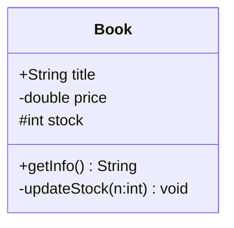
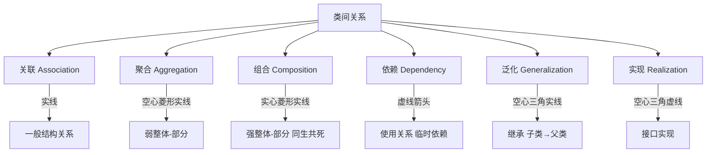
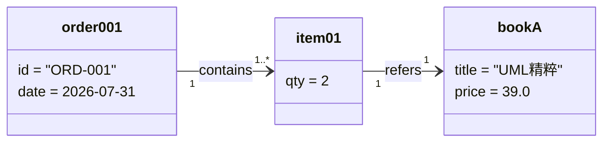
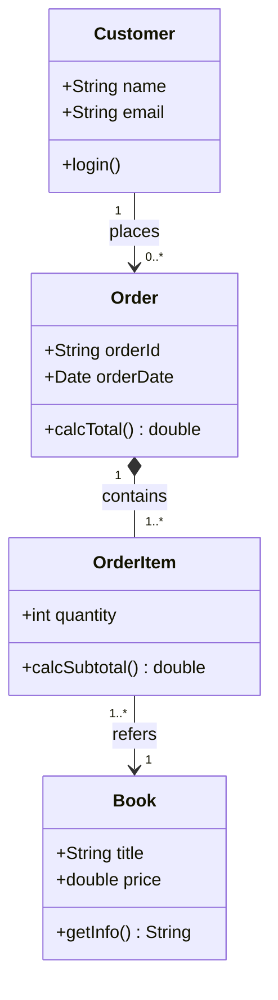

# 3.1 类图与对象图

类图（Class Diagram）是 UML 结构图的核心，它描述系统的静态结构：有哪些类、类的内部构成、类之间的关系。类图既是 OOA 阶段的概念模型，也是 OOD 阶段的设计模型载体，是从需求通往代码的骨架。对象图则是类图在某一时刻的实例化快照。

## 类图的元素

类在 UML 中用**矩形**表示，分隔为三层：

| 层 | 内容 | 说明 |
| --- | --- | --- |
| 第一层 | 类名 | 居中，正体；抽象类用斜体，接口加 `«interface»` |
| 第二层 | 属性 | `可见性 名字: 类型 = 默认值` |
| 第三层 | 操作 | `可见性 名字(参数列表): 返回类型` |

属性与操作的详细语法与可见性见 [[3.2 属性、操作与可见性]]。

## 类之间的关系

类图通过六种关系表达类之间的连接：

| 关系 | 语义 | 图符 | 强度 |
| --- | --- | --- | --- |
| 关联 | 类间的结构连接 | 实线（可带箭头、角色名） | 较强 |
| 聚合 | 弱整体—部分，部分可独立存在 | 空心菱形 + 实线 | 中 |
| 组合 | 强整体—部分，生命周期一致 | 实心菱形 + 实线 | 强 |
| 依赖 | 使用关系，临时性 | 虚线箭头 | 弱 |
| 泛化 | 继承，“是一种” | 空心三角 + 实线 | 强 |
| 实现 | 接口实现 | 空心三角 + 虚线 | 强 |

> [!note] 关系强弱记忆
> 依赖 < 关联 < 聚合 < 组合；泛化与实现是纵向的“is-a”关系，前四种是横向的“has-a / uses-a”关系。聚合与组合的精确区分见 [[3.3 关联、聚合与组合关系详解]]。

## 多重性

多重性（Multiplicity）描述关联一端可以有多少个对象参与，标注在关联线两端。

| 表示 | 含义 | 示例 |
| --- | --- | --- |
| `1` | 恰好一个 | 订单—顾客：1 |
| `0..1` | 零或一个（可选） | 员工—配偶：0..1 |
| `1..1` | 恰好一个（强调） | 订单—支付：1..1 |
| `0..*` 或 `*` | 零个或多个 | 顾客—地址：0..* |
| `1..*` | 至少一个 | 订单—订单项：1..* |
| `n..m` | n 到 m 个 | 选课—学生：30..60 |

> [!tip] 速记
> `*` 表示“无上限”，`..` 是范围分隔符。单写数字 `1` 等价于 `1..1`。

## 对象图：实例化快照

> [!definition] 对象图
> 对象图展示某一时点上系统中对象实例及其链接（Link）。它是类图的实例化快照，对象名格式为 `实例名: 类名`，下方列出属性的具体值。

> [!example]- 对象图说明
> 上图是“订单—订单项—图书”类图的一个实例快照：订单 `ORD-001` 含两个订单项 `item01`，订单项引用图书 `UML精粹`（单价 39.0）。对象图常用于验证类图或解释复杂场景。

对象图与类图的关系：

| 维度 | 类图 | 对象图 |
| --- | --- | --- |
| 描述 | 类型与结构 | 实例与值 |
| 存在 | 设计期抽象 | 运行时某时刻 |
| 数量 | 唯一类定义 | 可有任意实例 |
| 用途 | 系统结构建模 | 验证、示例说明 |

## 类图示例：在线书店

> [!example]- 图例说明
> - 顾客下多个订单（关联，`1` 对 `0..*`）；
> - 订单组合订单项（实心菱形，组合，生命周期一致）；
> - 订单项引用图书（关联，`1..*` 对 `1`）。

## 小结

类图用三层矩形刻画类的结构，用六种关系连接类，用多重性量化参与数量。对象图是类图的运行时快照，用于验证与示例。类图是后续动态建模（顺序图、状态图）的静态骨架，所有动态交互都发生在类图定义的对象之间。

## 关联

- 上一章：[[2.3 用例关系与需求追踪]]
- 下一节：[[3.2 属性、操作与可见性]]
- 进阶关系：[[3.3 关联、聚合与组合关系详解]]
- 上一级：[[MOC - 第3章]]
