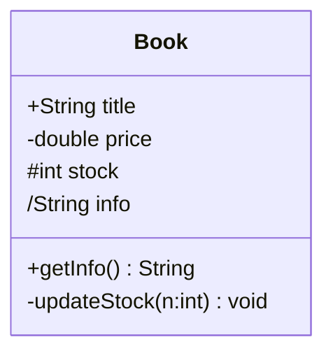

# 3.2 属性、操作与可见性

类图的三层结构中，属性描述“类知道什么”，操作描述“类能做什么”，可见性控制“谁能访问它们”。精确表达这三者，才能让类图既描述结构又指导编码。本节给出 UML 属性与操作的完整语法、四种可见性，以及与 Java 代码的对应关系。

## 属性定义

> [!definition] 属性
> 属性（Attribute）是类的命名槽，描述对象的状态。UML 语法为 `可见性 名字: 类型 = 默认值`，如 `- price: double = 0.0`。

属性语法的各部分：

| 部分 | 说明 | 示例 |
| --- | --- | --- |
| 可见性 | `+ - # ~` | `-` |
| 名字 | 属性名，首字母小写 | `price` |
| 类型 | 数据类型或类名 | `double` |
| 默认值 | 可选，初值 | `0.0` |
| 派生属性 | 以 `/` 开头，表示由其他属性计算 | `/total: double` |

> [!concept] 派生属性
> 派生属性（Derived Attribute）是可从其他属性计算得出的属性，名字前加 `/`。例如订单的 `/total` 可由订单项单价 × 数量求和得到。派生属性通常不存储，对应代码中的 getter 方法。

## 操作定义

> [!definition] 操作
> 操作（Operation）是类提供的服务，描述对象的行为。UML 语法为 `可见性 名字(参数列表): 返回类型`，如 `+ calcTotal(): double`。

操作语法的各部分：

| 部分 | 说明 | 示例 |
| --- | --- | --- |
| 可见性 | `+ - # ~` | `+` |
| 名字 | 方法名，动宾结构 | `calcTotal` |
| 参数列表 | `参数名: 类型`，逗号分隔 | `(itemId: String, qty: int)` |
| 返回类型 | 可为空（void） | `double` |

> [!note] 属性 vs 操作的边界
> 属性描述“状态”，操作描述“行为”。属性通常对应类的字段，操作对应类的方法。只读的派生值应作为派生属性或 getter 操作，而非真实字段。

## 可见性

可见性（Visibility）控制类成员的访问范围，是封装原则的体现。

| 符号 | 关键字 | 名称 | 访问范围 |
| --- | --- | --- | --- |
| `+` | `public` | 公有 | 任何类 |
| `-` | `private` | 私有 | 本类 |
| `#` | `protected` | 受保护 | 本类及子类 |
| `~` | package | 包级 | 同包内类 |

> [!tip] 封装原则
> 属性一般设为 `-`（private），通过 `+` getter/setter 暴露受控访问；需要子类直接访问的设为 `#`；只在同包使用的设为 `~`。这体现了“开放接口、隐藏实现”的封装思想。

## 类的职责分配

> [!concept] 单一职责原则（GRASP）
> 一个类应当只有一个引起它变化的原因，即只承担一组内聚的职责。把属性与操作分配给类时，应让“信息专家”——拥有完成某职责所需信息最多的类——承担该职责。

职责分配的检查清单：

1. 这个操作需要的数据是否主要来自本类属性？是 → 归本类；
2. 这个属性是否与类的核心概念一致？是 → 留本类；
3. 一个类是否承担了过多不相关的职责？是 → 拆分；
4. 是否有“数据—行为”分离？避免把数据放一类、操作放另一类。

## Java 代码与 UML 类图对应

UML 类图与 Java 代码可直接双向映射。下表给出对应关系：



```java
public class Book {
    // 属性：可见性与 UML 对应
    public String title;          // +  public
    private double price;         // -  private
    protected int stock;          // #  protected
    // /info 为派生属性，不存字段，由方法计算

    // 操作：可见性、参数、返回类型对应
    public String getInfo() {                       // +  getInfo(): String
        return title + " ¥" + price;
    }

    private void updateStock(int n) {               // -  updateStock(n:int): void
        stock += n;
    }
}
```

| UML | Java |
| --- | --- |
| `+ title: String` | `public String title;` |
| `- price: double` | `private double price;` |
| `# stock: int` | `protected int stock;` |
| `/ info: String`（派生） | `public String getInfo() { ... }`（无字段） |
| `+ getInfo(): String` | `public String getInfo() { ... }` |
| `- updateStock(n: int): void` | `private void updateStock(int n) { ... }` |

> [!warning] 命名风格差异
> UML 属性名通常用小写开头驼峰；Java 字段同样小写开头。UML 操作返回类型写在 `:` 后，Java 写在方法名前。UML 参数为 `名: 类型`，Java 为 `类型 名`，顺序相反。

## 小结

属性描述状态，操作描述行为，可见性控制访问。派生属性以 `/` 标识，对应计算型 getter。职责分配遵循单一职责与信息专家原则。UML 类图与 Java 代码可双向映射，模型可直接转化为代码骨架，这也是面向对象方法“分析—设计—编程平滑过渡”的体现。

## 关联

- 上一节：[[3.1 类图与对象图]]
- 下一节：[[3.3 关联、聚合与组合关系详解]]
- 上一级：[[MOC - 第3章]]
- 关联课程：[[Java程序设计]]、[[面向对象程序设计]]
