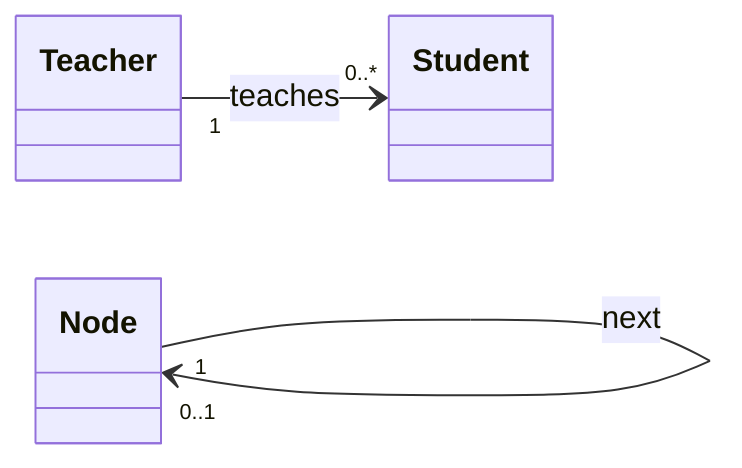

# 3.3 关联、聚合与组合关系详解

类图的关系中，关联、聚合、组合、依赖都属于“横向”关系，但它们的强度与语义差异常被混淆。本节聚焦这四种关系的精确区分，特别是聚合（弱整体—部分）与组合（强整体—部分）在生命周期上的本质差别，并给出图符、方向与代码对应。

## 普通关联

> [!definition] 关联（Association）
> 关联是两个类之间的结构连接，表示对象间存在语义上的长期关系。关联可带方向（单向/双向）、角色名与多重性。

关联的三种形式：

- **双向关联**：默认，两端可互相访问，用实线连接；
- **单向关联**：用带箭头的实线，表示只有一端知道另一端；
- **自关联**：类关联到自身，如 `Node` 节点的 next 指针。



## 聚合：弱整体—部分

> [!definition] 聚合（Aggregation）
> 聚合表示“整体—部分”关系，但部分**可独立于整体存在**。整体不负责部分的创建与销毁。图符为**空心菱形**，菱形在整体一端。

特征：

- 部分**可脱离整体**存在；
- 整体与部分的生命周期**独立**；
- 表达“has-a”的弱拥有关系。

示例：部门聚合员工（员工可调离其他部门）；球队聚合球员。

## 组合：强整体—部分

> [!definition] 组合（Composition）
> 组合表示“整体—部分”关系，部分**与整体同生共死**，生命周期一致。整体负责部分的创建与销毁。图符为**实心菱形**，菱形在整体一端。

特征：

- 部分**不能脱离整体**独立存在；
- 整体与部分的生命周期**一致**；
- 表达强包含关系，部分通常在整体内创建。

示例：订单组合订单项（订单删除则订单项消失）；窗口组合按钮。

## 关系对比图

```mermaid
flowchart TD
    subgraph 聚合 空心菱形 弱关系
        Dept[部门] o-- Emp[员工]
        Note1[员工可独立存在]
    end
    subgraph 组合 实心菱形 强关系
        Order[订单] *-- Item[订单项]
        Note2[订单项随订单同生共死]
    end
    subgraph 依赖 虚线箭头
        Service..>Util
        Note3[临时使用]
    end
```

> [!note] 菱形位置
> 聚合与组合的菱形都画在**整体**一端。无论箭头方向如何，菱形指向整体。例如“订单 ◆—— 订单项”中菱形在订单侧。

## 依赖关系

> [!definition] 依赖（Dependency）
> 依赖表示一个类**使用**了另一个类，但不是结构性拥有。被依赖类的变化可能影响依赖类。图符为**虚线箭头**，从依赖方指向被依赖方。

依赖通常是临时性的，常见形式：

- 方法的参数、返回值或局部变量使用了另一个类；
- 静态方法调用；
- 没有字段持有对方引用。

## 关系对比与代码示例

| 关系 | 语义 | 强度 | 生命周期 | 图符 | Java 体现 |
| --- | --- | --- | --- | --- | --- |
| 关联 | 长期结构关系 | 中 | 独立 | 实线/箭头 | 成员字段 |
| 聚合 | 弱整体—部分 | 中 | 部分独立 | 空心菱形 | 成员字段（外部传入） |
| 组合 | 强整体—部分 | 强 | 同生共死 | 实心菱形 | 成员字段（内部创建） |
| 依赖 | 临时使用 | 弱 | 无 | 虚线箭头 | 参数/局部变量 |

聚合与组合的代码差异在于“部分对象是否由整体创建”：

```java
// 聚合：员工独立存在，由外部传入，部门不负责创建销毁
class Department {
    private List<Employee> members;      // 空心菱形

    public Department(List<Employee> members) {
        this.members = members;          // 外部已存在的对象
    }
}

// 组合：订单项由订单内部创建，随订单一同销毁
class Order {
    private List<OrderItem> items;       // 实心菱形

    public Order() {
        this.items = new ArrayList<>();  // 内部创建
        this.items.add(new OrderItem()); // 部分不脱离整体
    }
}

// 依赖：Service 临时使用 Util，不持有字段
class OrderService {
    public double calc(Order o) {        // 参数依赖 Order
        return TaxUtil.compute(o);       // 局部调用 Util
    }
}
```

> [!warning] 聚合 vs 组合判断
> 看生命周期：部分能否脱离整体存在？
> - 能 → 聚合（空心菱形）；
> - 不能（同生共死）→ 组合（实心菱形）。
> 看创建责任：部分由谁创建？
> - 外部传入 → 聚合；
> - 整体内部 new → 组合。

## 小结

关联是长期结构关系；聚合与组合都是整体—部分，区别在于部分是否与整体同生共死（聚合弱、组合强）；依赖是临时使用关系。菱形画在整体端，空心表聚合、实心表组合。代码层面，聚合常以外部传入的字段实现，组合以内部创建的字段实现，依赖以参数或局部变量体现。精确区分这四种关系，是构建高内聚低耦合类结构的基础。

## 关联

- 上一节：[[3.2 属性、操作与可见性]]
- 关联基础：[[3.1 类图与对象图]]
- 上一级：[[MOC - 第3章]]
- 下一章：[[MOC - 第4章]]
