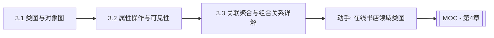

# MOC - 第3章 领域建模：类与对象模型

> [!info] 本章定位
> 第3章从需求进入静态结构建模。用例模型回答“系统做什么”，领域类模型回答“系统里有哪些概念、它们如何关联”。类图是 UML 中最重要、使用最广的图，是 OOA 的概念模型与 OOD 的设计模型的共同载体。本章解决三个问题：类图与对象图怎么画、属性/操作/可见性如何表达、类之间的六种关系如何精确区分。

## 学习路线图

## 知识点导航

| 节 | 主题 | 核心要点 | 入口 |
| --- | --- | --- | --- |
| 3.1 | 类图与对象图 | 类的三层结构、六种关系、多重性、对象图快照 | [[3.1 类图与对象图]] |
| 3.2 | 属性、操作与可见性 | 属性类型与派生、操作签名、四种可见性、Java 对应 | [[3.2 属性、操作与可见性]] |
| 3.3 | 关联、聚合与组合关系详解 | 关联/聚合/组合/依赖语义、菱形方向、生命周期 | [[3.3 关联、聚合与组合关系详解]] |

## 核心考点

> [!warning] 重点掌握
> 1. 类图的元素：类名、属性、操作三层结构与可见性符号（+、-、#、~）。
> 2. 类之间的六种关系：关联、聚合、组合、依赖、泛化、实现，及其图符与语义。
> 3. 多重性的表示：`1..1`、`0..*`、`1..*`、`n..m` 的含义。
> 4. 聚合（空心菱形）与组合（实心菱形）的本质区别（生命周期是否一致）。
> 5. 对象图与类图的关系：对象图是类图在某一时刻的实例化快照。
> 6. UML 类图与 Java 代码的双向映射。

## 自测题

> [!question] 题1
> 列举 UML 类图中类的三种可见性符号及其含义。
> > [!check]- 参考答案
> > `+` public（公有，对外公开）；`-` private（私有，仅类内访问）；`#` protected（受保护，类内及子类访问）；此外还有 `~` package（包级，同包可访问）。Java 中分别对应 `public`、`private`、`protected`、默认包访问。

> [!question] 题2
> 聚合与组合都是“整体—部分”关系，它们的核心区别是什么？各举一例。
> > [!check]- 参考答案
> > 区别在于部分的生命周期是否与整体一致。**聚合**是弱关系，部分可独立存在，整体不负责部分的销毁，图符为空心菱形，如“部门”聚合“员工”（员工可调离）。**组合**是强关系，部分与整体同生共死，整体负责创建与销毁部分，图符为实心菱形，如“订单”组合“订单项”（订单删除则订单项不存在）。

> [!question] 题3
> 解释多重性 `1..1`、`0..*`、`1..*`、`0..1` 的含义，并各举一例。
> > [!check]- 参考答案
> > - `1..1`：恰好一个，如“订单”对应“一个顾客”；
> > - `0..*`：零个或多个（任意多个），如“顾客”可拥有“多个地址”或没有；
> > - `1..*`：至少一个，如“订单”至少含“一个订单项”；
> > - `0..1`：零个或一个（可选），如“员工”可选“一个配偶”。

> [!question] 题4
> 什么是对象图？它与类图有何关系？
> > [!check]- 参考答案
> > 对象图（Object Diagram）是类图在某一时刻的实例化快照，展示具体的对象实例及其链。类图描述“类型与结构”，对象图描述“某时刻的值与连接”。对象图常用于验证类图的正确性或解释复杂场景。例如类图“订单—订单项”可实例化为对象图“订单#001 含两个订单项对象”。

## 章节导航

- 上一级：[[MOC - 面向对象系统分析与建模]]
- 上一章：[[MOC - 第2章]]
- 下一章：[[MOC - 第4章]]
