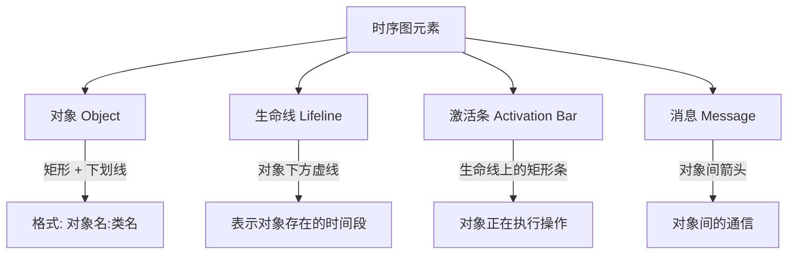
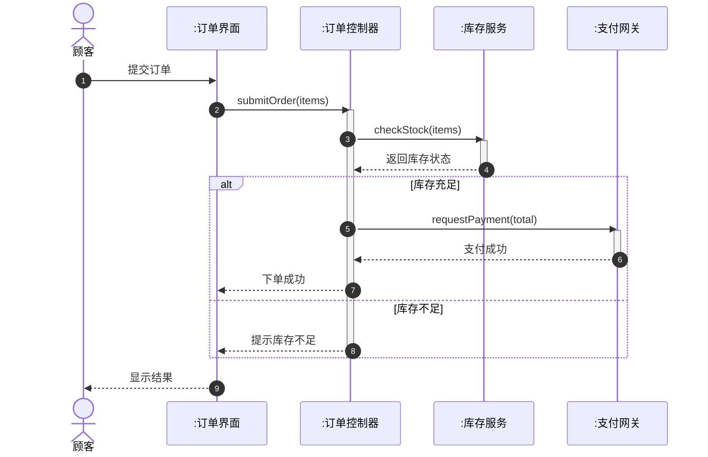
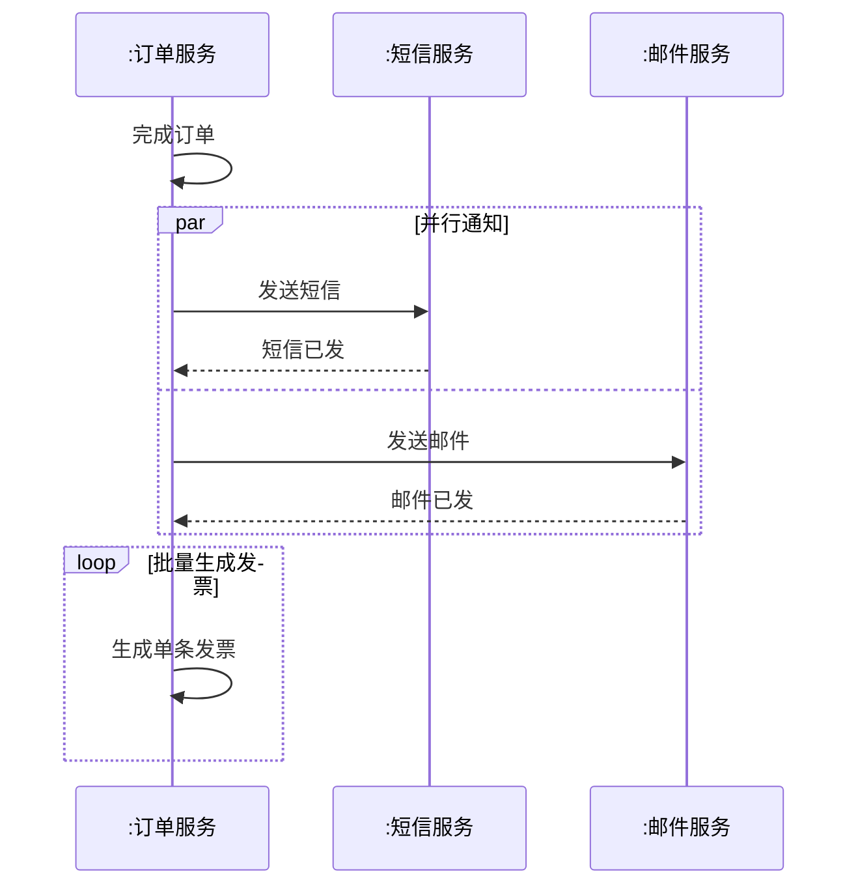

# 4.1 时序图基本元素与绘制

时序图（Sequence Diagram）是 UML 交互图中最常用的一种，它按**时间顺序**组织对象之间的消息交换，回答“在执行某个用例场景时，对象之间按什么次序互相调用”。时序图把参与交互的对象横向排列，把时间纵向展开，直观展示控制流在对象间的传递过程，是从用例走向类操作设计的关键中间模型。

## 时序图的组成元素

时序图由四个基本元素构成：对象、生命线、激活条、消息。

| 元素 | 图符 | 含义 |
| --- | --- | --- |
| 对象 | 矩形，内含 `对象名:类名`（下划线） | 参与交互的实例；可省略对象名写作 `:类名` |
| 生命线 | 对象下方的垂直虚线 | 对象在一段时间内存在并接收消息 |
| 激活条 | 生命线上的细长矩形 | 对象正在执行某操作（控制流在其上） |
| 消息 | 对象间的箭头 | 一个对象调用另一对象的操作或发送信号 |

> [!note] 对象命名
> 对象名格式为 `name:ClassName`，整体加下划线。可只写对象名（`order:Order`）、只写类名（`:Order`，匿名对象）或只写对象名。生命线底部用 `X` 表示对象被销毁。

## 消息类型

消息是时序图的核心，按调用方式分为四种：

| 消息类型 | 图符 | 语义 | 典型场景 |
| --- | --- | --- | --- |
| 同步消息 | 实线 + 实心三角箭头 | 调用者阻塞等待返回 | 普通方法调用 |
| 异步消息 | 实线 + 开放箭头（棒状） | 调用者不等待，立即继续 | 事件通知、消息队列 |
| 返回消息 | 虚线 + 开放箭头 | 控制流返回并带回结果 | 方法返回值 |
| 自调用消息 | 同步消息，起点终点在同一对象 | 对象调用自身方法 | 内部辅助方法调用 |

> [!tip] 同步 vs 异步的判断
> 看调用者是否阻塞等待：阻塞等待为同步（实心箭头），发完即走为异步（开放箭头）。同步消息通常配有返回消息，异步消息一般没有显式返回。在 Java 中，普通方法调用是同步；`CompletableFuture`、消息中间件发布是异步。

## 时间轴

时序图的时间轴是**隐式的纵向轴**：消息从上到下排列，越靠上的消息越早发生，越靠下越晚。时间轴不标绝对刻度，只表达相对顺序；消息之间的垂直距离不表示精确时长，但可粗略反映先后与耗时关系。

> [!warning] 时间轴的常见误解
> 时序图的纵向只表达**顺序**，不表达**精确时间长度**。若需表达时间约束，可在消息旁标注约束表达式，如 `{t < 200ms}`。需要严格时间性能分析时应使用专门的时间图（Timing Diagram），而非时序图。

## 组合片段（Combined Fragment）

组合片段用矩形框对消息进行逻辑分组，表达条件、循环、并行等控制结构，是时序图刻画复杂流程的关键。左上角标注片段类型及参数。

| 片段 | 关键字 | 语义 | 对应结构 |
| --- | --- | --- | --- |
| 互斥分支 | `alt` | 多个条件分支选其一执行 | if-else if-else |
| 可选 | `opt` | 条件为真才执行 | if（无 else） |
| 循环 | `loop` | 重复执行若干次 | for / while |
| 并行 | `par` | 多个片段并发执行 | 多线程并发 |
| 引用 | `ref` | 引用另一时序图 | 类似函数调用 |
| 断言 | `assert` | 序列必须成立 | 不变量约束 |
| 考虑 | `consider` / `ignore` | 关注或忽略某些消息 | 消息过滤 |

> [!note] alt 与 opt 的区别
> `alt` 是多分支互斥（必须有分隔的多个分支），`opt` 是单分支可选（相当于只有一个分支的 alt）。`loop` 框标注 `loop(min, max)`，`*` 表示无上限；`par` 用虚线分隔并行区域。

## 时序图示例：在线下单流程

下面用 Mermaid 的 `sequenceDiagram` 绘制在线下单流程，综合展示对象、生命线、消息与组合片段：

> [!example]- 图例说明
> - 顾客提交订单触发交互，消息自上而下按时间排列；
> - 订单控制器调用库存服务检查库存（同步消息），库存服务返回结果（虚线返回消息）；
> - `alt` 组合片段表达库存充足与不足两个互斥分支；
> - 激活条（`activate`/`deactivate`）显示控制器与服务在执行期间处于活跃状态；
> - 最终界面将结果返回给顾客。

### 并行与循环示例

> [!example]- 说明
> `par` 让短信与邮件通知并发进行；`loop` 表示对订单项逐条生成发票。二者都是组合片段对控制流的封装。

## 小结

时序图以时间为纵轴、对象为横轴，用对象、生命线、激活条、消息四元素刻画交互。同步、异步、返回、自调用四种消息表达不同调用语义；`alt`/`opt`/`loop`/`par` 等组合片段把复杂控制结构封装进图框。时序图是从用例场景到类操作设计的桥梁——每一条消息通常对应被调用类的一个操作。

## 关联

- 上一级：[[MOC - 第4章]]
- 上一章：[[3.3 关联、聚合与组合关系详解]]
- 下一节：[[4.2 协作图与对象交互]]
- 实践应用：[[4.3 交互建模实践与场景分析]]
