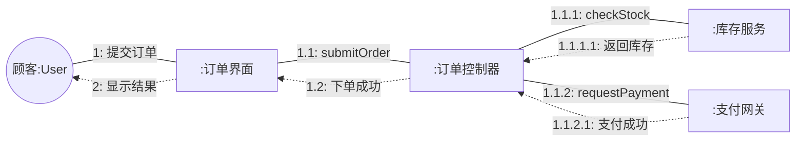

# 4.2 协作图与对象交互

协作图（Collaboration Diagram），UML 2.0 后改称**通信图**（Communication Diagram），是与时序图语义等价的另一种交互图。它同样刻画对象间的消息交换，但不再强调时间轴，而是把对象按结构关系布局，用**链接**连接对象、用**消息编号**表达执行顺序。协作图回答“哪些对象相互连接、它们如何协作完成功能”，适合分析对象结构关系与耦合度。

## 协作图的组成元素

协作图由对象、链接、消息三要素构成。

| 元素 | 图符 | 含义 |
| --- | --- | --- |
| 对象 | 矩形，`对象名:类名`（下划线） | 参与交互的实例 |
| 链接（Link） | 对象间的实线 | 对象间的连接路径，是关联的实例 |
| 消息 | 链接上的带编号箭头 | 沿链接传递的调用 |

> [!definition] 链接与关联
> 链接是关联（Association）在运行时的实例化。类图定义“订单与顾客之间存在关联”，协作图则展示具体对象 `order:Order` 与 `customer:Customer` 之间确实存在一条链接，消息可沿该链接传递。因此协作图的链接必须以类图的关联为依据，不能凭空添加。

## 消息编号

由于协作图没有时间轴，消息的先后顺序通过**编号**表达。常用**嵌套编号法**（Dewey 十进制编号）：

| 编号 | 含义 |
| --- | --- |
| `1` | 第一条消息 |
| `1.1` | 在消息 1 的处理过程中发出的第一条子消息 |
| `1.2` | 在消息 1 的处理过程中发出的第二条子消息 |
| `2` | 第一条消息返回后的下一条顶层消息 |
| `1.1.1` | 消息 1.1 处理中的更深层调用 |

> [!tip] 编号阅读规则
> 顶层编号（1、2、3…）表示按时间排列的主消息序列；点号后的数字表示调用层级。编号 `1.1` 一定在 `2` 之前完成，因为它是消息 1 处理过程的子步骤。同层编号按数字大小排时间。

## 协作图示例：在线下单

Mermaid 没有原生的协作图语法，可使用 `flowchart` 近似表达对象布局、链接与带编号消息：

> [!example]- 图例说明
> - 实线带编号箭头表示正向调用消息，虚线表示返回消息；
> - 编号 `1.1.1`、`1.1.2` 是控制器在处理 `submitOrder` 过程中发出的子调用，二者嵌套在第 1 步内；
> - 对象间的链接（实线）对应类图中的关联，消息沿链接传递；
> - 该协作图与 [[4.1 时序图基本元素与绘制]] 中的下单时序图语义等价。

## 时序图与协作图对比

两种交互图在语义上等价，可相互转换，但强调维度不同：

| 维度 | 时序图 Sequence | 协作图 Collaboration |
| --- | --- | --- |
| 强调重点 | 时间顺序 | 对象间的结构关系 |
| 时间表达 | 显式（纵轴自上而下） | 隐式（消息编号） |
| 对象布局 | 横向排列，位置无结构含义 | 按链接关系布局，体现拓扑 |
| 消息顺序 | 由纵向位置决定 | 由编号决定 |
| 适合场景 | 长流程、并发、异常分支 | 少量对象、强调结构耦合 |
| 控制结构 | 组合片段 alt/opt/loop/par | 难以直观表达复杂控制 |
| 工具支持 | Mermaid sequenceDiagram 原生 | Mermaid 无原生，用 flowchart 近似 |
| UML 2.0 名称 | Sequence Diagram | Communication Diagram |

> [!note] 等价性与转换
> 同一个交互可以用两种图表达且语义相同：时序图的消息从上到下对应协作图的编号 1、2、3…；时序图组合片段内的消息对应协作图的嵌套编号。多数建模工具（如 StarUML）支持一键在两种图之间转换。

## 适用场景

> [!example] 优先选用协作图的场景
> 1. **分析对象结构关系**：需要直观看到哪些对象互相连接、消息沿哪条路径传递，以评估耦合度。
> 2. **少量对象的紧凑协作**：对象较少（通常 3–6 个）且消息不多时，协作图比时序图更紧凑。
> 3. **验证类图关联**：协作图的每条链接都应是类图关联的实例，可用于检查类图是否遗漏了必要关联。
> 4. **设计早期职责分配**：在确定类操作前，先用协作图梳理对象间需要哪些消息，再落到类操作。

> [!warning] 优先选用时序图的场景
> 当流程较长、涉及循环与并行、需要精确表达异常分支与时间顺序时，协作图编号会变得冗长难读，应优先用时序图。实际工程中时序图使用频率远高于协作图。

## 小结

协作图（通信图）以对象、链接、消息三要素刻画交互，用嵌套编号表达时间顺序，用链接布局体现对象结构关系。它与时序图语义等价、各有侧重：时序图长于表达时序与控制结构，协作图长于表达对象拓扑与耦合。选择时依据“要强调时间还是结构”决定。

## 关联

- 上一级：[[MOC - 第4章]]
- 上一节：[[4.1 时序图基本元素与绘制]]
- 下一节：[[4.3 交互建模实践与场景分析]]
- 静态依据：[[3.1 类图与对象图]]、[[3.3 关联、聚合与组合关系详解]]
