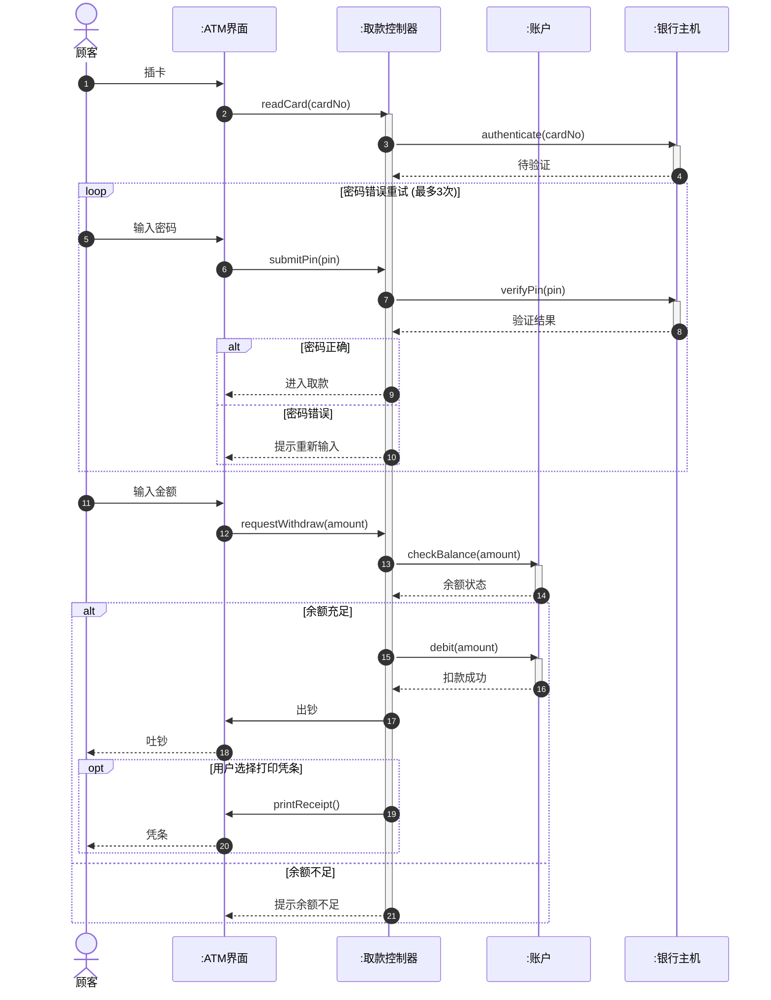

# 4.3 交互建模实践与场景分析

掌握时序图与协作图的语法只是起点，真正的能力在于“从需求到交互模型”的转化。本节聚焦建模实践：如何把一个用例描述转写成时序图、如何识别参与交互的对象、如何设计消息序列与异常处理，并以 ATM 取款为完整案例贯穿全流程。这一步是把 OOA 的用例与类图推向 OOD 的操作设计的关键环节。

## 从用例到时序图的转换方法

时序图是某个用例场景的动态展开。转换遵循“用例描述 → 对象识别 → 消息序列 → 异常处理 → 落到类操作”五步：


| 步骤 | 工作 | 依据 |
| --- | --- | --- |
| 1 | 阅读用例描述，明确主成功场景与扩展场景 | [[2.2 用例描述与需求规约]] |
| 2 | 识别参与交互的对象（边界、控制、实体） | 类图 + 用例参与者 |
| 3 | 按主成功场景步骤逐条转写为消息 | 用例主场景步骤 |
| 4 | 用 alt/opt 组合片段封装异常分支 | 用例扩展场景 |
| 5 | 每条消息对应被调用类的一个操作 | 职责分配 |

> [!tip] 一个用例多张时序图
> 一个用例通常有主成功场景和多个扩展场景。可以为每个场景画一张时序图，也可以用 `alt`/`opt` 把主场景与扩展合并到一张图中。场景复杂时拆分更清晰，简单时合并更紧凑。

## 识别参与交互的对象

交互建模的第一步是确定哪些对象出现在时序图上。常用 **Boundary-Control-Entity（边界-控制-实体，简称 BCE）** 模式辅助识别：

| 类型 | 职责 | 例子 |
| --- | --- | --- |
| 边界对象（Boundary） | 与外部参与者交互，收发消息 | 界面、API 入口、网关 |
| 控制对象（Control） | 协调用例的业务流程 | 订单控制器、取款控制器 |
| 实体对象（Entity） | 持久化业务数据与领域逻辑 | 订单、账户、库存 |

> [!note] 参与者也画进时序图
> 用例的参与者（人或外部系统）应作为时序图最左或最右的对象出现，用 `actor` 表示，让交互的发起方与终点一目了然。

## 消息序列设计

把用例主场景的每一步翻译为对象间的消息，遵循以下原则：

1. **从参与者发起**：第一条消息通常由主要参与者发给边界对象；
2. **职责驱动**：每条消息发给“最该负责该操作的对象”，避免控制器包办一切；
3. **同步为主**：普通方法调用用同步消息，事件通知用异步消息；
4. **自上而下**：消息按时间从上到下排列，体现先后；
5. **激活条配对**：调用时激活、返回时去激活，反映控制流占用。

## 异常处理建模

异常分支用组合片段表达：

| 异常类型 | 片段 | 示例 |
| --- | --- | --- |
| 条件分支 | `alt` | 余额充足 vs 余额不足 |
| 可选附加 | `opt` | 用户选择打印凭条 |
| 重试循环 | `loop` | 密码错误重试 3 次 |
| 中断处理 | `break` | 用户取消交易，跳出主流程 |

> [!warning] break 片段
> `break` 组合片段表示条件成立时中断外层交互并跳出，类似 break 语句。常用于“用户取消”“超时”等中断场景，框内条件为真时执行片段并结束外层。

## 完整案例：ATM 取款时序图

**用例**：顾客在 ATM 上取款。
**主成功场景**：
1. 顾客插卡，ATM 读取卡号；
2. 顾客输入密码，系统验证；
3. 顾客输入取款金额；
4. 系统检查余额并扣款；
5. ATM 吐钞，顾客取走现金；
6. 系统打印凭条，完成交易。

**扩展场景**：密码错误（重试 3 次）、余额不足、用户取消。

**对象识别**：参与者 `顾客`、边界 `ATM界面`、控制 `取款控制器`、实体 `账户`、外部系统 `银行主机`。



> [!example]- 案例要点说明
> - **参与者**：顾客在最左侧发起交互，银行主机作为外部系统在右侧；
> - **BCE 模式**：ATM 界面（边界）、取款控制器（控制）、账户（实体）职责清晰，控制器协调而不包办；
> - **loop 片段**：密码错误重试最多 3 次，用 `loop` 封装；
> - **alt 片段**：密码正确/错误、余额充足/不足两处互斥分支；
> - **opt 片段**：打印凭条是可选附加行为；
> - **激活条**：控制器在主流程期间持续活跃，实体与外部系统按需激活；
> - **消息映射操作**：`checkBalance`、`debit` 将成为 `账户` 类的操作，`requestWithdraw` 等成为控制器操作。

### 落到类操作

将上述时序图的消息提炼为类的操作（部分）：

```java
// 实体类：账户
public class Account {
    private double balance;

    public boolean checkBalance(double amount) { /* 检查余额是否充足 */ }
    public boolean debit(double amount) { /* 扣款 */ }
}

// 控制类：取款控制器
public class WithdrawController {
    private Account account;
    private BankHost host;

    public void readCard(String cardNo) { /* 读卡并请求认证 */ }
    public boolean verifyPin(String pin) { /* 验证密码 */ }
    public void requestWithdraw(double amount) { /* 协调取款流程 */ }
}
```

> [!note] 从交互图到类操作
> 时序图中每一条指向某对象的消息，最终都应映射为该对象所属类的一个操作（方法）。因此交互建模不仅是画图，更是发现和验证类操作的过程——若某类频繁被调用却缺少对应操作，说明类图需补充；若某操作无人调用，可能存在职责冗余。

## 小结

交互建模的实践核心是“从用例到时序图”的系统化转换：阅读用例描述、按 BCE 模式识别对象、按主场景排消息、用组合片段封装异常、最后把消息落为类操作。ATM 取款案例展示了 loop/alt/opt 的综合运用。每条消息都是类操作的候选项，交互图因此成为连接需求与设计的验证工具。

## 关联

- 上一级：[[MOC - 第4章]]
- 上一节：[[4.2 协作图与对象交互]]
- 需求依据：[[2.2 用例描述与需求规约]]
- 静态依据：[[3.1 类图与对象图]]
- 下一章：[[MOC - 第5章]]
