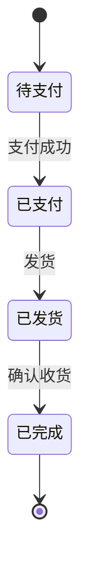
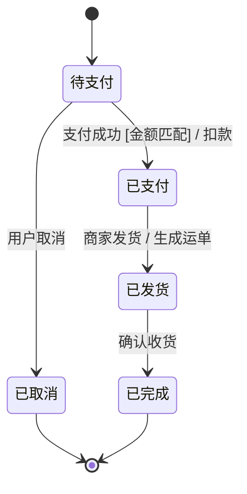
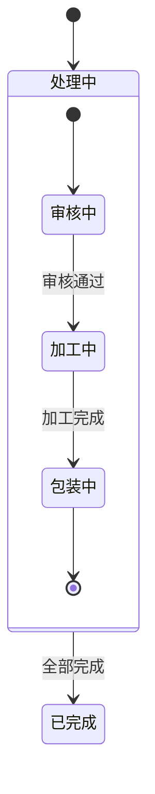
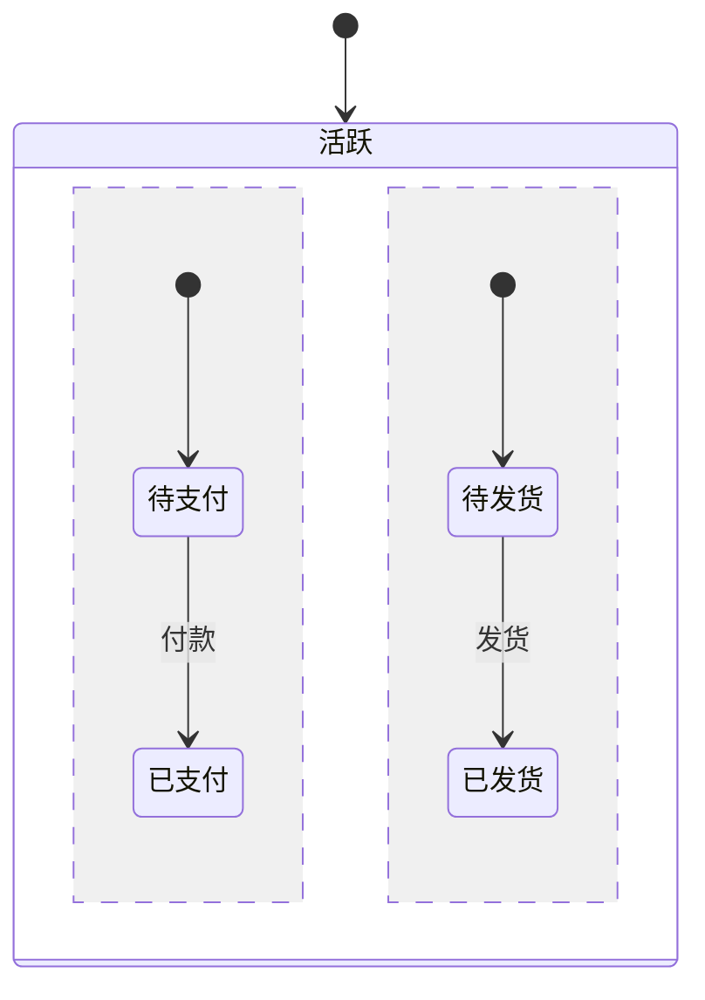

# 5.1 状态机图基本元素

状态机图（State Machine Diagram）刻画一个对象在其生命周期内经历的所有状态，以及触发状态转换的事件与条件。它回答“对象什么时候处于什么状态、什么事件让它改变状态”，是事件驱动建模的核心图种，特别适合订单、连接、进程、工单等具有明显生命周期的对象。状态机图既能用于分析阶段描述领域对象行为，也能用于设计阶段指导状态相关代码的实现。

## 状态

状态（State）描述对象在某一时刻所处的情形，在此期间对象的行为相对稳定。UML 用**圆角矩形**表示状态，内部标注状态名及可选的行为。

| 状态类型 | 图符 | 说明 |
| --- | --- | --- |
| 初态（Initial） | 实心圆 | 状态机的起点，每个状态机有且只有一个初态 |
| 终态（Final） | 同心圆（带实心圆环） | 状态机结束，可有零个或多个终态 |
| 中间状态 | 圆角矩形 | 对象经历的正常状态 |

> [!definition] 状态的本质
> 状态是对象属性的某种“等价类”——在同一状态内，对象对相同事件的反应相同。状态名应是形容词或过去分词，如“已支付”“待审核”“运行中”，避免用动作命名状态。



## 转换

转换（Transition）描述对象从一个状态变到另一个状态的过程。一个完整转换由五部分组成：

```
源状态 -- 事件 [监护条件] / 动作 --> 目标状态
```

| 组成 | 含义 | 示例 |
| --- | --- | --- |
| 源状态 | 转换发生前对象所处状态 | 待支付 |
| 触发事件 | 引起转换的事件 | 支付成功 |
| 监护条件 | 布尔表达式，为真转换才发生 | `[amount > 0]` |
| 动作 | 转换时执行的原子操作 | `/扣款` |
| 目标状态 | 转换后对象所处状态 | 已支付 |

> [!warning] 事件与监护条件的区别
> **事件**决定“何时考虑转换”——只有指定事件发生，状态机才会评估该转换。**监护条件**决定“转换是否真正发生”——事件发生后，条件为真才转换，为假则忽略。例如 `支付成功 [金额匹配] / 扣款`：支付成功事件触发评估，金额匹配才真正转换。

### 事件类型

| 事件类型 | 说明 | 示例 |
| --- | --- | --- |
| 信号事件 | 接收到异步信号 | 收到“超时”信号 |
| 调用事件 | 接收到同步调用 | 调用 `cancel()` |
| 时间事件 | 经过指定时间 | `after(30s)` |
| 变更事件 | 条件变为真 | `when(余额 < 阈值)` |

## 状态内部行为

状态内部可定义三种行为，写在状态矩形内、状态名下方：

| 行为 | 关键字 | 执行时机 | 特性 |
| --- | --- | --- | --- |
| 进入动作 | `entry` | 进入状态时立即执行一次 | 原子、不可打断 |
| 内部活动 | `do` | 处于状态期间持续进行 | 可被打断 |
| 退出动作 | `exit` | 离开状态时立即执行一次 | 原子、不可打断 |

```
已支付
entry / 发送确认邮件
do / 等待发货
exit / 记录离开时间
```

> [!note] 内部转换
> 除上述三种外，状态还可有**内部转换**：事件发生但不离开状态、不触发 entry/exit。格式为 `事件 [条件] / 动作`，与外部转换区别在于不改变状态、不调用 entry/exit。

## 状态机图示例：订单状态



> [!example]- 图例说明
> - 初态 `[*]` 进入“待支付”；
> - 待支付可因“用户取消”进入已取消，或因“支付成功且金额匹配”进入已支付并扣款；
> - 已支付 → 已发货（生成运单动作）→ 已完成；
> - 已取消与已完成都是终态。

## 复合状态

复合状态（Composite State）是包含子状态的状态，用于把复杂状态机分层组织。

### 顺序子状态

子状态在某一时刻只处于一个，构成子状态机：



### 正交区域（并发状态）

当一个对象同时具有多个独立维度的状态时，用虚线把复合状态分为多个**正交区域**，各区域并发演化：



> [!note] 正交区域
> 上图中虚线 `--` 分隔两个正交区域，表示订单在“活跃”期间同时维护支付状态与物流状态两个独立维度。进入复合状态时两个区域同时激活，需要两个区域都到终态才离开复合状态。

### 历史状态

历史状态（History State）让复合状态在被中断后能“记住”离开时所处的子状态，返回时从断点继续，而非从初态重新开始。

| 类型 | 图符 | 含义 |
| --- | --- | --- |
| 浅历史（Shallow） | 圆圈带 H | 记住复合状态直接子状态，不记深层 |
| 深历史（Deep） | 圆圈带 H* | 记住最深层子状态 |

> [!tip] 历史状态的应用
> 典型场景：播放器在播放中被电话打断，挂断后从被打断的歌曲继续。离开“播放中”复合状态进入“通话中”，返回时经历史状态恢复到原子状态，而不是从播放列表开头重来。

## 小结

状态机图由状态、转换、事件、监护条件、动作构成。初态、终态、中间状态刻画生命周期边界；entry/do/exit 描述状态内部行为；复合状态把复杂状态机分层，正交区域表达并发，历史状态支持断点续接。转换的五元组“源 / 事件 / 条件 / 动作 / 目标”是状态机的最小完整单元。

## 关联

- 上一级：[[MOC - 第5章]]
- 上一章：[[4.3 交互建模实践与场景分析]]
- 下一节：[[5.2 状态建模方法与实践]]
- 代码落地：[[5.3 状态模式与代码实现]]
