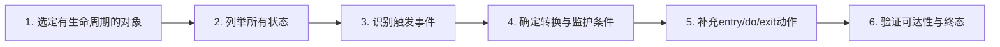
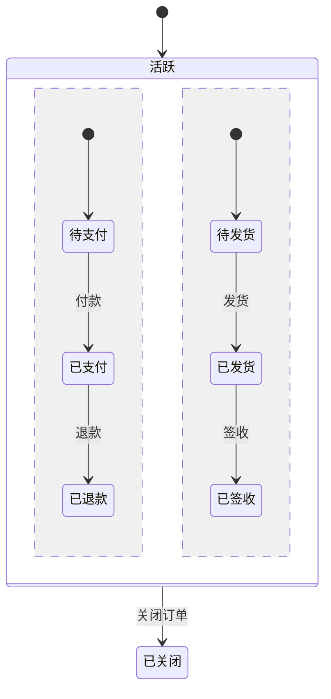
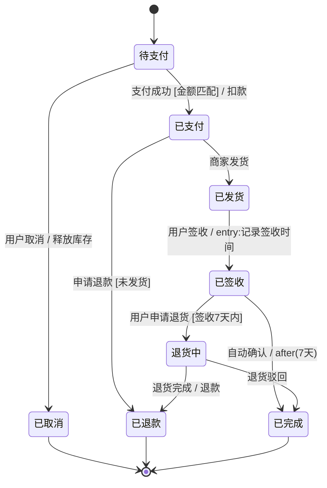

# 5.2 状态建模方法与实践

掌握状态机的语法后，更重要的是“如何为一个对象正确建模状态机”。本节聚焦方法：从对象生命周期出发识别状态、用事件驱动确定转换、遵循状态机设计原则避免常见陷阱、用正交区域处理并发，并以订单状态机为完整案例。状态建模是把领域规则可视化的过程，一张准确的状态机图往往胜过数页自然语言描述。

## 状态建模流程



| 步骤 | 关键问题 | 产出 |
| --- | --- | --- |
| 1 | 哪些对象有明显生命周期？ | 候选对象列表 |
| 2 | 对象会处于哪些稳定情形？ | 状态集合 |
| 3 | 什么事件让它改变？ | 事件列表 |
| 4 | 事件后是否一定转换？需要什么前提？ | 转换 + 监护条件 |
| 5 | 进入/离开状态要做什么？ | entry/do/exit |
| 6 | 每个状态是否可达？终态是否合理？ | 验证后的状态机 |

## 识别对象状态

### 什么样的对象需要状态机

> [!tip] 状态机适用判断
> 并非所有对象都需要状态机。只有**具有明显生命周期、对相同事件有不同反应、状态间存在复杂转换**的对象才适合。典型的有：订单、工单、连接、会话、进程、审批流、电梯、播放器。属性简单、行为一致的对象无需状态机。

### 分析对象生命周期

从对象的创建到销毁，列出它经历的所有稳定情形：

1. **从用例出发**：用例描述中的“待支付”“已发货”等词往往是状态名；
2. **从属性组合出发**：对象的几个关键属性的组合等价类即状态；
3. **从事件反应差异出发**：若对象对同一事件在不同时期反应不同，说明处于不同状态。

> [!warning] 避免把属性当状态
> 状态应是“行为的等价类”，不是属性的简单枚举。若两个“状态”对所有事件反应完全相同，应合并为一个状态。避免把每个属性值都做成状态，导致状态爆炸。

## 确定状态转换

转换由事件驱动。对每个状态，逐一思考“在此状态下可能发生哪些事件、发生后转到哪里”：

| 当前状态 | 事件 | 监护条件 | 动作 | 目标状态 |
| --- | --- | --- | --- | --- |
| 待支付 | 支付成功 | 金额匹配 | 扣款 | 已支付 |
| 待支付 | 用户取消 | — | 释放库存 | 已取消 |
| 已支付 | 商家发货 | — | 生成运单 | 已发货 |

> [!note] 完备性检查
> 检查每个状态在所有可能事件下的行为：是否每个事件都有明确处理？遗漏的事件往往意味着漏掉的状态或转换。同时检查每个状态是否可达、每个非终态是否都有通往终态的路径。

## 状态机设计原则

> [!warning] 设计原则
> 1. **状态命名用形容词/过去分词**：已支付、运行中，而非“支付”“运行”；
> 2. **一个状态职责单一**：不要把多个独立维度硬塞进一个状态机，用正交区域分离；
> 3. **动作保持原子**：entry/exit 动作应快速完成，不要在动作里做长时间阻塞；
> 4. **避免状态爆炸**：状态过多时考虑用复合状态分层，或重新审视状态划分；
> 5. **终态要合理**：终态表示对象生命周期结束，确认是否真的不可恢复；
> 6. **优先用监护条件而非重复状态**：若差异只是条件分支，用监护条件，不要为每个条件造状态。

## 并发状态：正交区域

当一个对象同时具有多个独立维度的状态时，把它们放进同一复合状态的不同正交区域，避免状态笛卡尔积爆炸。

例如订单同时有“支付状态”和“物流状态”，若不分离，需要“待支付待发货”“待支付已发货”“已支付待发货”等组合状态，数量随维度乘积增长。用正交区域后，两个维度独立演化：



> [!example]- 正交区域说明
> 上图用 `--` 把“活跃”分为支付与物流两个正交区域，二者独立转换。订单可同时处于“已支付”与“已发货”，无需为每个组合单独建状态。正交区域适合“两个维度彼此独立、可同时演化”的场景。

## 完整案例：订单状态机

综合运用顺序子状态、监护条件、entry/exit 动作，建模一个电商订单的完整生命周期：



> [!example]- 订单状态机要点
> - **状态命名**：全部用过去分词（已支付、已发货、已签收）；
> - **监护条件**：支付需金额匹配、退款需未发货、退货需签收 7 天内；
> - **时间事件**：签收后 `after(7天)` 自动确认完成；
> - **entry 动作**：进入“已签收”时记录签收时间；
> - **多终态**：已取消、已退款、已完成都是合理终态；
> - **可达性**：每个状态都有进入路径，每个非终态都有通往终态的路径。

### 从状态机到规则校验

状态机可直接用于运行时校验非法操作。例如“未发货才能退款”体现为 `已支付 → 已退款` 的转换存在，而 `已发货` 没有直达 `已退款` 的转换：

```java
public void refund(Order order) {
    if (!order.canTransitionTo(OrderState.已退款)) {
        throw new IllegalStateException("当前状态不允许退款: " + order.getState());
    }
    order.transitionTo(OrderState.已退款);
}
```

> [!note] 状态机作为业务规则的单点真理
> 状态机图定义了“什么操作在什么状态下合法”，代码层面应集中校验，避免散落各处的 `if` 判断彼此矛盾。这正是下一节 [[5.3 状态模式与代码实现]] 要解决的问题。

## 小结

状态建模的方法是：选定有生命周期的对象、从生命周期识别状态、用事件驱动确定转换、补充 entry/do/exit、验证可达性与终态。设计时遵循命名规范、职责单一、动作原子、避免状态爆炸等原则。多维度状态用正交区域分离。订单状态机案例展示了监护条件、时间事件、多终态的综合运用。

## 关联

- 上一级：[[MOC - 第5章]]
- 上一节：[[5.1 状态机图基本元素]]
- 下一节：[[5.3 状态模式与代码实现]]
- 关联活动图：[[6.1 活动图基本元素与流程建模]]
