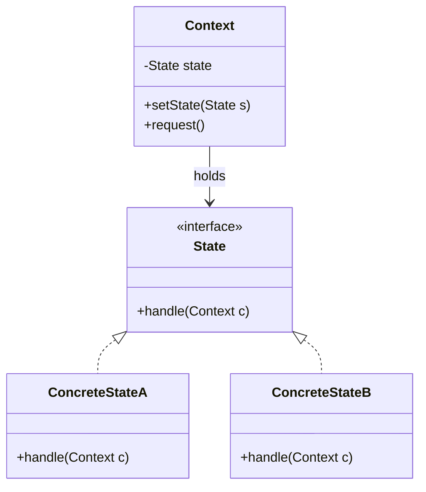

# 5.3 状态模式与代码实现

状态机图是设计模型，最终要落地为代码。最朴素的实现是用 `if-else` 或 `switch` 在每个方法里判断当前状态，但随着状态增多，分支会爆炸、难以维护。**状态模式**（State Pattern）通过把每个状态封装为独立类，把状态相关的行为多态化，消除分支判断，使状态机代码与状态机图直接对应。本节讲解状态模式原理、UML 到代码的映射、Java 实现及状态机框架。

## 状态模式原理

> [!definition] 状态模式
> 状态模式（State Pattern）属行为型设计模式。它允许一个对象在其内部状态改变时改变其行为，对象看起来像是修改了其类。核心做法是：把每个状态封装为一个状态类，统一实现一个状态接口；上下文对象持有当前状态对象的引用，把状态相关操作委托给当前状态对象；状态转换通过替换当前状态对象完成。

### 模式结构



| 角色 | 职责 | 对应 UML 状态机 |
| --- | --- | --- |
| Context（上下文） | 持有当前状态，委托请求 | 被建模的对象（如订单） |
| State（状态接口） | 声明状态相关行为 | 状态共有操作 |
| ConcreteState（具体状态） | 实现该状态下的行为，并触发转换 | 状态机中的每个状态 |

> [!note] 状态模式 vs 策略模式
> 二者结构相似，都把行为委托给策略/状态对象。区别在**意图**：策略模式由客户端主动选择策略，策略间通常独立、无转换；状态模式的状态对象自己知道如何转换到下一状态，转换由状态内部驱动，对上下文透明。

## UML 状态机到代码的映射

| UML 状态机元素 | 代码实现 |
| --- | --- |
| 状态 | 一个实现 State 接口的类 |
| 转换（事件 + 目标状态） | 在当前状态的 `handle` 中调用 `context.setState(new 目标状态())` |
| 监护条件 | `handle` 内的 `if` 判断 |
| entry/do/exit 动作 | 状态类的方法或 `setState` 时调用 |
| 事件 | Context 上的方法，委托给 `state.handle` |
| 初态 | Context 构造时 `state = new InitialState()` |

## Java 实现：订单状态机

以 [[5.2 状态建模方法与实践]] 的订单状态机为例，实现“待支付 → 已支付 → 已发货 → 已签收”主流程。

### 状态接口与上下文

```java
// 状态接口：声明订单在任意状态下都可能收到的事件
public interface OrderState {
    void pay(OrderContext order);     // 支付事件
    void ship(OrderContext order);    // 发货事件
    void sign(OrderContext order);    // 签收事件
    String getName();
}
```

```java
// 上下文：持有当前状态，把事件委托给状态对象
public class OrderContext {
    private OrderState state;

    public OrderContext() {
        this.state = new PendingPaymentState(); // 初态：待支付
    }

    public void setState(OrderState state) {
        System.out.println("状态转换: " + this.state.getName() + " -> " + state.getName());
        this.state = state;
    }

    public void pay()   { state.pay(this); }
    public void ship()  { state.ship(this); }
    public void sign()  { state.sign(this); }

    public OrderState getState() { return state; }
}
```

### 具体状态类

```java
// 待支付状态
public class PendingPaymentState implements OrderState {
    public String getName() { return "待支付"; }

    public void pay(OrderContext order) {
        // 监护条件：金额匹配（此处省略具体校验）
        System.out.println("扣款成功");
        order.setState(new PaidState()); // 转换到已支付
    }

    public void ship(OrderContext order) {
        System.out.println("非法操作：未支付不能发货");
    }

    public void sign(OrderContext order) {
        System.out.println("非法操作：未支付不能签收");
    }
}
```

```java
// 已支付状态
public class PaidState implements OrderState {
    public String getName() { return "已支付"; }

    public void pay(OrderContext order) {
        System.out.println("已支付，无需重复支付");
    }

    public void ship(OrderContext order) {
        System.out.println("生成运单");
        order.setState(new ShippedState()); // 转换到已发货
    }

    public void sign(OrderContext order) {
        System.out.println("非法操作：未发货不能签收");
    }
}
```

```java
// 已发货状态
public class ShippedState implements OrderState {
    public String getName() { return "已发货"; }

    public void pay(OrderContext order)  { System.out.println("已支付，无需重复支付"); }
    public void ship(OrderContext order) { System.out.println("已发货，无需重复发货"); }

    public void sign(OrderContext order) {
        System.out.println("记录签收时间");
        order.setState(new SignedState()); // 转换到已签收
    }
}
```

```java
// 已签收状态（接近终态）
public class SignedState implements OrderState {
    public String getName() { return "已签收"; }

    public void pay(OrderContext order)  { System.out.println("已支付，无需重复支付"); }
    public void ship(OrderContext order) { System.out.println("已签收，不可再发货"); }
    public void sign(OrderContext order) { System.out.println("已签收"); }
}
```

### 客户端调用

```java
public class Client {
    public static void main(String[] args) {
        OrderContext order = new OrderContext();
        order.pay();    // 扣款成功 -> 已支付
        order.ship();   // 生成运单 -> 已发货
        order.sign();   // 记录签收时间 -> 已签收
    }
}
```

> [!example]- 输出说明
> ```
> 扣款成功
> 状态转换: 待支付 -> 已支付
> 生成运单
> 状态转换: 已支付 -> 已发货
> 记录签收时间
> 状态转换: 已发货 -> 已签收
> ```
> 每个状态只允许合法事件，非法操作被拒绝；转换由状态类内部驱动，Context 无任何分支判断。

> [!tip] 状态模式的收益
> - **消除分支判断**：Context 不再用 `switch(state)` 判断，新增状态只需新增状态类；
> - **状态隔离**：每个状态的逻辑封装在自己的类中，互不干扰；
> - **开闭原则**：新增状态对扩展开放、对修改关闭；
> - **与 UML 图对应**：一个状态类对应状态图中的一个状态节点，转换对应 `setState` 调用，可读性强。

## 状态机框架介绍

手写状态模式适合状态较少的场景；状态复杂、转换密集时，可使用专门的状态机框架，集中管理转换表、监护条件与动作。

| 框架 | 语言 | 特点 |
| --- | --- | --- |
| Spring StateMachine | Java | 基于 Spring，支持分层状态、正交区域、状态持久化 |
| Squirrel-foundation | Java | 轻量，支持流式 API、状态机定义与事件触发 |
| XState | JavaScript/TypeScript | 前端常用，支持状态图可视化与演员模型 |
| Stateless | C# | .NET 平台轻量状态机，声明式配置 |

> [!note] 框架 vs 手写状态模式
> 手写状态模式结构清晰、无依赖，适合教学与简单场景；框架提供转换表、事件队列、状态持久化、可视化等能力，适合复杂业务状态机。选择依据：状态数量、是否需要持久化、团队技术栈。

## 小结

状态模式把每个状态封装为独立类，通过多态委托消除 `if-else`/`switch` 分支，使代码与 UML 状态机图直接对应。转换由状态类内部驱动 `setState`，监护条件变为 `handle` 内的判断，entry/exit 动作变为状态类方法。复杂状态机可借助 Spring StateMachine 等框架集中管理转换表。状态模式是连接动态建模与面向对象设计的关键落地手段。

## 关联

- 上一级：[[MOC - 第5章]]
- 上一节：[[5.2 状态建模方法与实践]]
- 设计模式基础：设计模式（State 属行为型）
- 类图语法：[[3.1 类图与对象图]]、[[3.2 属性、操作与可见性]]
- 下一章：[[MOC - 第6章]]
