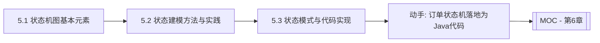

# MOC - 第5章 状态建模：状态机图

> [!info] 本章定位
> 第4章用时序图刻画“对象之间如何协作”，第5章转向单个对象自身的生命周期——**状态机图**（State Machine Diagram）回答“一个对象在生存期内有哪些状态、什么事件让它从一个状态转到另一个”。状态机是事件驱动建模的核心，特别适合描述订单、工单、连接、进程等具有明显生命周期的对象。本章还把状态机与设计模式结合，说明如何用 State 模式把状态机直接落地为可维护的代码。

## 学习路线图

## 知识点导航

| 节 | 主题 | 核心要点 | 入口 |
| --- | --- | --- | --- |
| 5.1 | 状态机图基本元素 | 初态/终态/中间状态、转换三要素、entry/do/exit、复合状态与历史状态 | [[5.1 状态机图基本元素]] |
| 5.2 | 状态建模方法与实践 | 生命周期分析、事件驱动转换、设计原则、正交区域、订单状态机案例 | [[5.2 状态建模方法与实践]] |
| 5.3 | 状态模式与代码实现 | State 模式原理、UML 到代码映射、Java 实现、状态机框架 | [[5.3 状态模式与代码实现]] |

## 核心考点

> [!warning] 重点掌握
> 1. 状态机三要素：状态（State）、事件（Event）、转换（Transition），以及转换的五元组 `源状态 / 触发事件 / 监护条件 / 动作 / 目标状态`。
> 2. 初态（实心圆）、终态（同心圆）与中间状态（圆角矩形）的图符。
> 3. 状态内部的三种行为：`entry`（进入动作）、`do`（内部活动）、`exit`（退出动作）。
> 4. 复合状态：子状态机、正交区域（并发状态）、历史状态（浅历史/深历史）。
> 5. 监护条件（Guard Condition）与触发事件的区别：事件决定“何时考虑转换”，监护条件决定“转换是否真正发生”。
> 6. 状态模式（State Pattern）如何把状态机映射为类层次，消除大量的 `if-else` / `switch` 分支。

## 自测题

> [!question] 题1
> 状态机中一个完整的转换由哪几部分组成？监护条件的作用是什么？
> > [!check]- 参考答案
> > 一个完整的转换（Transition）由五部分组成：**源状态**、**触发事件**（Trigger）、**监护条件**（Guard Condition，方括号内的布尔表达式）、**动作**（Action，斜杠后）、**目标状态**。监护条件的作用是在事件发生后判断转换是否真正执行：只有条件为真时转换才发生，否则忽略该事件或保持原状态。例如 `余额充足 [balance >= amount] / 扣款`。

> [!question] 题2
> 说明 `entry`、`do`、`exit` 三种状态内部行为的执行时机。
> > [!check]- 参考答案
> > - `entry`：进入状态时**立即执行一次**的原子动作，如 `entry/记录开始时间`；
> > - `do`：处于该状态期间**持续进行**的活动，可被打断，如 `do/播放动画`；
> > - `exit`：离开状态时**立即执行一次**的原子动作，如 `exit/释放资源`。
> > 执行顺序为：先执行新状态的 `entry`，再执行 `do` 活动，发生转换离开时执行 `exit`。

> [!question] 题3
> 什么是复合状态？正交区域（并发状态）解决什么问题？
> > [!check]- 参考答案
> > 复合状态是包含子状态的状态，子状态之间可构成顺序子状态机或并发的正交区域。**正交区域**（Orthogonal Region）用虚线分隔，表示对象在同一复合状态内同时处于多个独立的子状态，解决“一个对象同时具有多个独立维度的状态”问题。例如订单同时有“支付状态”和“物流状态”两个正交区域，二者独立演化。正交区域对应并发，进入复合状态时各区域同时激活。

> [!question] 题4
> 状态模式如何消除状态机代码中的大量分支判断？简述其结构。
> > [!check]- 参考答案
> > 状态模式把每个状态封装为一个独立的状态类，都实现同一个状态接口；上下文对象持有当前状态对象的引用，把状态相关行为委托给当前状态对象。发生转换时，上下文把当前状态替换为新状态对象。由于行为逻辑分散在各状态类中，上下文不再需要 `if-else`/`switch` 判断当前状态，新增状态只需新增一个状态类，符合开闭原则。结构为：`Context` 聚合 `State` 接口，`ConcreteStateA`、`ConcreteStateB` 等实现 `State`，转换由状态类触发并回写上下文。

## 章节导航

- 上一级：[[MOC - 面向对象系统分析与建模]]
- 上一章：[[MOC - 第4章]]
- 下一章：[[MOC - 第6章]]
