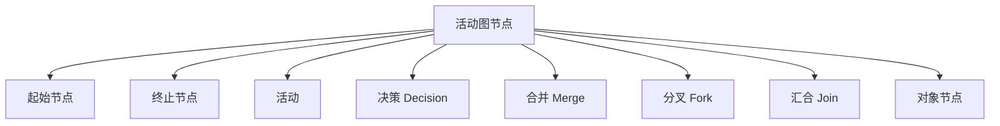
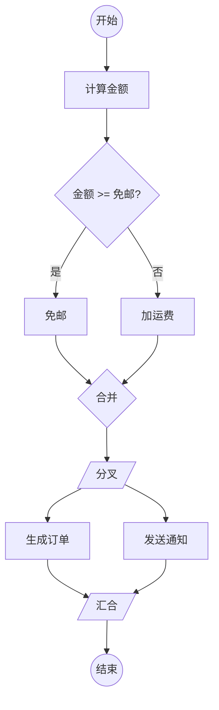
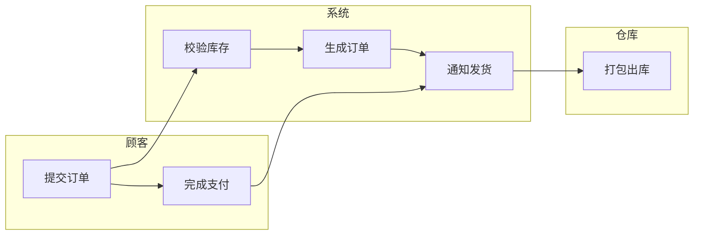
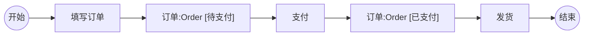
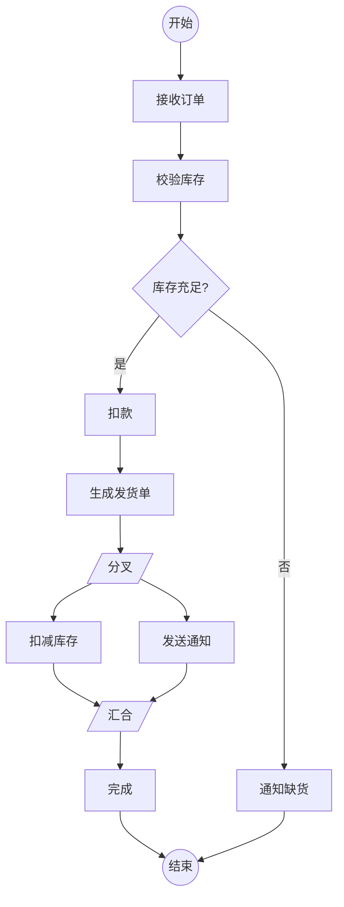

# 6.1 活动图基本元素与流程建模

活动图（Activity Diagram）是 UML 行为图之一，它用控制流把一系列活动组织起来，刻画“一个流程如何一步步推进”。活动图既能描述跨角色的业务流程，也能描述单个操作的算法步骤，是 UML 中最接近传统流程图的图种，但额外支持并发与对象流。它是业务分析、需求梳理与算法设计的通用工具。

## 活动图的元素

| 元素 | 图符 | 含义 |
| --- | --- | --- |
| 起始节点 | 实心圆 | 流程起点，每张图一个 |
| 终止节点 | 同心圆（带圆环） | 流程终点，可有多个或没有 |
| 活动（Action/Activity） | 圆角矩形 | 一个可执行步骤，如“校验库存” |
| 决策（Decision） | 菱形 | 互斥分支，每条出边带条件 |
| 合并（Merge） | 菱形 | 多条分支汇合，不判断条件 |
| 分叉（Fork） | 粗实线 | 并发开始，一进多出 |
| 汇合（Join） | 粗实线 | 并发汇合，多进一出，需全部到达 |
| 对象节点 | 矩形 | 活动输入/输出的对象 |

> [!warning] 决策 vs 分叉（高频考点）
> **决策**是互斥分支，图符菱形，一进多出但**只走一条**，每条出边带监护条件，类似 if-else。**分叉**是并发分支，图符粗实线，一进多出且**全部并行**，无监护条件，类似多线程启动。决策用菱形，分叉用粗实线，二者图符和语义都不同，切勿混淆。

### 决策与合并、分叉与汇合的配对

> [!example]- 节点配对说明
> - 菱形 `D` 是决策（互斥选其一），菱形 `M` 是合并（汇合两条分支，不再判断）；
> - 粗线 `FK` 是分叉（并发开始），粗线 `JN` 是汇合（等待两条并发流都到达）；
> - 决策与合并成对处理条件分支，分叉与汇合成对处理并发。决策可不经合并直接继续，但并发必须由汇合收口。

## 泳道

泳道（Swimlane）把活动图按角色或职责纵向分列，每个活动归入执行它的角色，体现“谁做什么”。

> [!note] 泳道的作用
> 泳道让职责归属一目了然，便于发现跨角色的协作瓶颈、识别可自动化的手工环节、为后续类与组件划分提供依据。泳道可按人、角色、子系统、组织划分，数量不宜过多（通常 3–6 条），否则图会过于庞大。

## 对象流

对象流（Object Flow）展示活动之间传递的对象。对象用矩形表示，可标注对象名、类型及状态（用 `[状态名]` 表示）。

> [!tip] 对象流与类图的呼应
> 对象流中的对象应是类图中定义的类的实例，对象的状态可与状态机图的状态对应。这样活动图、类图、状态机图三者通过“对象”这一概念衔接，形成完整的动态—静态闭环。

## Mermaid 活动图示例：订单处理

Mermaid 没有专门的活动图语法，通常用 `flowchart` 表达，节点形状近似 UML 图符：实心圆用 `(( ))`，菱形决策用 `{ }`，活动用 `[ ]`。

> [!example]- 图例说明
> - 起始节点 `S`、终止节点 `E` 用双圆括号；
> - 活动 `A1–A8` 用圆角矩形；
> - 决策 `D1` 用菱形，出边带“是/否”条件；
> - 分叉 `FK` 与汇合 `JN` 用粗线，处理“扣减库存”与“发送通知”的并发。

## 活动图与流程图对比

| 维度 | 活动图 Activity Diagram | 流程图 Flowchart |
| --- | --- | --- |
| 并发 | 支持（分叉/汇合） | 一般不支持 |
| 对象流 | 支持（对象节点 + 状态） | 不支持 |
| 泳道 | 标准支持 | 无标准（部分工具扩展） |
| 归属 | UML 标准，与其他 UML 图协同 | 通用工具，独立 |
| 表达力 | 业务流程 + 算法 + 并发 | 顺序流程为主 |
| 适用阶段 | OOA 业务建模 + OOD 算法设计 | 通用算法描述 |

> [!note] 选择依据
> 若流程含并发、需要展示对象传递、或要与 UML 静态/动态模型衔接，用活动图；若只是描述简单的顺序算法步骤，流程图更轻量。本课程要求掌握活动图。

## 小结

活动图用起止节点、活动、决策、合并、分叉、汇合刻画流程，用泳道划分职责，用对象流展示对象传递。决策与分叉是高频考点：决策是互斥分支（菱形），分叉是并发分支（粗线）。活动图相比流程图多了并发与对象流能力，是 UML 业务与算法建模的通用工具。

## 关联

- 上一级：[[MOC - 第6章]]
- 上一章：[[5.3 状态模式与代码实现]]
- 下一节：[[6.2 高级活动图与应用场景]]
- 图表协同：[[6.3 活动图与其他图的协同]]
