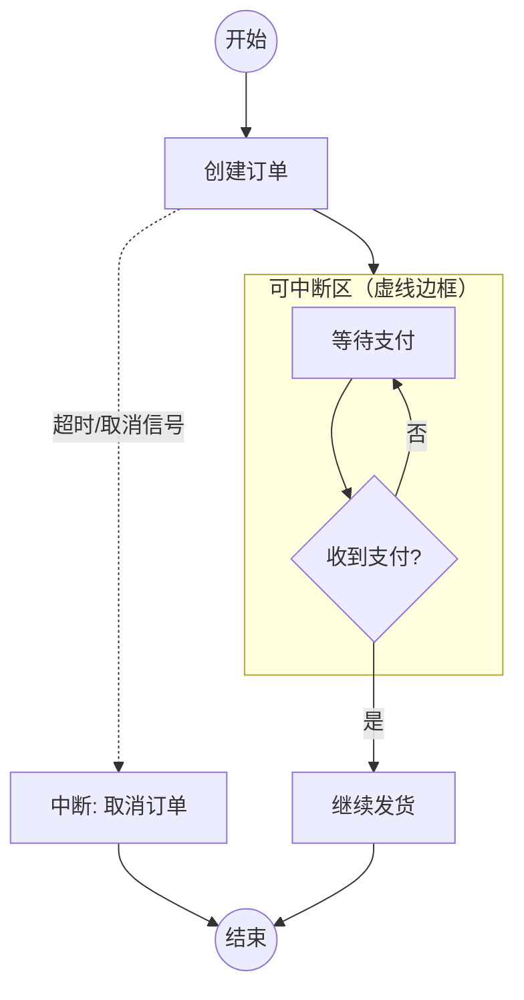
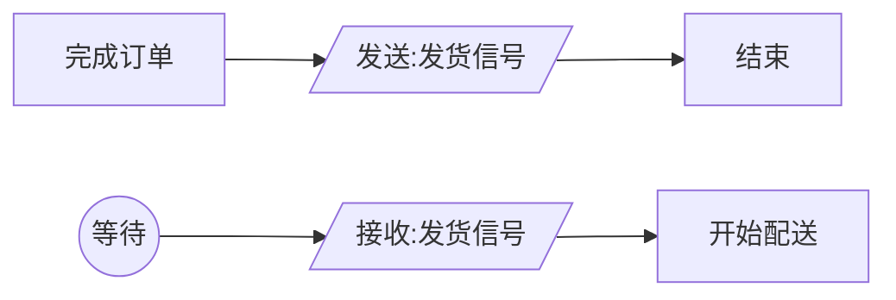
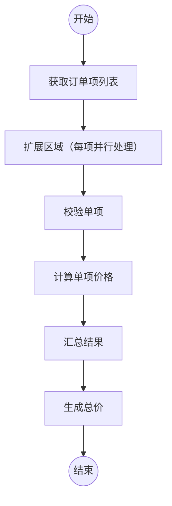
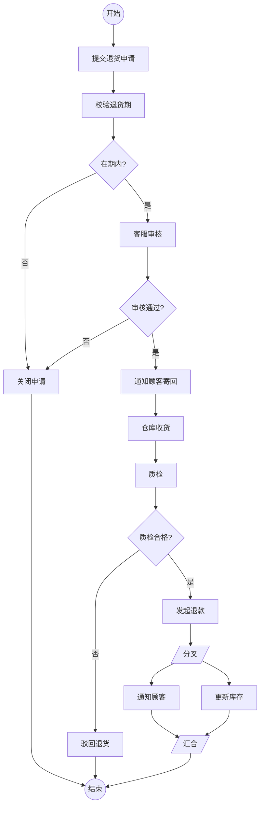
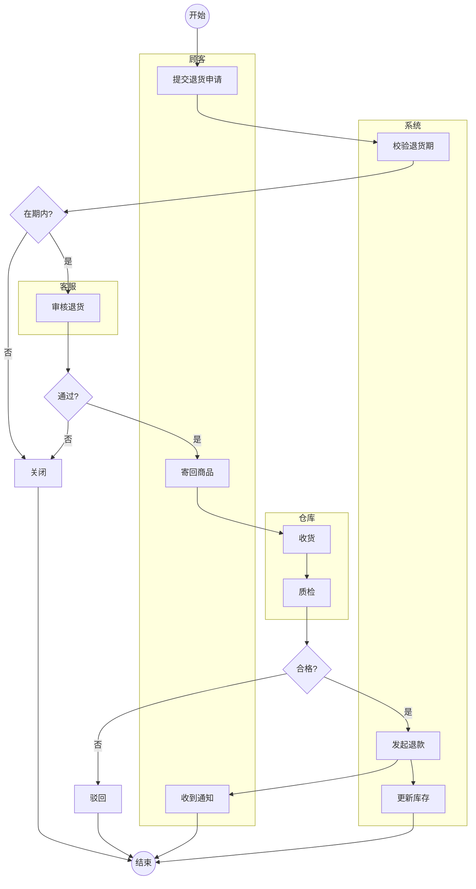

# 6.2 高级活动图与应用场景

基本活动图能表达顺序与并发流程，但真实业务中常出现“可中断”“信号触发”“批量处理”等需求。UML 提供了可中断活动区、发送/接收信号、扩展区域等高级构造来刻画这些场景。本节讲解这些构造的语义，并给出电商退货流程的完整活动图案例，展示活动图在业务流程建模中的实战价值。

## 可中断活动区

可中断活动区（Interruptible Activity Region）用一个虚线圆角矩形圈出一组活动，区域内若收到中断事件，整个区域被中止，控制流跳出。

> [!definition] 可中断活动区
> 区域内活动在执行中，若外部有中断事件（通常是接收信号）到达区域的边界，则区域被中断，所有进行中的活动终止，控制流经中断边转到区域外。典型场景：等待支付期间用户取消或超时，整个等待被中止。

> [!note] 中断与异常的区别
> 中断是“外部事件中止整个区域”，跳出后通常走专门的善后流程；异常分支是决策的互斥分支，仍在正常流程内。可中断活动区适合“等待某事件，期间可被打断”的场景。

## 发送信号与接收信号

信号是异步通信的载体，活动图用特定图符表示发送与接收：

| 构造 | 图符 | 含义 |
| --- | --- | --- |
| 发送信号 | 凸五边形（向右尖角） | 活动产生一个信号并发送 |
| 接收信号 | 凹五边形（向左凹角） | 等待并接收一个信号后继续 |

> [!tip] 信号的应用
> 信号用于跨流程、跨系统的异步通知。例如订单服务完成订单后“发送发货信号”，物流服务“接收发货信号”后开始配送，两个流程通过信号解耦。信号常与可中断活动区配合：等待信号的区域内若收到特定信号即中断。

## 扩展区域

扩展区域（Expansion Region）对集合中的每个元素并行或顺序执行内部活动，类似 `for-each`。用四角内凹的矩形表示，输入输出为集合，区域内的活动对每个元素执行一次。

> [!example]- 扩展区域说明
> 订单含多个订单项，扩展区域对每个订单项并行执行“校验—计算价格”，最后汇总。扩展区域有三种模式：`parallel`（并行）、`iterative`（顺序迭代）、`stream`（流式）。适合处理大规模同质数据集，避免为每个元素单独画一条路径。

## 活动图在业务流程建模中的应用

活动图是业务流程建模（BPM）的利器，原因在于：

1. **泳道划分责任主体**：把跨部门流程按角色分列，明确谁做什么；
2. **对象流体现数据流转**：展示表单、文档、订单等对象在流程中的传递与状态变化；
3. **决策与并发刻画业务规则**：条件分支表达审批规则，分叉表达并行任务；
4. **可中断区处理超时与取消**：真实业务的“等待—超时”场景；
5. **与用例、类图衔接**：活动图细化用例流程，对象流呼应类图。

> [!warning] 业务建模时的常见误区
> - 把每个系统操作都画成活动，导致图过于细碎——应在业务动作粒度建模，而非代码粒度；
> - 混淆决策与分叉——条件用菱形决策，并发用粗线分叉；
> - 忘记汇合收口——分叉产生的并发流必须由汇合收束，否则流程不完整。

## 完整案例：电商退货流程活动图

**流程描述**：
1. 顾客提交退货申请，附订单号与原因；
2. 系统校验是否在退货期内；
3. 客服审核：通过则通知顾客寄回，拒绝则关闭申请；
4. 仓库收到退货，质检：合格则退款，不合格则驳回；
5. 退款后并发执行“通知顾客”与“更新库存”。

### 加入泳道的版本

> [!example]- 退货案例要点
> - **泳道**：顾客、客服、系统、仓库四条泳道，职责清晰；
> - **决策**：退货期内、审核通过、质检合格三处互斥分支；
> - **并发**：退款后同时“通知顾客”与“更新库存”（第一图用分叉/汇合）；
> - **多终态**：关闭、驳回、正常结束都通向终止节点；
> - **对象流呼应**：退货申请、商品、退款记录可作为对象节点，对应类图中的类。

## 小结

高级活动图通过可中断活动区处理“等待—中断”，通过发送/接收信号刻画异步通信，通过扩展区域批量处理集合元素。在业务流程建模中，活动图结合泳道、决策、并发与对象流，能把跨部门流程完整可视化。电商退货案例展示了多泳道、多决策、并发与多终态的综合运用。

## 关联

- 上一级：[[MOC - 第6章]]
- 上一节：[[6.1 活动图基本元素与流程建模]]
- 下一节：[[6.3 活动图与其他图的协同]]
- 业务依据：[[2.2 用例描述与需求规约]]
