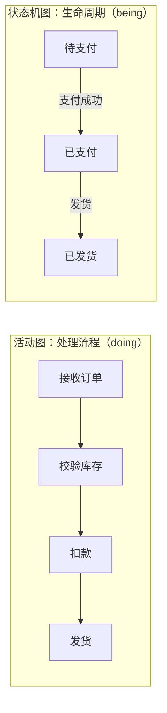
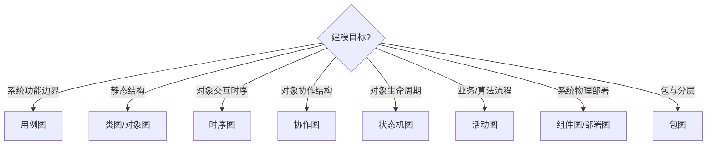

# 6.3 活动图与其他图的协同

UML 提供了十余种图，每种图只刻画系统的某一个侧面。单独看任何一张图都无法完整理解系统，必须把多张图协同使用，从不同视角相互补充、相互验证。本节聚焦活动图与用例图、时序图、状态机图的关系，给出建模图表的选择策略，帮助在合适场景选对图种。

## 活动图与用例图：业务流程补充

| 维度 | 用例图 | 活动图 |
| --- | --- | --- |
| 视角 | 用户视角，回答“系统能做什么” | 流程视角，回答“怎么做” |
| 粒度 | 一个用例是一个功能单元 | 细化用例内部的步骤序列 |
| 元素 | 参与者、用例、关系 | 活动、决策、泳道、对象流 |
| 用途 | 需求边界与功能清单 | 用例流程的详细展开 |

> [!note] 协同方式
> 用例图给出系统功能边界，每个用例可对应一张活动图，详细展开其主成功场景与扩展场景的步骤。活动图是“用例描述的可视化版”，把文字步骤转为图形流程，便于发现遗漏步骤与异常分支。详见 [[2.1 用例图基本元素与绘制]]、[[2.2 用例描述与需求规约]]。

## 活动图与时序图：动态行为互补

| 维度 | 活动图 | 时序图 |
| --- | --- | --- |
| 主体 | 活动/步骤 | 对象 |
| 强调 | 流程推进与控制流 | 对象间消息时序 |
| 并发 | 分叉/汇合显式表达 | par 片段表达 |
| 职责 | 泳道划分角色 | 对象划分调用 |
| 适用 | 业务流程、算法流程 | 单个用例的对象交互 |

> [!tip] 选择依据
> 关心“流程怎么走、有哪些分支与并发”用活动图；关心“哪些对象参与、按什么顺序互相调用”用时序图。同一个用例可以先画活动图梳理流程，再画时序图落实到对象。二者常配合使用：活动图定流程骨架，时序图填对象交互细节。详见 [[4.1 时序图基本元素与绘制]]。

## 活动图与状态机图：对比分析

| 维度 | 活动图 | 状态机图 |
| --- | --- | --- |
| 关注对象 | 流程/用例 | 单个对象 |
| 驱动 | 控制流（活动完成即推进） | 事件驱动（事件触发转换） |
| 节点 | 活动（做事） | 状态（处于某种情形） |
| 转换 | 自动推进或带条件 | 必须有触发事件 |
| 适用 | 业务/算法流程 | 对象生命周期 |

> [!warning] 活动图与状态机图的本质区别
> 活动图的节点是**活动**（doing，正在做的事），活动完成后控制流自动推进到下一活动；状态机图的节点是**状态**（being，所处的情形），状态不会自动改变，必须有外部**事件**触发转换。活动图描述“流程”，状态机图描述“对象生命周期”。例如“订单处理”用活动图（描述处理步骤），而“订单状态”用状态机图（描述待支付/已支付/已发货等状态及触发事件）。详见 [[5.1 状态机图基本元素]]。

### 同一对象的两种视角

以订单为例：

> [!example]- 双视角说明
> 活动图刻画“订单被处理的步骤序列”，状态机图刻画“订单本身经历的状态与触发事件”。前者是流程视角，后者是对象视角，二者互补：活动图的某些活动完成往往对应状态机的一次状态转换（如“扣款”完成对应订单从“待支付”转到“已支付”）。

## 建模图表选择策略

| 建模目标 | 首选图 | 备选/补充 |
| --- | --- | --- |
| 系统功能与参与者 | 用例图 | 活动图细化用例 |
| 静态结构与关系 | 类图 | 对象图实例化 |
| 对象交互时序 | 时序图 | 协作图看结构 |
| 对象生命周期 | 状态机图 | 活动图看流程 |
| 业务/算法流程 | 活动图 | 时序图落实对象 |
| 物理架构 | 组件图、部署图 | 包图看逻辑分层 |

> [!note] 图表协同原则
> 1. **静态先行**：先类图建立骨架，再动态图补充行为；
> 2. **多图互验**：时序图的对象应是类图的实例，活动图的对象流呼应类图，状态机的状态可与活动图对象流的状态对应；
> 3. **按需选择**：不为每个视角都画图，选最能表达当前设计意图的图；
> 4. **避免重复**：同一信息不要在多张图重复维护，用链接和引用关联。

## UML 图全景对照

| 类别 | 图 | 核心问题 | 章节 |
| --- | --- | --- | --- |
| 结构图 | 类图、对象图、组件图、部署图、包图、复合结构图 | 系统由什么构成 | 第3、7章 |
| 行为图 | 用例图、活动图、状态机图 | 系统做什么、怎么行为 | 第2、5、6章 |
| 交互图 | 时序图、协作图、交互概览图、时间图 | 对象如何交互 | 第4章 |

> [!tip] 记忆口诀
> 结构图看“有什么”（类、对象、组件、部署、包），行为图看“做什么”（用例、活动、状态），交互图看“怎么交互”（时序、协作）。本课程重点掌握：用例图、类图、时序图、协作图、状态机图、活动图、组件图、部署图、包图。

## 小结

活动图与用例图协同（细化用例流程）、与时序图协同（流程骨架配对象交互）、与状态机图对比（doing vs being）。建模时按目标选图：功能边界用用例图，静态结构用类图，交互时序用时序图，对象生命周期用状态机图，业务流程用活动图。多图互验、按需选择、避免重复是图表协同的基本原则。

## 关联

- 上一级：[[MOC - 第6章]]
- 上一节：[[6.2 高级活动图与应用场景]]
- 协同图表：[[2.1 用例图基本元素与绘制]]、[[3.1 类图与对象图]]、[[4.1 时序图基本元素与绘制]]、[[5.1 状态机图基本元素]]
- 下一章：[[MOC - 第7章]]
