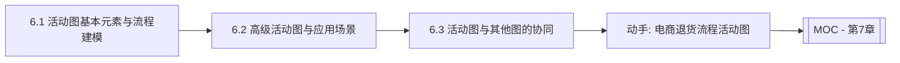

# MOC - 第6章 活动建模：活动图

> [!info] 本章定位
> 第4章的时序图刻画“对象之间如何协作”，第5章的状态机图刻画“单个对象的生命周期”，第6章的活动图（Activity Diagram）则刻画“一个流程如何一步步推进”。活动图是 UML 中最接近流程图的图种，它用控制流和数据流把活动、决策、并发、对象传递组织起来，既能描述业务流程，也能描述算法流程与系统行为。本章解决三个问题：活动图的基本元素与流程建模、高级活动图的应用场景、活动图与其他 UML 图的协同选择。

## 学习路线图

## 知识点导航

| 节 | 主题 | 核心要点 | 入口 |
| --- | --- | --- | --- |
| 6.1 | 活动图基本元素与流程建模 | 起止节点/活动/决策/分叉/汇合、泳道、对象流、与流程图对比 | [[6.1 活动图基本元素与流程建模]] |
| 6.2 | 高级活动图与应用场景 | 可中断活动区、信号、扩展区域、业务流程建模、电商退货案例 | [[6.2 高级活动图与应用场景]] |
| 6.3 | 活动图与其他图的协同 | 活动图与用例/时序/状态图对比、图表选择策略 | [[6.3 活动图与其他图的协同]] |

## 核心考点

> [!warning] 重点掌握
> 1. 活动图基本节点：起始节点（实心圆）、终止节点（同心圆）、活动（圆角矩形）、决策（菱形）、合并、分叉（粗实线）、汇合（粗实线）。
> 2. 决策与分叉的区别：决策是“互斥分支”（一进多出选一），分叉是“并发分支”（一进多出全走）。
> 3. 泳道（Swimlane）：按角色或职责划分活动归属，体现“谁做什么”。
> 4. 对象流（Object Flow）：活动输入/输出的对象，用矩形表示，可附加状态。
> 5. 活动图与流程图的本质区别：活动图支持并发（分叉/汇合）与对象流，是 UML 标准的一部分；流程图通常不支持并发与对象。
> 6. 可中断活动区、发送/接收信号、扩展区域等高级构造的语义。

## 自测题

> [!question] 题1
> 活动图中决策（Decision）与分叉（Fork）有何本质区别？各自的图符是什么？
> > [!check]- 参考答案
> > **决策**是互斥分支：一个控制流进入，根据监护条件选择**唯一**一条出边执行，图符为**菱形**，每条出边带条件，类似 if-else。**分叉**是并发分支：一个控制流进入，**同时**产生多条并行的控制流，图符为**粗实线（水平或竖直）**，表示并发开始，无监护条件。决策是“选其一”，分叉是“全都要”。分叉需与汇合（Join）配对，把并发流重新汇合。

> [!question] 题2
> 什么是泳道？它在活动图中的作用是什么？
> > [!check]- 参考答案
> > 泳道（Swimlane）把活动图按角色、组织或子系统纵向划分为若干列，每个活动归入对应泳道，表示该活动由谁负责执行。作用是明确职责归属、发现协作瓶颈、识别可自动化的环节。例如退货流程可分为“顾客”“客服”“仓库”三条泳道，每个活动放在相应角色下，一眼看出谁做什么。

> [!question] 题3
> 活动图与流程图有何区别？为什么说活动图更适合面向对象建模？
> > [!check]- 参考答案
> > 区别：(1) 活动图支持**并发**（分叉/汇合），流程图一般不支持；(2) 活动图支持**对象流**，可展示活动间传递的对象及其状态，流程图无；(3) 活动图支持**泳道**划分职责，流程图无标准泳道；(4) 活动图是 UML 标准，与其他 UML 图（类图、时序图）可协同，流程图是通用工具。活动图更适合面向对象建模，因为它能表达对象传递、并发行为，并与 UML 静态/动态模型无缝衔接。

> [!question] 题4
> 什么是可中断活动区？给出一个典型应用场景。
> > [!check]- 参考答案
> > 可中断活动区（Interruptible Activity Region）是活动图中一个用虚线圆角矩形圈出的区域，区域内的活动在执行过程中若收到特定中断事件（如“取消”信号），则整个区域被中止，控制流跳出区域。典型场景：用户下单后进入“等待支付”可中断区，若超时或用户主动取消，整个支付等待被中断，流程跳转到“取消订单”；若正常支付完成则离开区域继续后续流程。

## 章节导航

- 上一级：[[MOC - 面向对象系统分析与建模]]
- 上一章：[[MOC - 第5章]]
- 下一章：[[MOC - 第7章]]
