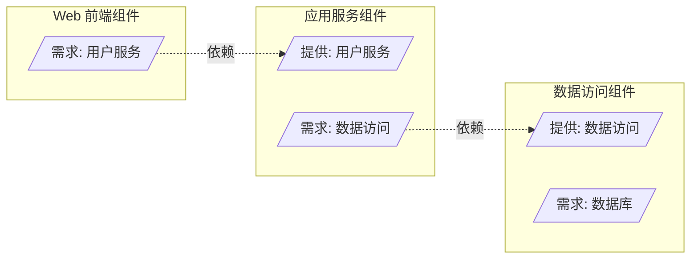
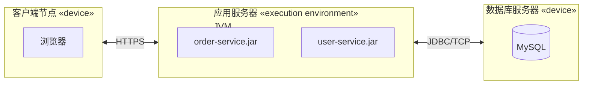
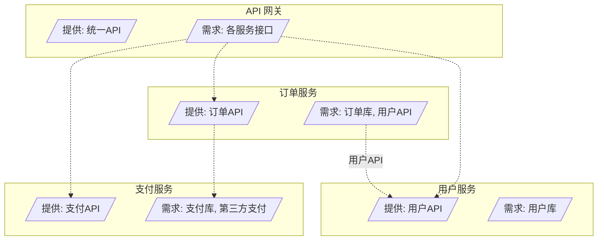
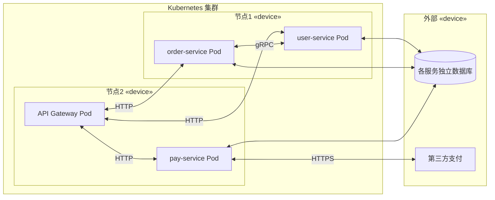

# 7.1 组件图与部署图

组件图与部署图是 UML 的两种结构图，刻画系统的物理组成：组件图回答“系统由哪些可部署单元构成、它们通过什么接口协作”，部署图回答“这些组件部署在哪些硬件节点上、节点间如何通信”。二者常配合使用，是分布式系统、微服务架构与运维文档的核心建模工具。

## 组件图

> [!definition] 组件
> 组件（Component）是系统中一个**可替换、可独立部署**的模块化单元，它通过接口对外提供能力并声明所需依赖。组件封装内部实现，外部只能通过其接口使用，是组件化设计与 SOA/微服务的基础。

### 组件图的元素

| 元素 | 图符 | 含义 |
| --- | --- | --- |
| 组件 | 带两个小标签的矩形 | 可独立部署的模块化单元 |
| 提供接口 | 棒棒糖（实线圆圈） | 组件对外提供的服务 |
| 需求接口 | 插座（半圆凹槽） | 组件依赖的外部服务 |
| 依赖 | 虚线箭头 | 组件使用另一组件的能力 |
| 端口 | 组件边界上的小方块 | 组件与外界的交互点 |

> [!note] 提供接口与需求接口
> **提供接口**（Provided Interface）是组件对外暴露的能力，图符为“棒棒糖”（圆圈连实线）。**需求接口**（Required Interface）是组件运行所需、须由他人提供的服务，图符为“插座”（半圆凹槽）。一个组件的需求接口与另一组件的提供接口匹配，即可通过依赖组装，体现“可插拔”的松耦合设计。

### 组件图示例：分层组件

> [!example]- 图例说明
> - Web 前端组件“需求”用户服务，应用服务组件“提供”用户服务，二者通过接口匹配组装；
> - 应用服务组件又“需求”数据访问，数据访问组件“提供”该能力；
> - 组件间只依赖接口而非具体实现，任一组件可被提供相同接口的其他组件替换。

> [!tip] 组件 vs 类
> 组件比类粒度更大：一个组件通常包含多个类，是部署与替换的单位；类是设计与编码的单位。组件强调“通过接口组装”，类强调“内部结构与关系”。组件图用于架构层，类图用于设计层。

## 部署图

> [!definition] 部署图
> 部署图（Deployment Diagram）描述软件组件在硬件节点上的运行时布局，展示节点、节点间的通信路径以及部署在节点上的组件制品（Artifact）。

### 部署图的元素

| 元素 | 图符 | 含义 |
| --- | --- | --- |
| 节点（Node） | 立方体 | 硬件或执行环境，如服务器、JVM、容器 |
| 设备节点 | 立方体 `«device»` | 物理硬件设备 |
| 执行环境节点 | 立方体 `«execution environment»` | 软件运行环境，如 JVM、应用服务器 |
| 制品（Artifact） | 节点内矩形 | 部署的物理文件，如 jar、war、镜像 |
| 通信路径 | 节点间的实线 | 节点间网络连接，可标注协议 |

### 部署图示例：三层部署

> [!example]- 部署图说明
> - 客户端是设备节点，运行浏览器；
> - 应用服务器是执行环境节点（JVM），部署 `order-service.jar` 与 `user-service.jar` 两个制品；
> - 数据库服务器是设备节点，运行 MySQL；
> - 节点间通信路径标注协议：客户端到应用走 HTTPS，应用到数据库走 JDBC/TCP。

## 微服务架构组件图案例

微服务架构天然适合用组件图与部署图表达：每个微服务是一个组件，通过 API 接口协作；每个服务独立部署到节点。

> [!example]- 微服务案例要点
> - **组件图**：每个微服务是一个组件，通过提供/需求接口协作；订单服务依赖用户服务接口（服务间调用）与订单库；
> - **部署图**：服务以 Pod 形式部署在 K8s 节点，API 网关统一入口，各服务有独立数据库（Database-per-service 模式），支付服务调用第三方支付；
> - 组件图关注“逻辑接口依赖”，部署图关注“物理运行布局”，二者互补。

## 小结

组件图用组件、提供/需求接口、依赖刻画系统的可部署单元及其接口协作；部署图用节点、制品、通信路径刻画组件在硬件上的运行时布局。提供接口（棒棒糖）与需求接口（插座）的匹配实现可插拔组装。微服务架构是组件图与部署图的典型应用场景。二者配合，逻辑接口依赖与物理部署一目了然。

## 关联

- 上一级：[[MOC - 第7章]]
- 上一章：[[6.3 活动图与其他图的协同]]
- 下一节：[[7.2 包图与系统架构]]
- 静态依据：[[3.1 类图与对象图]]
