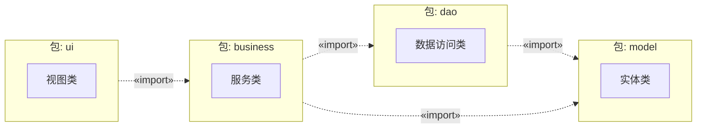
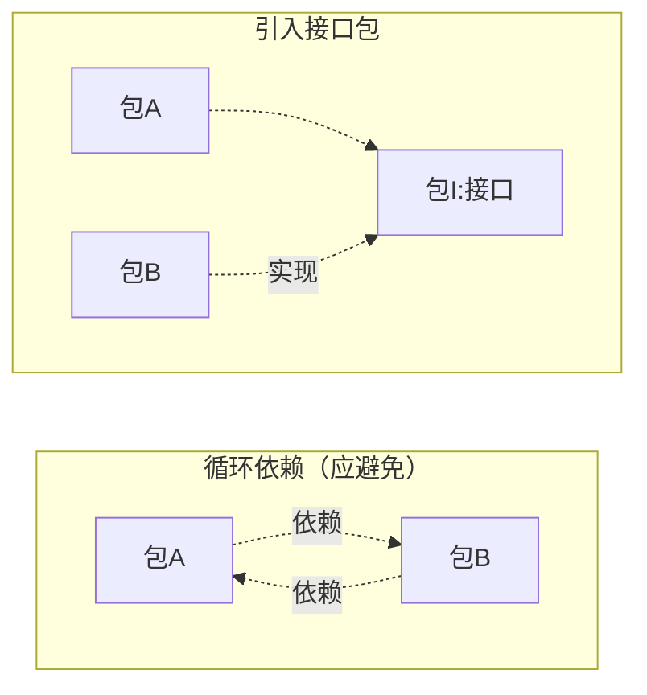
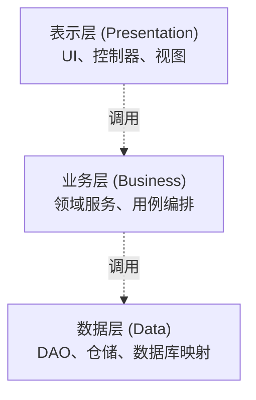
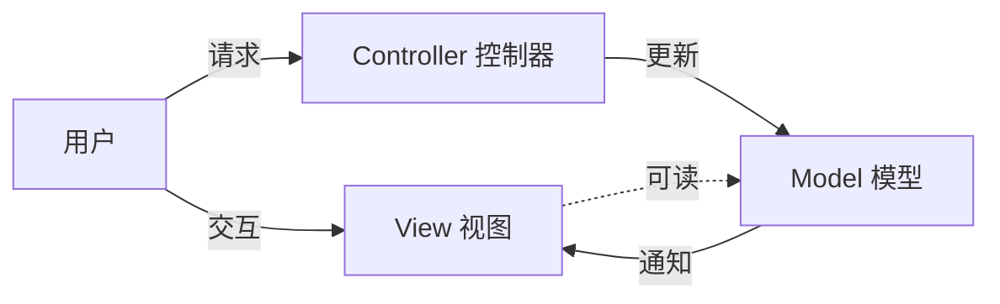
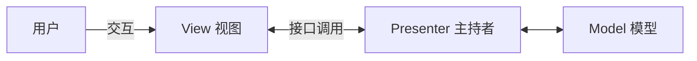
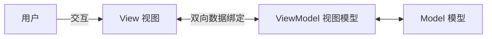

# 7.2 包图与系统架构

包图（Package Diagram）用“包”组织 UML 元素，刻画系统的逻辑分组与依赖关系，是表达系统分层架构的工具。合理的包划分能控制耦合度、明确职责边界、支持独立编译与演化。本节讲解包图的元素、包间耦合控制、分层架构，以及 MVC、MVP、MVVM 三种经典架构模式。

## 包图的元素

> [!definition] 包
> 包（Package）是 UML 的通用分组机制，类似文件系统的文件夹。包可包含类、接口、用例、组件甚至其他包，形成嵌套结构。包用“文件夹”图符（带标签的折角矩形）表示。

| 元素 | 图符 | 含义 |
| --- | --- | --- |
| 包 | 折角矩形 | 元素的分组容器 |
| 嵌套包 | 包内含包 | 层次化组织 |
| 依赖 | 虚线箭头 | 一个包用到另一包的元素 |
| `«import»` | 带依赖关键字 | 引入目标包的命名空间，可用其公有元素 |
| `«access»` | 带依赖关键字 | 访问目标包元素但不引入命名空间 |
| `«merge»` | 带依赖关键字 | 合并目标包内容（较高级） |

> [!example]- 包图说明
> - `ui` 包依赖 `business`，`business` 依赖 `dao` 与 `model`，依赖方向自上而下；
> - 每个包把相关类组织在一起，包间只通过 `«import»` 暴露公有元素；
> - 这种分层包结构是分层架构的直接体现。

## 包间耦合度控制

包间依赖决定了系统的耦合度与可演化性，应遵循以下原则：

> [!warning] 包依赖原则
> 1. **依赖应单向**：包 A 依赖包 B 时，B 不应反向依赖 A，否则形成循环；
> 2. **避免循环依赖**：循环依赖使包群实际耦合为一体，无法独立编译、测试与发布；
> 3. **依赖稳定方向**：让易变的包依赖稳定的包，而非相反；
> 4. **面向接口包依赖**：依赖抽象接口包而非具体实现包（依赖倒置）；
> 5. **内聚度优先**：一起变更的类应放同一包，无关的类分到不同包。

### 循环依赖的消除

> [!tip] 重构循环依赖的方法
> - **引入接口包**：把公共抽象提到新包，让双方都依赖它；
> - **依赖倒置**：让一方依赖另一方的抽象接口而非实现；
> - **合并包**：若两包高度耦合难以分离，合并为一个包；
> - **重新分配类**：把引发循环的类移到更合适的包。

## 分层架构

分层架构把系统按职责分为若干层，每层只与相邻层交互，是包图最常见的组织形式。

| 层 | 职责 | 典型元素 |
| --- | --- | --- |
| 表示层 | 与用户交互、收发请求、展示数据 | 控制器、视图、API 端点 |
| 业务层 | 业务规则、用例编排、领域逻辑 | 服务、领域模型、用例类 |
| 数据层 | 持久化、数据访问 | DAO、仓储、ORM、数据库 |

> [!note] 分层依赖方向
> 标准分层架构中，**上层依赖下层，下层不感知上层**。表示层调用业务层，业务层调用数据层；数据层不应反向调用业务层（否则破坏分层）。跨层调用（如表示层直达数据层）通常视为反模式，应避免。严格的分层只允许调用相邻层，松散分层允许跨层但保持单向。

## 架构模式：MVC、MVP、MVVM

三种模式都是表示层与业务逻辑分离的经典方案，差异在于中间角色与同步机制。

### MVC（Model-View-Controller）

| 角色 | 职责 |
| --- | --- |
| Model | 业务数据与领域逻辑 |
| View | 展示数据，监听 Model 变化 |
| Controller | 接收输入，调用 Model，选择 View |

> [!note] MVC 特点
> View 可直接访问 Model 读取数据，Model 通过观察者模式通知 View 刷新。Controller 只处理输入与流程编排，不负责 View 的具体渲染。MVC 适合 Web 后端（如 Spring MVC）。

### MVP（Model-View-Presenter）

> [!note] MVP 特点
> View 与 Model **完全隔离**，只能通过 Presenter 通信。View 实现一个接口供 Presenter 调用更新视图，Presenter 持有 View 接口引用。由于 View 通过接口抽象，Presenter 可独立单元测试。MVP 适合桌面、Android 等需要测试的场景。

### MVVM（Model-View-ViewModel）

> [!note] MVVM 特点
> ViewModel 通过**数据绑定**让 View 自动同步，View 依赖 ViewModel 的属性与命令，ViewModel 不直接持有 View 引用。双向绑定减少了手动更新视图的样板代码。MVVM 适合 WPF、Vue、Knockout 等支持绑定的框架。

### 三种模式对比

| 维度 | MVC | MVP | MVVM |
| --- | --- | --- | --- |
| 中间角色 | Controller | Presenter | ViewModel |
| View 访问 Model | 可以 | 不可以 | 不可以 |
| 同步机制 | 观察者通知 | Presenter 接口调用 | 数据绑定 |
| View 可测试性 | 弱 | 强 | 强 |
| 典型场景 | Web 后端 | 桌面/移动 | 现代前端 |

> [!tip] 选择依据
> Web 后端选 MVC；需要单元测试 View 逻辑的桌面/移动端选 MVP；前端框架支持数据绑定时选 MVVM。三者本质都是“关注点分离”，让表示、逻辑、数据各司其职。

## 小结

包图用包组织元素、用依赖表达关系，是表达系统逻辑分层的工具。包间依赖应单向、避免循环，通过引入接口包、依赖倒置消除循环。分层架构把系统分为表示、业务、数据三层，依赖自上而下。MVC、MVP、MVVM 三种模式以不同中间角色与同步机制实现表示与逻辑分离，按场景选择。

## 关联

- 上一级：[[MOC - 第7章]]
- 上一节：[[7.1 组件图与部署图]]
- 下一节：[[7.3 软件架构建模与模式]]
- 静态依据：[[3.1 类图与对象图]]
