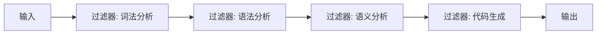
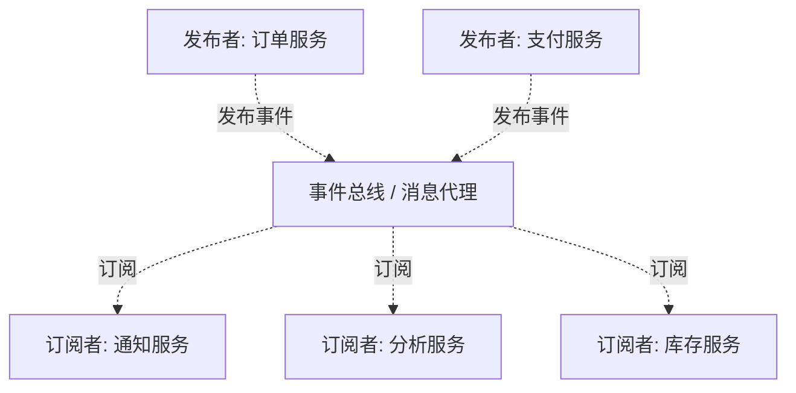
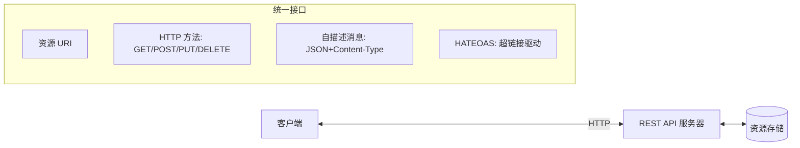
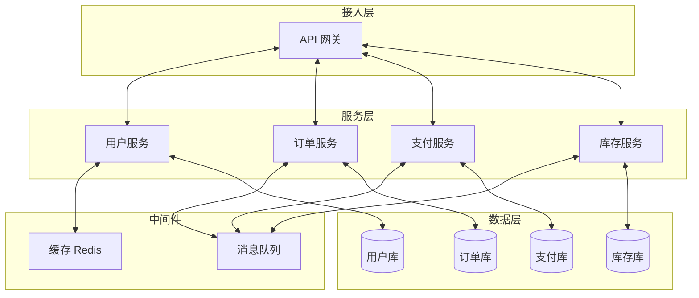

# 7.3 软件架构建模与模式

软件架构是系统的高层结构决策，决定了系统的质量属性上限。本节从更宏观的视角讨论架构：常见架构风格（管道-过滤器、客户端-服务器、分层、事件驱动）、架构模式应用（微服务、SOA、REST）、架构质量属性（性能、可用性、安全性、可修改性），以及用架构决策记录（ADR）沉淀架构决策。这是把 UML 模型与工程架构实践衔接的最后一环。

## 软件架构风格

> [!definition] 架构风格
> 架构风格（Architectural Style）是一组约束系统组织方式的规则，定义了组件、连接器及其组合的模式。它是一种可复用的架构模板，影响系统的质量属性。

| 架构风格 | 核心思想 | 优势 | 典型应用 |
| --- | --- | --- | --- |
| 管道-过滤器 | 数据流经一系列过滤器顺序处理 | 流程清晰、过滤器可复用、支持并行 | 编译器、ETL、Unix 管道 |
| 客户端-服务器 | 客户端发请求，服务器提供服务 | 资源集中、易管理 | Web 应用、数据库 |
| 分层 | 按职责分层，层间单向依赖 | 关注点分离、可替换层 | 企业应用、OSI 模型 |
| 事件驱动 | 组件通过发布/订阅事件通信 | 松耦合、可扩展 | GUI、消息系统、IoT |
| 仓库/黑板 | 共享数据存储，多个独立组件访问 | 数据集中、组件独立 | IDE、知识系统 |
| 解释器 | 解释执行特定语言的程序 | 灵活、可扩展规则 | 规则引擎、DSL |

### 管道-过滤器风格示例



### 事件驱动风格示例



> [!example]- 风格说明
> - **管道-过滤器**：数据像流水线一样经过多个过滤器，每个过滤器独立处理并输出，适合数据变换流水线；
> - **事件驱动**：发布者与订阅者通过事件总线解耦，互不感知，扩展时只需新增订阅者，适合松耦合的分布式系统。

## 架构模式应用

架构模式比架构风格更具体，针对特定问题给出可复用的解决方案。

### 微服务 vs SOA vs REST

| 维度 | 微服务 | SOA | REST |
| --- | --- | --- | --- |
| 粒度 | 细粒度，每个服务专注单一业务 | 辩证粒度，服务可较大 | 资源粒度，HTTP 接口风格 |
| 通信 | 轻量（HTTP/gRPC + 消息队列） | 企业服务总线 ESB | HTTP 方法 + 资源 URI |
| 数据 | 每服务独立数据库 | 共享数据库 | 不涉及数据存储 |
| 部署 | 独立部署、独立演化 | 集中编排 | 接口风格，不规定部署 |
| 定位 | 架构风格 | 架构风格 | 接口设计风格 |

> [!warning] 微服务 vs SOA 的本质区别
> SOA 依赖 ESB 集中编排、常共享数据库；微服务去中心化、每服务独立数据库、用轻量协议直接通信。微服务是 SOA 思想的现代化与细化，强调“独立部署、独立数据、去中心化治理”。REST 是接口设计风格，可被微服务或 SOA 采用，三者层次不同。

### REST 架构约束

REST（Representational State Transfer）是一组架构约束，核心包括：

1. **客户端-服务器**：分离关注点，客户端与服务器独立演化；
2. **无状态**：每个请求自包含，服务器不保存会话状态；
3. **可缓存**：响应可标记是否可缓存，提升性能；
4. **统一接口**：资源 URI、HTTP 方法、自描述消息、HATEOAS；
5. **分层系统**：客户端不感知中间代理；
6. **按需代码**（可选）：服务器可下发可执行代码。



## 架构质量属性

架构决策直接影响系统的质量属性（Quality Attributes），也称“非功能性需求”。

| 质量属性 | 含义 | 典型战术 |
| --- | --- | --- |
| 性能 | 响应时间、吞吐量 | 缓存、并发、异步、负载均衡 |
| 可用性 | 系统可用时长占比 | 冗余、故障转移、心跳检测 |
| 安全性 | 抵御攻击、保护数据 | 认证授权、加密、审计 |
| 可修改性 | 适应变更的容易程度 | 模块化、低耦合、抽象接口 |
| 可测试性 | 易于发现缺陷 | 接口抽象、依赖注入、可观察性 |
| 可伸缩性 | 负载增长时的扩展能力 | 水平扩展、无状态、分片 |
| 可靠性 | 持续无故障运行 | 重试、幂等、事务、限流 |

> [!note] 质量属性之间的权衡
> 质量属性常相互冲突：强安全可能牺牲性能，高可用需冗余而增加成本，强一致降低可用性（CAP 定理）。架构决策的本质是在冲突的质量属性间权衡，记录权衡理由是 ADR 的核心价值。

### ATAM 质量评估

架构权衡分析法（ATAM）通过质量属性场景评估架构：定义场景 → 分析架构对场景的支持 → 识别敏感点、权衡点、风险点 → 改进架构。

## 架构图示例：微服务电商



> [!example]- 架构图说明
> - **接入层**：API 网关统一入口，路由与鉴权；
> - **服务层**：按业务能力拆分微服务，每服务独立；
> - **中间件**：消息队列解耦异步通信，缓存提升性能；
> - **数据层**：每服务独立数据库（Database-per-service），避免共享；
> - 该架构通过服务拆分提升可修改性与可伸缩性，通过冗余与消息队列提升可用性。

## 架构决策记录（ADR）

> [!definition] ADR
> 架构决策记录（Architecture Decision Record，ADR）是一份短文档，记录一个架构决策的背景、决策、理由与后果。它让架构决策可追溯、可审查、可传承，避免“为什么这样设计”成为团队记忆黑盒。

### ADR 模板

```markdown
# ADR-001: 采用微服务架构拆分电商系统

## 状态
已接受（2026-07-31）

## 背景
单体应用随业务增长出现部署耦合、扩展困难、团队协作冲突等问题，
需要决定是否拆分为微服务。

## 决策
采用微服务架构，按业务能力拆分用户、订单、支付、库存等服务，
每服务独立数据库，通过 API 网关与消息队列通信。

## 理由
- 独立部署：各服务可独立发布，降低发布风险；
- 独立扩展：高负载服务（如订单）可单独水平扩展；
- 团队自治：按服务划分团队，减少协作摩擦；
- 技术异构：各服务可选合适技术栈。

## 后果
- 优点：可修改性、可伸缩性、团队自治提升；
- 代价：分布式事务复杂、运维成本上升、需引入服务治理；
- 风险：数据一致性需用 Saga/事件溯源补偿，网络故障需容错。
```

> [!tip] ADR 的价值
> ADR 把架构决策从“口口相传”变为“文档可查”，新成员能快速理解决策背景，避免反复推翻已讨论过的决策。每个重要决策一份 ADR，编号管理，纳入版本控制。详见软件工程相关资料。

## 小结

软件架构风格（管道-过滤器、客户端-服务器、分层、事件驱动）提供可复用的组织模板；微服务、SOA、REST 是不同层次的架构模式与接口风格。架构决策影响性能、可用性、安全、可修改等质量属性，且常需权衡。ADR 沉淀决策的背景、理由与后果，使架构可追溯。UML 的组件图、部署图、包图是表达这些架构决策的可视化载体。

## 关联

- 上一级：[[MOC - 第7章]]
- 上一节：[[7.2 包图与系统架构]]
- 组件与部署：[[7.1 组件图与部署图]]
- 关联课程：软件工程（架构设计与质量属性）
