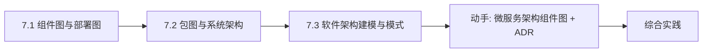

# MOC - 第7章 架构与组件建模

> [!info] 本章定位
> 前 6 章聚焦“类与对象的行为”，第7章把视角抬升到“整个系统的物理与逻辑结构”。**组件图**刻画系统的可部署单元及其接口依赖，**部署图**刻画组件在硬件节点上的运行时布局，**包图**刻画逻辑分层的组织结构，而**架构风格与模式**给出组织系统的成熟范式。本章解决三个问题：组件图与部署图怎么画、包图如何组织分层架构、如何选择与记录架构决策。这是从 OOD 走向工程实现与运维的桥梁。

## 学习路线图

## 知识点导航

| 节 | 主题 | 核心要点 | 入口 |
| --- | --- | --- | --- |
| 7.1 | 组件图与部署图 | 组件/接口/依赖、节点/通信路径、微服务组件图案例 | [[7.1 组件图与部署图]] |
| 7.2 | 包图与系统架构 | 包嵌套/依赖、分层架构、MVC/MVP/MVVM | [[7.2 包图与系统架构]] |
| 7.3 | 软件架构建模与模式 | 架构风格、微服务/SOA/REST、质量属性、ADR | [[7.3 软件架构建模与模式]] |

## 核心考点

> [!warning] 重点掌握
> 1. 组件图三要素：组件（Component）、接口（提供接口 / 需求接口）、依赖关系；提供接口用“棒棒糖”图符，需求接口用“插座”图符。
> 2. 部署图元素：节点（Node）、组件部署、通信路径；节点分设备节点与执行环境节点。
> 3. 包图的元素：包、嵌套、依赖（含 `«import»`、`«access»`）；包间依赖应单向、避免循环依赖。
> 4. 分层架构：表示层、业务层、数据层的职责与依赖方向（上层依赖下层，下层不感知上层）。
> 5. MVC、MVP、MVVM 三种架构模式的角色划分与数据流向区别。
> 6. 常见架构风格：管道-过滤器、客户端-服务器、分层、事件驱动；架构质量属性与质量场景。

## 自测题

> [!question] 题1
> 组件图中“提供接口”与“需求接口”分别表示什么？图符如何区分？
> > [!check]- 参考答案
> > **提供接口**（Provided Interface）表示组件对外提供的能力，即其他组件可调用的服务，图符为组件边界上的“棒棒糖”（实线圆圈）。**需求接口**（Required Interface）表示组件运行所依赖、需要其他组件提供的服务，图符为组件边界上的“插座”（半圆凹槽）。一个组件通常既提供接口又需求接口：提供自身能力，依赖他人能力。二者匹配后通过依赖关系连接，体现“可插拔”的组件化设计。

> [!question] 题2
> 部署图的作用是什么？包含哪些主要元素？
> > [!check]- 参考答案
> > 部署图（Deployment Diagram）描述软件组件在硬件节点上的物理部署，回答“哪些组件部署在哪些机器上、它们如何通信”。主要元素：**节点**（Node，分为设备节点如服务器、执行环境节点如 JVM/容器）、**组件部署**（组件实例部署在节点内）、**通信路径**（节点间的连接，标注协议如 HTTP/TCP）。部署图常用于分布式系统、运维规划与部署文档。

> [!question] 题3
> 什么是包图？包间依赖为什么应避免循环？
> > [!check]- 参考答案
> > 包图（Package Diagram）用包组织 UML 元素，展示系统的逻辑分组与依赖关系，支持包的嵌套。包间依赖表示一个包用到另一个包的内容（`«import»` 引入命名空间、`«access»` 仅访问不引入）。应避免循环依赖：若包 A 依赖 B、B 又依赖 A，则二者实际耦合为一体，无法独立编译、测试、演化，违背高内聚低耦合。重构循环依赖常用引入接口包、依赖倒置、合并包等方式。

> [!question] 题4
> 对比 MVC、MVP、MVVM 三种架构模式中“控制器/主持者/视图模型”的角色差异。
> > [!check]- 参考答案
> > - **MVC**：Controller 接收输入，更新 Model，Model 通知 View 刷新；View 可直接访问 Model，三者间存在多向通信，适合 Web 后端。
> > - **MVP**：Presenter 充当中间人，View 与 Model 完全隔离，只能通过 Presenter 通信；View 通过接口被 Presenter 调用，便于单元测试，适合桌面/移动端。
> > - **MVVM**：ViewModel 通过数据绑定让 View 自动同步，View 依赖 ViewModel 的属性与命令，ViewModel 不直接持有 View 引用；双向绑定减少样板代码，适合现代前端（WPF、Vue 等）。核心差异在于 View 与 Model 的耦合程度以及同步机制（通知 / 接口 / 绑定）。

## 章节导航

- 上一级：[[MOC - 面向对象系统分析与建模]]
- 上一章：[[MOC - 第6章]]
- 下一章：[[MOC - 第8章]]
