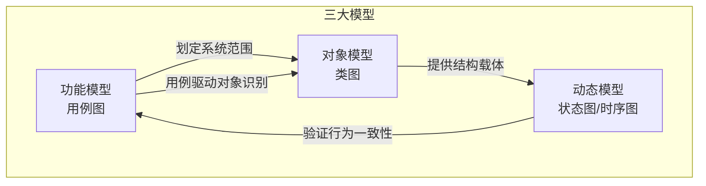
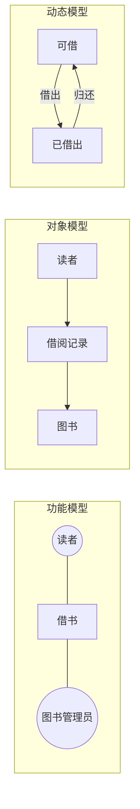
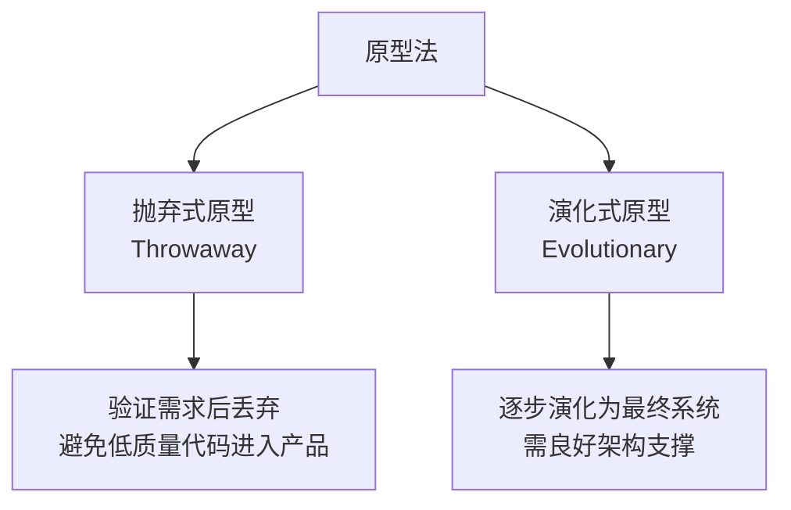
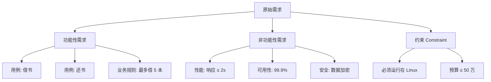
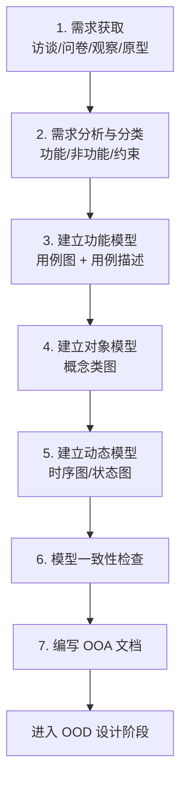

# 8.1 OOA方法与需求获取

面向对象分析（Object-Oriented Analysis, OOA）是软件生命周期中连接“现实问题”与“软件模型”的关键阶段。它要求分析者抛开实现细节，用面向对象的概念去**理解问题域、刻画需求、建立独立于实现的分析模型**。本节回答：OOA 是什么、它产出哪三大模型、如何从用户那里获取需求、如何区分功能性需求与非功能性需求。

## OOA 的定义与目标

> [!definition] OOA
> 面向对象分析（OOA）是在需求获取的基础上，运用面向对象的概念（类、对象、属性、操作、关联、消息），对问题域进行抽象并建立分析模型的过程。其核心特征是**独立于具体实现**：分析模型只描述“系统是什么、做什么”，不涉及“怎么实现”。

OOA 的主要目标：

1. **理解问题域**：弄清业务背景、参与者、业务流程与约束，建立与领域专家的共同语言。
2. **建立分析模型**：用 UML 图把需求结构化、可视化，消除自然语言需求的二义性。
3. **划定系统边界**：明确系统职责与外部环境的交互接口。
4. **为 OOD 提供输入**：产出可被设计阶段细化和实现的分析类与交互模型。

> [!note] OOA 与传统结构化分析的区别
> 传统结构化分析（SA）以“数据流图 + 数据字典”为中心，面向过程；OOA 以“对象 + 类”为中心，把数据与操作封装在一起，模型更稳定、更贴近现实世界，且与 OOP 实现语言自然衔接。

## OOA 三大模型

OOA 建立三个互相补充、交叉验证的模型：**功能模型、对象模型、动态模型**。三者缺一不可，共同构成完整的分析视图。

| 模型 | 主图 | 回答的问题 | 关注点 |
| --- | --- | --- | --- |
| 功能模型 | 用例图 | 系统应提供什么功能？谁使用？ | 外部行为、系统边界 |
| 对象模型 | 类图 | 系统中有哪些概念？它们如何关联？ | 静态结构（OOA 核心） |
| 动态模型 | 状态图、时序图 | 对象如何随时间交互与变化？ | 行为与控制流 |

> [!tip] 三大模型的建模顺序
> 实际工程中通常按“**功能模型 → 对象模型 → 动态模型**”推进：先用用例图确定范围，再从用例中提取类形成对象模型，最后用时序图/状态图验证对象协作是否满足用例。但三者并非线性，而是迭代精化。

### 三大模型示例：图书馆借阅

## 需求获取方法

需求获取（Requirements Elicitation）是 OOA 的起点，目标是从用户、业务、文档等来源收集真实、完整的需求。

| 方法 | 适用场景 | 优势 | 劣势 |
| --- | --- | --- | --- |
| 访谈 | 早期、信息不明确 | 深入、灵活、可追问 | 耗时、依赖访谈技巧 |
| 问卷 | 大量用户、统计性需求 | 覆盖面广、可量化 | 缺乏深度、回收率低 |
| 观察 | 业务流程复杂、隐含知识多 | 真实反映实际操作 | 被观察者可能改变行为 |
| 原型 | 需求模糊、用户难表达 | 直观、快速反馈 | 易被误认为最终产品 |
| JAD 联合会议 | 多方干系人、需达成共识 | 集中讨论、减少反复 | 组织成本高 |
| 文档分析 | 已有系统、行业标准 | 客观、可追溯 | 可能过时、缺乏背景 |

### 原型法的两种策略

> [!warning] 需求获取的常见陷阱
> - **听信单一来源**：只问一个用户就下结论，遗漏其他干系人视角；
> - **解决方案混入需求**：用户描述“我要一个按钮”而非业务目标，需追问背后意图；
> - **忽视隐含需求**：性能、安全、可维护性等非功能性需求常被忽略；
> - **过早承诺**：在分析阶段就锁定技术实现，违背 OOA 独立于实现的原则。

## 需求分析与分类

获取的原始需求需经过分析、整理、分类，形成结构化的需求规约。

### 功能性需求 vs 非功能性需求

> [!definition] 功能性需求
> 功能性需求（Functional Requirement）描述系统**应提供的功能与行为**，回答“系统做什么”。如“读者可在线检索图书”“系统应支持借阅续期”。

> [!definition] 非功能性需求
> 非功能性需求（Non-Functional Requirement）描述系统**应具备的质量属性或约束**，回答“系统做得多好”。如“检索响应时间 ≤ 2 秒”“系统应 7×24 可用”“数据需加密存储”。

| 维度 | 功能性需求 | 非功能性需求 |
| --- | --- | --- |
| 内容 | 系统功能、输入输出、业务规则 | 性能、安全、可用性、可维护性、可移植性 |
| 验证 | 通过功能测试 | 通过性能测试、安全审计、代码审查 |
| 影响 | 决定系统能否满足业务 | 决定系统质量上限 |
| 表达 | 用例描述、用例图 | 质量场景、约束列表 |

### 需求分类示例

## OOA 完整流程

> [!example]- 流程说明
> 1. **需求获取**：多方法并用，记录原始陈述；
> 2. **需求分析**：去重、消歧、分类，识别冲突并标记待核实；
> 3. **功能模型**：识别参与者与用例，绘制用例图并撰写用例描述；
> 4. **对象模型**：用名词提取法从用例描述中提取候选类，绘制概念类图；
> 5. **动态模型**：为关键用例画时序图，为有复杂生命周期的类画状态图；
> 6. **一致性检查**：用例、类图、交互图三者自洽，无悬空类、无遗漏用例；
> 7. **文档化**：产出需求规约与分析模型，移交 OOD。

## 小结

OOA 以“理解问题域、建立独立于实现的分析模型”为目标，产出功能、对象、动态三大模型。需求获取是 OOA 的起点，访谈、问卷、观察、原型各有所长，应组合使用。需求需分类为功能性需求与非功能性需求，前者描述“做什么”，后者描述“做得多好”。OOA 的产出物是 OOD 的输入，分析模型的质量直接决定后续设计的成败。

## 关联

- 上一级：[[MOC - 第8章]]
- 下一节：[[8.2 领域分析与概念模型构建]]
- 用例建模细节：[[2.1 用例图基本元素与绘制]]、[[2.2 用例描述与需求规约]]
- 类图基础：[[3.1 类图与对象图]]
- 时序图基础：[[4.1 时序图基本元素与绘制]]
