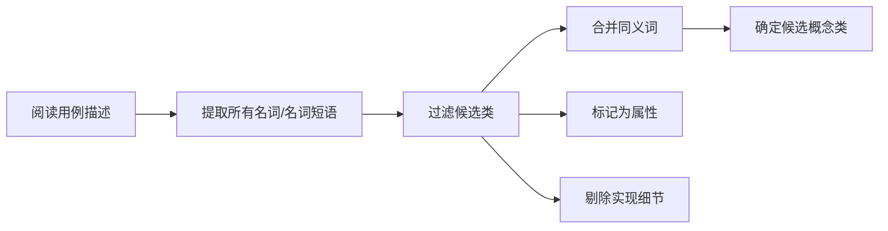
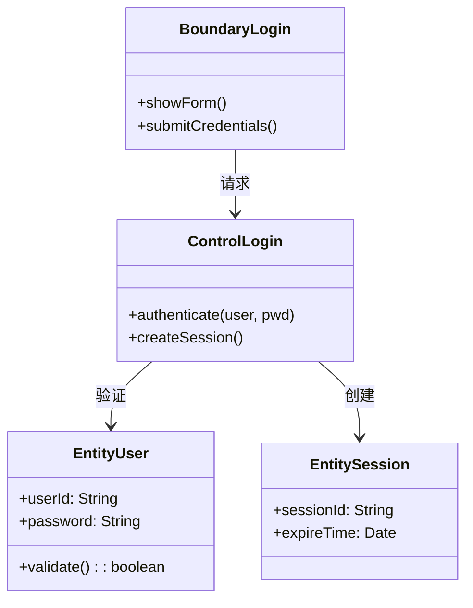
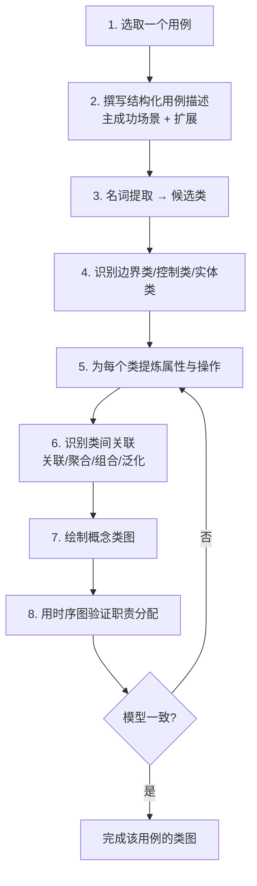
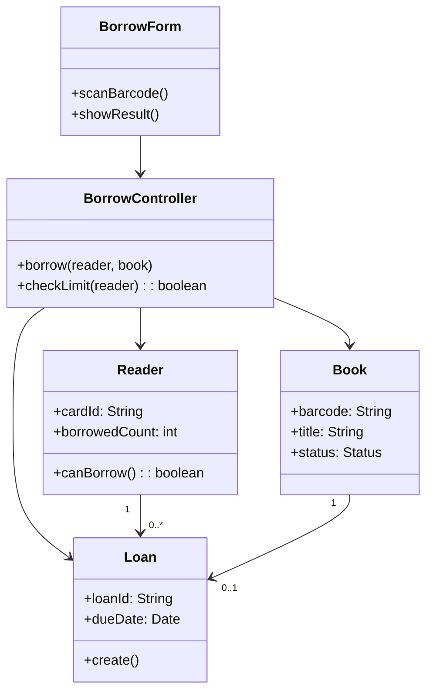
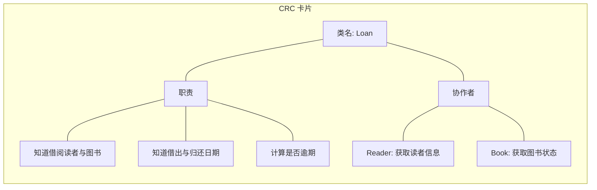
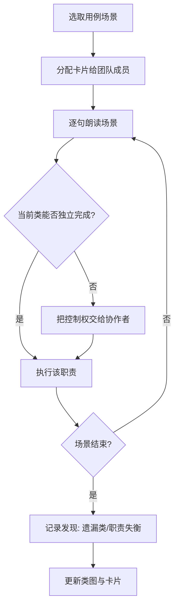

# 8.2 领域分析与概念模型构建

需求获取之后，分析者面对的是一堆用例与自然语言描述。**领域分析**负责从这些材料中识别稳定的业务概念，**概念模型构建**把这些概念组织成类图。本节回答：如何做领域分析、如何用名词提取法找候选类、概念类图中的三类分析类（边界/控制/实体）如何划分、如何从用例一步步转换到类图、CRC 卡片法如何辅助职责分配。

## 领域分析

> [!definition] 领域分析
> 领域分析（Domain Analysis）是对特定业务领域内的共性概念、术语、规则与流程进行系统化识别与整理的过程，目标是建立**领域模型**——一组描述领域核心概念及其关系的类图。领域模型聚焦“问题域中存在什么”，而非“系统将如何实现”。

### 名词提取法

名词提取法（Noun Extraction）是识别候选领域类最常用的启发式方法：

**过滤规则**：

| 类别 | 处理 | 示例 |
| --- | --- | --- |
| 业务实体 | 保留为类 | 读者、图书、订单 |
| 属性 | 转为类的属性 | 姓名、ISBN、价格 |
| 同义词 | 合并，取规范名 | “用户”=“会员” |
| 实现细节 | 剔除 | 数据库表、UI 按钮 |
| 系统外部 | 剔除或标为参与者 | 银行、物流公司 |

> [!warning] 名词提取法的局限
> 名词提取法依赖用例描述的完整性与准确性，容易遗漏隐含概念（如“权限”“会话”），也容易把动作误判为类（如“支付”既可能是类也可能是操作）。需结合领域专家访谈与已有模式经验补充修正。

## 概念类图与三类分析类

OOA 阶段的类图称为**概念类图**（Conceptual Class Diagram），它强调业务含义，弱化实现细节。引入 **BCE 模式**把分析类分为三类：

| 分析类 | 图符 | 职责 | 命名建议 |
| --- | --- | --- | --- |
| 边界类 Boundary | 带界面的矩形 | 系统与外部交互，接收输入、展示输出 | `XxxForm`、`XxxPage`、`XxxGateway` |
| 控制类 Control | 圆形带箭头 | 协调用例流程，封装业务控制逻辑 | `XxxController`、`XxxHandler` |
| 实体类 Entity | 圆形带下划线 | 持久化业务对象，存储信息 | 领域名词，如 `Order`、`User` |

> [!tip] 一个用例的典型 BCE 结构
> 每个用例通常对应“一个边界类 + 一个控制类 + 若干实体类”。边界类接收用户输入并交给控制类，控制类协调实体类完成业务，结果经边界类返回。这种结构使界面、逻辑、数据三者分离，便于后续演化与测试。

## 从用例到类图的转换步骤

从用例描述到概念类图的转换是 OOA 的核心工作，可按以下步骤推进：

### 转换示例：用例“借书”

**用例描述（主成功场景）**：
1. 读者出示借书证，请求借阅图书。
2. 图书管理员扫描图书条码，系统检查该读者借阅数量。
3. 系统判断未超上限，创建借阅记录，标记图书为已借出。
4. 系统显示借阅成功并提示归还日期。

**名词提取**：读者、借书证、图书、图书管理员、条码、借阅数量、上限、借阅记录、归还日期。

**过滤与分类**：

| 名词 | 处理 | 结果 |
| --- | --- | --- |
| 读者 | 实体类 | `Reader` |
| 图书管理员 | 参与者（外部） | 不入类图，作为 Actor |
| 借书证 | 实体类或属性 | 作为 `Reader` 的属性 `cardId` |
| 图书 | 实体类 | `Book` |
| 条码 | 属性 | `Book.barcode` |
| 借阅数量 | 派生属性 | `Reader.borrowedCount` |
| 上限 | 业务规则常量 | `MAX_BORROW = 5` |
| 借阅记录 | 实体类 | `Loan` |
| 归还日期 | 属性 | `Loan.dueDate` |
| 借书界面 | 边界类 | `BorrowForm` |
| 借书流程 | 控制类 | `BorrowController` |

**概念类图**：

## CRC 卡片法

> [!definition] CRC 卡片
> CRC（Class-Responsibility-Collaboration）卡片是一种用索引卡片记录类的工具，每张卡片描述一个类的**职责**（它知道什么、做什么）与**协作者**（它需要哪些类来完成职责）。CRC 强调“职责驱动设计”，常通过团队角色扮演走查用例场景来验证模型。

### CRC 卡片模板

| 类名 | 职责 | 协作者 |
| --- | --- | --- |
| `Loan` | 记录借阅读者与图书；记录借出/归还日期；判断是否逾期 | `Reader`、`Book` |
| `BorrowController` | 接收借书请求；检查借阅上限；创建借阅记录 | `Reader`、`Book`、`Loan` |
| `Reader` | 维护借书证号与已借数量；判断是否可再借 | `Loan` |
| `Book` | 维护条码与状态；标记借出/可借 | `Loan` |

### CRC 走查流程

> [!tip] CRC 卡片的价值
> CRC 不是最终交付物，而是“思维工具”：它强迫分析者把抽象的类落到具体职责上，通过角色扮演暴露“谁负责什么”的争议。走查中常发现某类职责过重（上帝类）、某类无职责（冗余类）、或职责分配不均（控制类做了实体类的事）。这些发现会直接反馈到类图与职责分配上。

## 小结

领域分析通过名词提取法从用例中识别候选类，结合 BCE 模式（边界/控制/实体）形成概念类图。从用例到类图的转换是迭代过程：选场景→提名词→分类→定属性操作→建关联→画类图→用时序图验证。CRC 卡片法以职责驱动设计，通过团队走查发现模型缺陷。概念模型是 OOA 的核心产出，为 OOD 提供稳定输入。

## 关联

- 上一级：[[MOC - 第8章]]
- 上一节：[[8.1 OOA方法与需求获取]]
- 下一节：[[8.3 OOA文档与建模规范]]
- 类图基础：[[3.1 类图与对象图]]、[[3.3 关联、聚合与组合关系详解]]
- 用例描述：[[2.2 用例描述与需求规约]]
