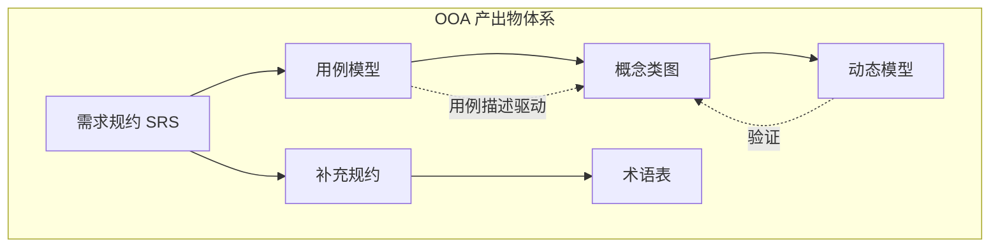
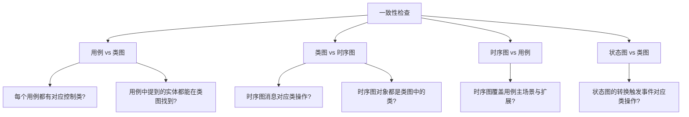
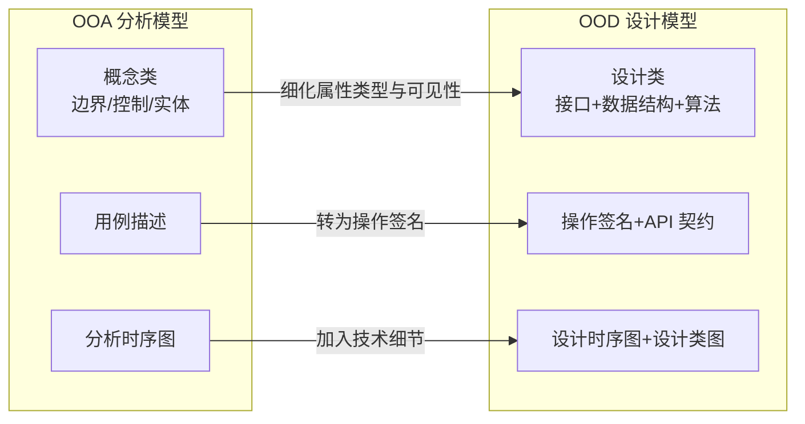

# 8.3 OOA文档与建模规范

OOA 的产出不仅要“画对图”，还要“写成文档”便于评审、移交与维护。本节回答：OOA 应交付哪些产出物、需求规约文档如何编写、分析模型如何做一致性检查、OOA 如何平滑衔接到 OOD。规范的文档与可追溯的衔接，是分析成果能被设计阶段正确消化的前提。

## OOA 产出物清单

OOA 阶段的产出物（Artifacts）通常包括以下几类：

| 产出物 | 形式 | 主要内容 |
| --- | --- | --- |
| 需求规约（SRS） | 文档 | 功能/非功能需求、约束、用例汇总 |
| 用例模型 | 用例图 + 用例描述 | 参与者、用例、关系、主成功场景与扩展 |
| 概念类图 | 类图 | 分析类（BCE）、属性、操作、关联 |
| 动态模型 | 时序图、状态图 | 关键用例的对象交互、复杂生命周期类 |
| 补充规约 | 文档/表格 | 非功能性需求、业务规则、术语表 |
| 术语表 | 表格 | 领域术语定义，消除歧义 |



> [!note] 产出物之间的依赖
> 需求规约是顶层文档，统领用例模型与补充规约；用例模型驱动概念类图构建；概念类图是动态模型的载体，动态模型反过来验证类图一致性；术语表服务于所有文档，消除领域歧义。产出物之间应交叉引用，形成可追溯网络。

## 需求规约文档编写

需求规约（Software Requirements Specification, SRS）是 OOA 的核心文档，常参考 IEEE 830 结构。以下是面向对象分析场景下的精简模板。

### SRS 文档结构

```markdown
1. 引言
   1.1 目的
   1.2 范围
   1.3 术语与缩写（指向术语表）
   1.4 参考文献
2. 总体描述
   2.1 产品概述
   2.2 产品功能（用例汇总）
   2.3 用户特征（参与者）
   2.4 约束
   2.5 假设与依赖
3. 具体需求
   3.1 功能性需求（按用例组织）
       3.1.1 用例: 借书
       3.1.2 用例: 还书
       ...
   3.2 非功能性需求
       3.2.1 性能需求
       3.2.2 安全需求
       3.2.3 可用性需求
       3.2.4 可维护性需求
4. 附录
   4.1 用例图
   4.2 概念类图
   4.3 关键时序图/状态图
   4.4 术语表
```

### 用例描述规范

每个用例应包含以下要素（详见 [[2.2 用例描述与需求规约]]）：

| 要素 | 说明 |
| --- | --- |
| 用例名 | 动宾短语，如“借出图书” |
| 参与者 | 主要参与者与次要参与者 |
| 前置条件 | 用例开始前必须满足的条件 |
| 后置条件 | 用例成功结束后系统状态 |
| 主成功场景 | 编号步骤，描述正常流程 |
| 扩展 | 异常与分支，标注扩展点 |
| 业务规则 | 该用例涉及的规则约束 |

> [!example]- 用例描述示例：借出图书
> ```markdown
> **用例名**：借出图书
> **参与者**：读者（主）、图书管理员（次）
> **前置条件**：读者已登录且借书证有效
> **后置条件**：创建借阅记录，图书状态变为已借出
> **主成功场景**：
> 1. 读者出示借书证，请求借阅图书
> 2. 管理员扫描图书条码
> 3. 系统检查读者借阅数量未超上限
> 4. 系统创建借阅记录并设置归还日期
> 5. 系统标记图书为已借出
> 6. 系统提示借阅成功
> **扩展**：
> 3a. 借阅数量超上限：系统拒绝并提示原因
> 2a. 图书已借出：系统提示并结束
> **业务规则**：每位读者最多借 5 本，借期 30 天
> ```

## 分析模型一致性检查

OOA 产出的用例模型、对象模型、动态模型必须自洽，常见检查项如下：



| 检查维度 | 检查内容 | 典型问题 |
| --- | --- | --- |
| 完整性 | 每个用例是否有类图与时序图支撑 | 用例无对应控制类（遗漏） |
| 一致性 | 类图操作与时序图消息是否对应 | 时序图调用 `pay()` 但类图无此操作 |
| 命名一致 | 同一概念是否用同一名字 | 类图 `User`、时序图 `Account` 指同一对象 |
| 无悬空引用 | 关联端点是否指向存在的类 | 关联指向已删除的类 |
| 角色覆盖 | 参与者是否都出现在用例中 | 识别的参与者无任何用例 |

> [!warning] 常见不一致问题
> - **上帝类**：某控制类承担过多职责，操作数远超其他类——应拆分；
> - **贫血实体**：实体类只有属性无操作，行为全堆在控制类——应把业务行为移回实体；
> - **孤儿用例**：用例图存在但无任何类或时序图支撑——需补全或删除；
> - **消息无主**：时序图消息找不到对应操作——补操作或修正时序图。

## OOA 到 OOD 的衔接

OOA 产出的是“问题域模型”，OOD 在其基础上加入“实现决策”形成“解域模型”。衔接时需做以下转换：



| 衔接项 | OOA（分析） | OOD（设计） |
| --- | --- | --- |
| 类 | 概念类，属性无类型 | 设计类，属性有类型与可见性 |
| 操作 | 仅描述职责 | 完整签名（参数、返回值） |
| 关联 | 业务含义 | 细化为引用、集合、外键 |
| 动态 | 分析时序图 | 设计时序图（含技术组件） |
| 边界类 | 抽象界面 | 具体 UI 组件或 API 接口 |
| 控制类 | 流程协调 | Service/Controller，含事务 |
| 实体类 | 业务对象 | 持久化对象（含 ORM 映射） |

> [!tip] 衔接的关键原则
> 1. **保持可追溯**：每个设计类应能追溯到分析类，每个操作追溯到用例步骤；
> 2. **不丢业务语义**：设计不能扭曲分析模型的业务含义，技术决策应服务于业务需求；
> 3. **逐步细化**：分析模型的抽象级别逐步下降，先定接口再定实现，避免一步到位引入实现细节；
> 4. **应用设计原则**：在转换中引入 SOLID 原则与设计模式（见 [[9.1 面向对象设计原则SOLID]]）。

## 小结

OOA 的产出物包括需求规约、用例模型、概念类图、动态模型、补充规约与术语表，彼此交叉引用构成可追溯网络。需求规约参考 IEEE 830 结构组织，用例描述需规范含前置/后置/主场景/扩展。三大模型需做完整性、一致性、命名一致等检查，避免上帝类、贫血实体、孤儿用例等问题。OOA 到 OOD 的衔接通过细化属性类型、补全操作签名、引入技术决策完成，衔接过程应保持可追溯与业务语义不变。

## 关联

- 上一级：[[MOC - 第8章]]
- 上一节：[[8.2 领域分析与概念模型构建]]
- 用例描述：[[2.2 用例描述与需求规约]]、[[2.3 用例关系与需求追踪]]
- 设计衔接：[[9.1 面向对象设计原则SOLID]]、[[9.3 架构设计与系统映射]]
