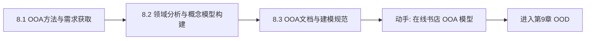

# MOC - 第8章 面向对象分析（OOA）完整流程

> [!info] 本章定位
> 前 7 章分别学习了 UML 的各类图与建模元素，第8章把它们整合为**面向对象分析（OOA）的完整工作流**。OOA 处于软件生命周期的需求分析阶段，目标是**理解问题域、建立独立于实现的分析模型**，为后续 OOD 与编码提供稳定输入。本章解决三个核心问题：如何获取并整理需求、如何从需求中识别领域概念并构建概念模型、如何产出规范的分析文档并衔接设计。本章是“从现实世界到软件世界”的第一座桥梁。

## 学习路线图

## 知识点导航

| 节 | 主题 | 核心要点 | 入口 |
| --- | --- | --- | --- |
| 8.1 | OOA方法与需求获取 | OOA定义/三大模型、需求获取方法、需求分类 | [[8.1 OOA方法与需求获取]] |
| 8.2 | 领域分析与概念模型构建 | 领域分析、概念类图、用例转类图、CRC卡片法 | [[8.2 领域分析与概念模型构建]] |
| 8.3 | OOA文档与建模规范 | 产出物清单、需求规约、一致性检查、OOD衔接 | [[8.3 OOA文档与建模规范]] |

## 核心考点

> [!warning] 重点掌握
> 1. OOA 的定义与目标：理解问题域、建立分析模型（功能模型、对象模型、动态模型三大模型），强调“独立于实现”。
> 2. OOA 三大模型的分工：功能模型=用例图、对象模型=类图、动态模型=状态图/时序图；三者互相补充、交叉验证。
> 3. 需求获取方法：访谈、问卷、观察、原型（联合需求获取 JAD、原型法适用场景与优劣）。
> 4. 功能性需求与非功能性需求的区分：功能性=系统“做什么”，非功能性=性能、安全、可用性、可维护性等“做得多好”。
> 5. 领域分析中的“名词提取法”：从用例描述中提取名词→候选类，过滤后形成概念类图。
> 6. 三类分析类：边界类（Boundary）、控制类（Control）、实体类（Entity），即 BCE 模式。
> 7. CRC 卡片法：类-职责-协作，用于职责分配与协作关系识别。
> 8. OOA 到 OOD 的衔接：分析模型是设计的输入，类在设计中细化为接口与数据结构。

## 自测题

> [!question] 题1
> OOA 的三大模型分别是什么？它们各自回答什么问题？
> > [!check]- 参考答案
> > OOA 三大模型：**功能模型**（用例图）回答“系统应提供什么功能”，从用户视角描述外部行为；**对象模型**（类图）回答“系统内部有哪些概念及其结构关系”，是最核心、最静态的模型；**动态模型**（状态图/时序图）回答“对象随时间如何交互与变化状态”。三者互相补充：功能模型划定范围，对象模型刻画静态结构，动态模型刻画行为，交叉验证保证模型一致性。

> [!question] 题2
> 什么是名词提取法？在 OOA 中如何使用它识别候选类？
> > [!check]- 参考答案
> > 名词提取法（Noun Extraction）是一种从需求文本（主要是用例描述）中识别候选领域类的技术：逐句阅读用例描述，提取所有名词与名词短语作为候选类，再按规则过滤——去掉属性（如“姓名”应作为属性而非类）、去掉实现细节、合并同义词、剔除冗余，剩下的即候选概念类。该方法的局限在于依赖文本质量、易遗漏隐含概念，常需结合领域专家访谈与模式经验补充。

> [!question] 题3
> 边界类、控制类、实体类（BCE）各自承担什么职责？举例说明。
> > [!check]- 参考答案
> > - **边界类（Boundary）**：位于系统与外部交互的边界，负责输入输出与界面，如“登录界面”“支付网关接口”；
> > - **控制类（Control）**：协调用例流程、封装业务逻辑与控制流，如“下单控制器”“结算流程”；
> > - **实体类（Entity）**：表示问题域中持久化、有生命周期的业务对象，如“订单”“用户”“商品”。
> > 一个用例通常涉及一个边界类、一个控制类和若干实体类，形成“边界→控制→实体”的协作链。

> [!question] 题4
> CRC 卡片包含哪些核心要素？它如何辅助概念模型构建？
> > [!check]- 参考答案
> > CRC 卡片（Class-Responsibility-Collaboration）包含：**类名**、**职责（Responsibilities）**（该类应知道和做什么）、**协作者（Collaborators）**（履行职责需依赖的其他类）。它通过“角色扮演”式的走查，把用例场景逐句映射到类与协作，帮助发现遗漏的类、验证职责分配是否合理、识别过度集中或耦合过紧的问题。CRC 是从需求到类图的过渡工具，常在白板或卡片上手写，便于团队讨论。

## 章节导航

- 上一级：[[MOC - 面向对象系统分析与建模]]
- 上一章：[[MOC - 第7章]]
- 下一章：[[MOC - 第9章]]
