# 9.1 面向对象设计原则 SOLID

SOLID 是五个面向对象设计原则的首字母缩写，由 Robert C. Martin 提出，是判断面向对象设计好坏的核心准则。这些原则共同目标是**降低耦合、提高内聚、增强可扩展性与可维护性**。本节逐一讲解 SRP、OCP、LSP、ISP、DIP，并给出违反与遵循的类图对比及 Java 代码示例。

## SOLID 概览

| 缩写 | 全称 | 中文 | 核心思想 |
| --- | --- | --- | --- |
| SRP | Single Responsibility Principle | 单一职责原则 | 一个类只有一个变化的理由 |
| OCP | Open-Closed Principle | 开闭原则 | 对扩展开放，对修改关闭 |
| LSP | Liskov Substitution Principle | 里氏替换原则 | 子类必须能替换父类 |
| ISP | Interface Segregation Principle | 接口隔离原则 | 接口要小而专 |
| DIP | Dependency Inversion Principle | 依赖倒置原则 | 依赖抽象，不依赖具体 |

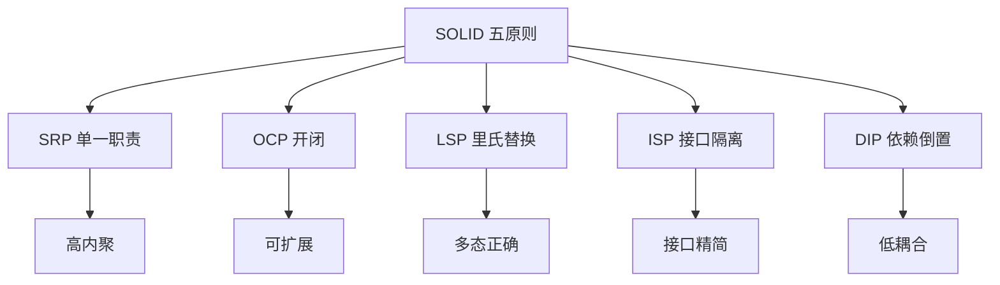

## 单一职责原则（SRP）

> [!definition] SRP
> 一个类应该只有一个引起它变化的原因（reason to change）。即每个类只承担一项职责，职责的变化只影响该类本身。

### 违反 SRP：上帝类

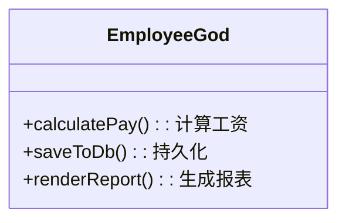

```java
// 违反 SRP：一个类既算工资、又存数据库、又生成报表
class EmployeeGod {
    double calculatePay() { /* 计算逻辑 */ }
    void saveToDb() { /* 数据库操作 */ }
    String renderReport() { /* 报表生成 */ }
}
```

> [!warning] 违反症状
> “上帝类”承担多种职责，任何一职责变化都要修改该类，牵一发动全身，难以测试与复用。判断方法：能否用一句话描述该类职责，若需“和/且”连接多个动词，则违反 SRP。

### 遵循 SRP：按职责拆分

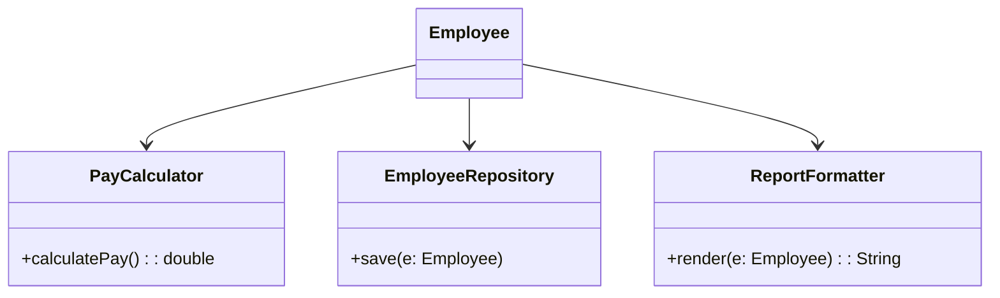

```java
// 遵循 SRP：按职责拆分为三个类
class PayCalculator {
    double calculatePay(Employee e) { return e.getSalary() * 1.0; }
}
class EmployeeRepository {
    void save(Employee e) { /* 数据库操作 */ }
}
class ReportFormatter {
    String render(Employee e) { return "Report: " + e.getName(); }
}
class Employee {
    private String name;
    private double salary;
    // 仅持有数据，业务行为委托给上面的类
}
```

## 开闭原则（OCP）

> [!definition] OCP
> 软件实体（类、模块、函数）应该对扩展开放、对修改关闭。即增加新功能时通过新增代码实现，而不修改已有代码。

### 违反 OCP：类型判断分支

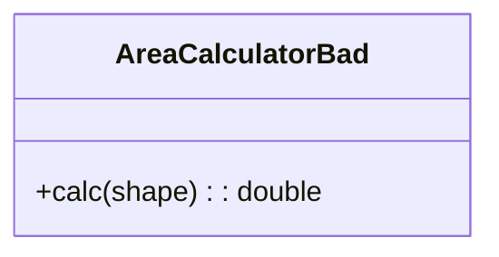

```java
// 违反 OCP：每加一种形状都要改 calc 方法
class AreaCalculatorBad {
    double calc(Object shape) {
        if (shape instanceof Circle) {
            Circle c = (Circle) shape;
            return Math.PI * c.r * c.r;
        } else if (shape instanceof Rectangle) {
            Rectangle r = (Rectangle) shape;
            return r.w * r.h;
        }
        // 新增三角形需改这里 ❌
        throw new IllegalArgumentException();
    }
}
```

### 遵循 OCP：抽象 + 多态

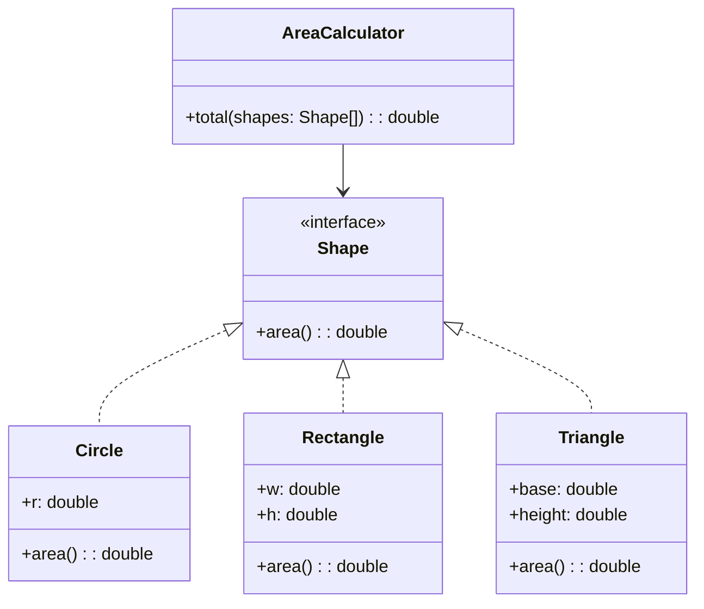

```java
// 遵循 OCP：抽象出 Shape 接口，新形状实现接口即可
interface Shape {
    double area();
}
class Circle implements Shape {
    double r;
    public double area() { return Math.PI * r * r; }
}
class Rectangle implements Shape {
    double w, h;
    public double area() { return w * h; }
}
class Triangle implements Shape {  // 新增形状，不改已有代码 ✅
    double base, height;
    public double area() { return 0.5 * base * height; }
}
class AreaCalculator {
    double total(Shape[] shapes) {
        double sum = 0;
        for (Shape s : shapes) sum += s.area();
        return sum;
    }
}
```

## 里氏替换原则（LSP）

> [!definition] LSP
> 所有引用基类（父类）的地方必须能透明地使用其子类的对象，且程序行为不变。子类不得削弱父类承诺的行为。

### 经典反例：正方形继承长方形

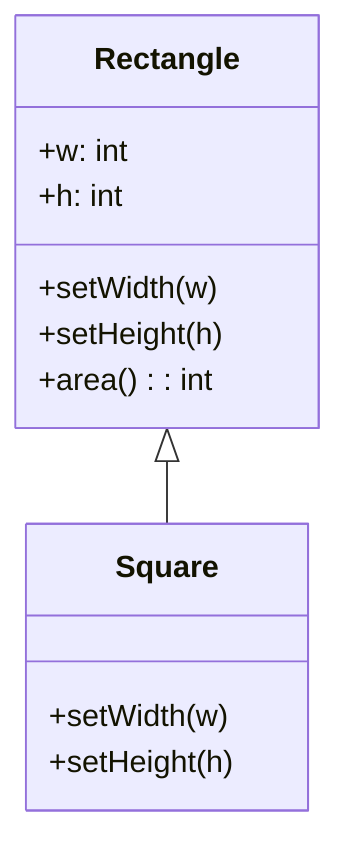

```java
// 违反 LSP：正方形继承长方形，但 setWidth 会同时改 height，破坏父类契约
class Rectangle {
    int w, h;
    void setWidth(int w) { this.w = w; }
    void setHeight(int h) { this.h = h; }
    int area() { return w * h; }
}
class Square extends Rectangle {
    @Override void setWidth(int w) { this.w = w; this.h = w; }  // ❌ 破坏父类行为
    @Override void setHeight(int h) { this.w = h; this.h = h; }
}
// 调用方期望 Rectangle 行为，传入 Square 时结果异常
void resize(Rectangle r) {
    r.setWidth(5);
    r.setHeight(10);
    assert r.area() == 50;  // Square 时 area()=100，违反 LSP
}
```

### 正确做法：引入共同抽象

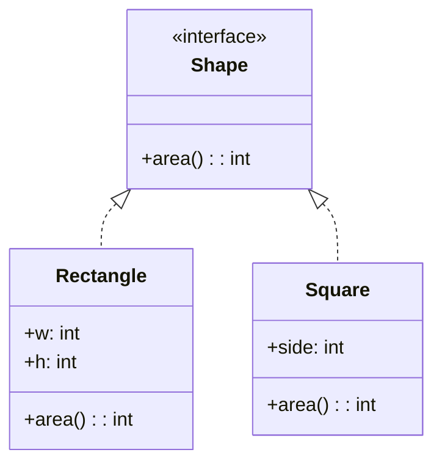

```java
// 遵循 LSP：正方形与长方形平级，都实现 Shape，不互相继承
interface Shape { int area(); }
class Rectangle implements Shape {
    int w, h;
    public int area() { return w * h; }
}
class Square implements Shape {
    int side;
    public int area() { return side * side; }
}
```

## 接口隔离原则（ISP）

> [!definition] ISP
> 客户端不应该被迫依赖它不使用的方法。即接口要小而专，不要把多个职责塞进一个胖接口，应按客户端需要拆分为多个细粒度接口。

### 违反 ISP：胖接口

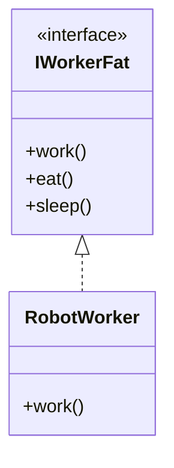

```java
// 违反 ISP：机器人被迫实现 eat/sleep
interface IWorkerFat {
    void work();
    void eat();
    void sleep();
}
class RobotWorker implements IWorkerFat {
    public void work() { /* 工作 */ }
    public void eat() { throw new UnsupportedOperationException(); }  // ❌
    public void sleep() { throw new UnsupportedOperationException(); }
}
```

### 遵循 ISP：拆分接口

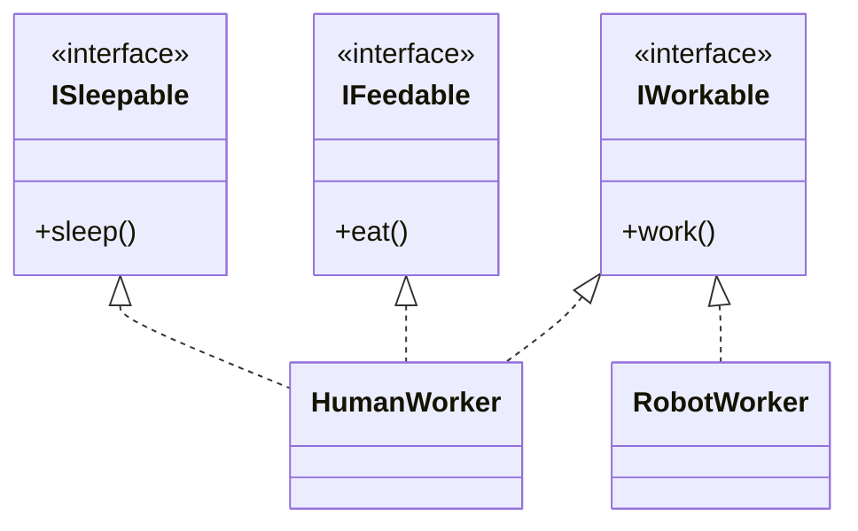

```java
// 遵循 ISP：按职责拆分为三个接口
interface IWorkable { void work(); }
interface IFeedable { void eat(); }
interface ISleepable { void sleep(); }

class HumanWorker implements IWorkable, IFeedable, ISleepable {
    public void work() { }
    public void eat() { }
    public void sleep() { }
}
class RobotWorker implements IWorkable {  // 只实现需要的 ✅
    public void work() { }
}
```

## 依赖倒置原则（DIP）

> [!definition] DIP
> 1. 高层模块不应依赖低层模块，二者都应依赖抽象。
> 2. 抽象不应依赖细节，细节应依赖抽象。
> 即面向接口编程，而非面向实现编程。

### 违反 DIP：高层依赖低层具体类

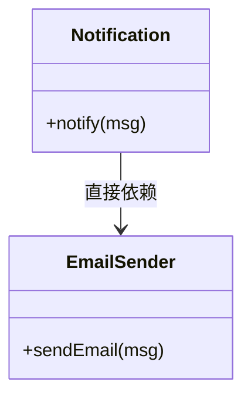

```java
// 违反 DIP：Notification 直接依赖 EmailSender，换发送方式需改 Notification
class EmailSender {
    void sendEmail(String msg) { /* 发邮件 */ }
}
class Notification {
    private EmailSender sender = new EmailSender();  // ❌ 依赖具体类
    void notify(String msg) { sender.sendEmail(msg); }
}
```

### 遵循 DIP：依赖抽象（依赖注入）

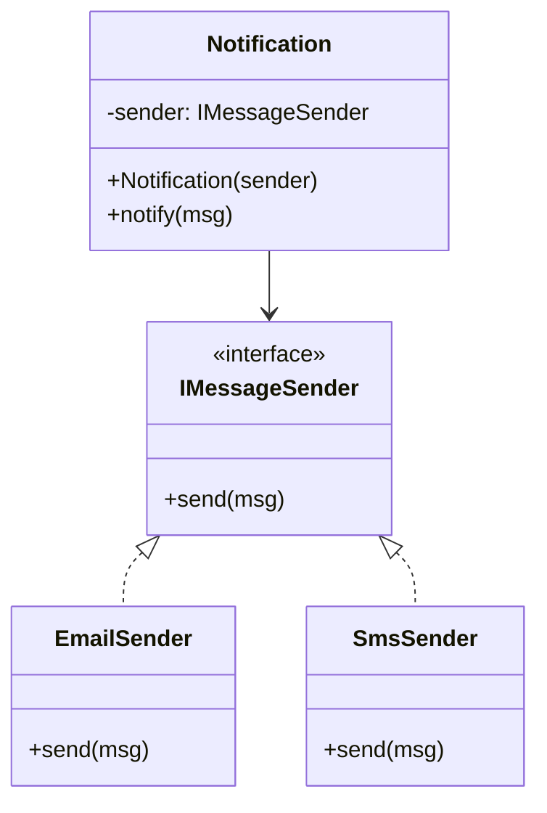

```java
// 遵循 DIP：抽象出接口，通过构造注入
interface IMessageSender {
    void send(String msg);
}
class EmailSender implements IMessageSender {
    public void send(String msg) { /* 发邮件 */ }
}
class SmsSender implements IMessageSender {
    public void send(String msg) { /* 发短信 */ }
}
class Notification {
    private final IMessageSender sender;
    public Notification(IMessageSender sender) {  // ✅ 依赖抽象
        this.sender = sender;
    }
    void notify(String msg) { sender.send(msg); }
}
// 使用：
Notification n = new Notification(new SmsSender());
```

> [!tip] 依赖注入的常见方式
> - **构造注入**：通过构造函数传入依赖，适合必须依赖；
> - **Setter 注入**：通过 setter 传入，适合可选依赖；
> - **接口注入**：依赖实现某接口，较少用；
> - 框架（如 Spring）通过 IoC 容器自动装配，是 DIP 的工程化实现。

## 五原则之间的关系

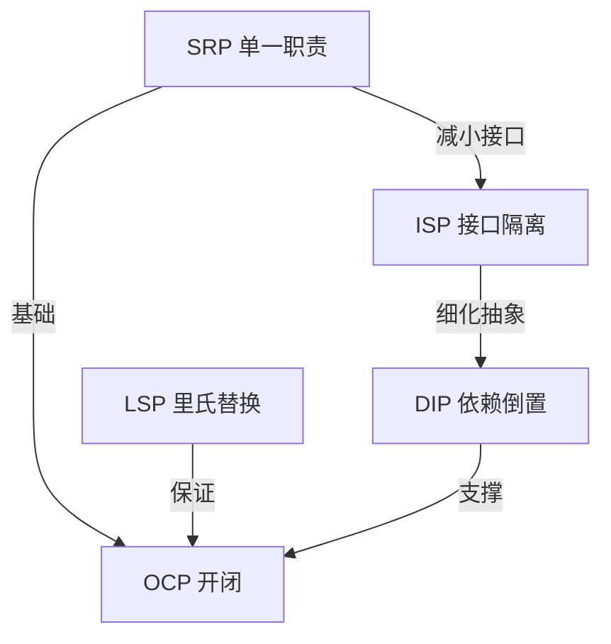

> [!note] 原则之间的协同
> SRP 是其他原则的基础——职责清晰才能正确抽象；OCP 是设计的目标——通过抽象与多态实现扩展开放；LSP 保证继承体系的多态正确，是 OCP 的前提；ISP 把抽象做得更精细，避免胖接口污染；DIP 把依赖导向抽象，是 OCP 与松耦合的实现手段。五原则共同服务于“高内聚、低耦合、易扩展、易维护”。

## 小结

SOLID 是面向对象设计的五条核心原则：SRP 让类职责单一，OCP 让系统易于扩展，LSP 保证继承多态的正确性，ISP 让接口精简，DIP 让依赖关系松散。每条原则都有明确的违反症状与重构方向，工程中应作为代码评审与重构的检查清单。原则不是教条，需结合场景权衡，但理解其意图是写出高质量面向对象代码的前提。

## 关联

- 上一级：[[MOC - 第9章]]
- 下一节：[[9.2 设计模式与重用]]
- 设计模式应用：[[5.3 状态模式与代码实现]]、[[9.2 设计模式与重用]]
- OOA 衔接：[[8.3 OOA文档与建模规范]]
