# 9.2 设计模式与重用

设计模式（Design Pattern）是面向对象设计中针对反复出现的问题给出的成熟、可复用解决方案。GoF（《设计模式》一书）归纳了 23 种经典模式。本节按创建型、结构型、行为型三大类介绍重点模式，给出 Mermaid 类图与 Java 代码，并讨论模式选择策略。设计模式是 SOLID 原则在具体场景下的落地经验。

## 设计模式分类

GoF 23 种模式按职责分为三类：

| 类别 | 关注点 | 数量 | 重点模式（本节） |
| --- | --- | --- | --- |
| 创建型 | 对象创建过程 | 5 | 工厂方法、抽象工厂、单例、建造者 |
| 结构型 | 类与对象组合 | 7 | 适配器、装饰器、代理、外观 |
| 行为型 | 对象间职责分配与通信 | 11 | 策略、观察者、命令、状态 |

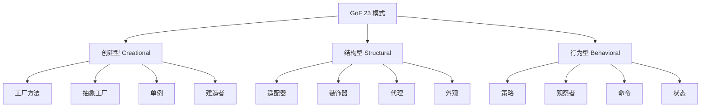

## 创建型模式

### 工厂方法（Factory Method）

> [!definition] 工厂方法
> 定义一个创建对象的接口，由子类决定实例化哪一个类。工厂方法使一个类的实例化延迟到其子类。

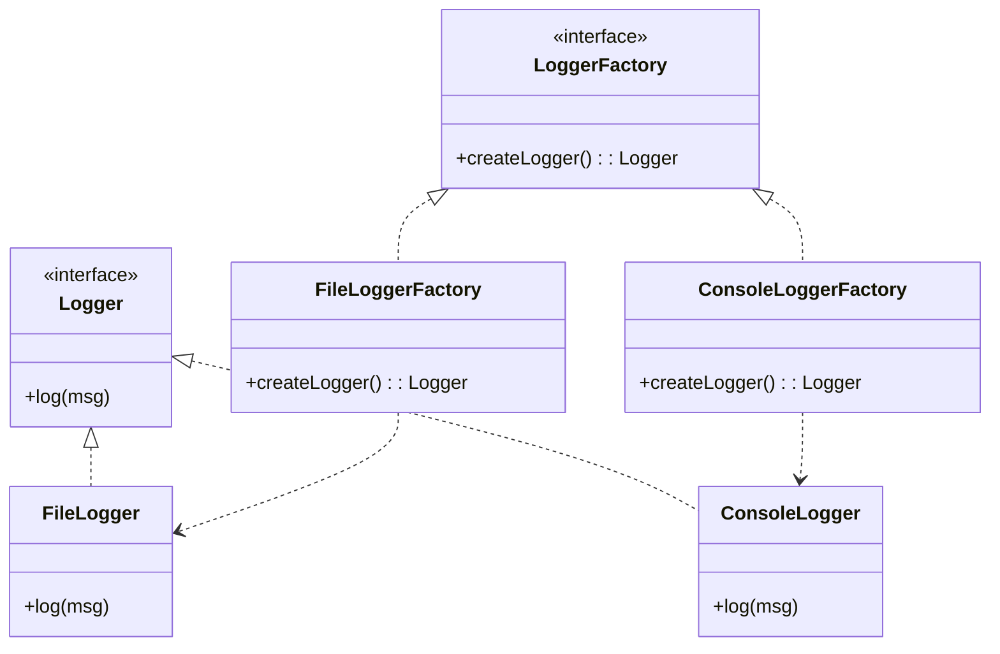

```java
interface Logger { void log(String msg); }
class FileLogger implements Logger {
    public void log(String msg) { System.out.println("File: " + msg); }
}
class ConsoleLogger implements Logger {
    public void log(String msg) { System.out.println("Console: " + msg); }
}
interface LoggerFactory { Logger createLogger(); }
class FileLoggerFactory implements LoggerFactory {
    public Logger createLogger() { return new FileLogger(); }
}
class ConsoleLoggerFactory implements LoggerFactory {
    public Logger createLogger() { return new ConsoleLogger(); }
}
// 使用：客户端依赖抽象，新增日志类型只需新增工厂
LoggerFactory factory = new FileLoggerFactory();
Logger logger = factory.createLogger();
logger.log("hello");
```

### 抽象工厂（Abstract Factory）

> [!definition] 抽象工厂
> 提供一个接口，用于创建**一系列相关或相互依赖的对象**（产品族），而无需指定具体类。

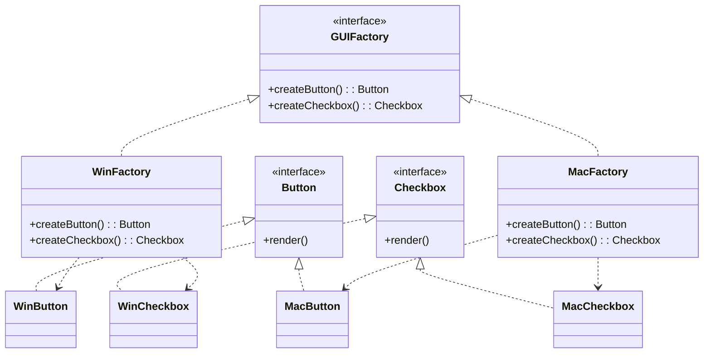

```java
interface Button { void render(); }
interface Checkbox { void render(); }
class WinButton implements Button { public void render() { System.out.println("Win Button"); } }
class MacButton implements Button { public void render() { System.out.println("Mac Button"); } }
class WinCheckbox implements Checkbox { public void render() { System.out.println("Win Checkbox"); } }
class MacCheckbox implements Checkbox { public void render() { System.out.println("Mac Checkbox"); } }

interface GUIFactory {
    Button createButton();
    Checkbox createCheckbox();
}
class WinFactory implements GUIFactory {
    public Button createButton() { return new WinButton(); }
    public Checkbox createCheckbox() { return new WinCheckbox(); }
}
class MacFactory implements GUIFactory {
    public Button createButton() { return new MacButton(); }
    public Checkbox createCheckbox() { return new MacCheckbox(); }
}
```

### 单例（Singleton）

> [!definition] 单例
> 确保一个类只有一个实例，并提供一个全局访问点。

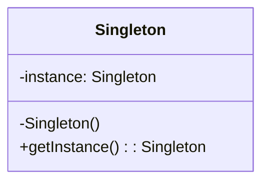

```java
// 线程安全的双重检查锁单例
class Singleton {
    private static volatile Singleton instance;
    private Singleton() {}  // 私有构造
    public static Singleton getInstance() {
        if (instance == null) {
            synchronized (Singleton.class) {
                if (instance == null) {
                    instance = new Singleton();
                }
            }
        }
        return instance;
    }
}
```

> [!warning] 单例的争议
> 单例是唯一一个有“状态”的创建型模式，常被滥用为全局变量，导致隐藏依赖、难以测试、并发问题。仅在确需“全局唯一实例”时使用（如配置管理、日志写入器），否则优先用依赖注入。

### 建造者（Builder）

> [!definition] 建造者
> 将一个复杂对象的构建与它的表示分离，使得同样的构建过程可以创建不同的表示。适合构造步骤稳定、参数众多的对象。

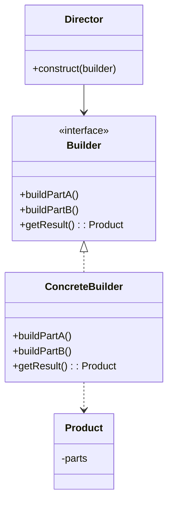

```java
class Product {
    private final List<String> parts = new ArrayList<>();
    void add(String part) { parts.add(part); }
    String describe() { return String.join(", ", parts); }
}
interface Builder {
    void buildPartA();
    void buildPartB();
    Product getResult();
}
class ConcreteBuilder implements Builder {
    private Product product = new Product();
    public void buildPartA() { product.add("PartA"); }
    public void buildPartB() { product.add("PartB"); }
    public Product getResult() { return product; }
}
class Director {
    void construct(Builder b) { b.buildPartA(); b.buildPartB(); }
}
// 使用
Builder b = new ConcreteBuilder();
new Director().construct(b);
Product p = b.getResult();
```

## 结构型模式

### 适配器（Adapter）

> [!definition] 适配器
> 将一个类的接口转换成客户端期望的另一个接口，使原本接口不兼容的类可以一起工作。

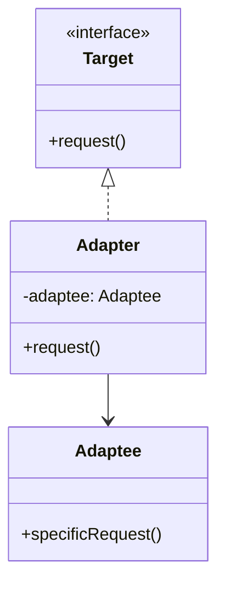

```java
interface Target { void request(); }
class Adaptee {  // 旧接口，不兼容 Target
    void specificRequest() { System.out.println("旧接口调用"); }
}
class Adapter implements Target {
    private Adaptee adaptee = new Adaptee();
    public void request() { adaptee.specificRequest(); }  // 转换调用
}
// 使用：客户端面向 Target，Adapter 桥接旧类
Target t = new Adapter();
t.request();
```

### 装饰器（Decorator）

> [!definition] 装饰器
> 动态地给一个对象添加额外职责，比生成子类更灵活。装饰器与被装饰对象实现同一接口，通过组合层层包装。

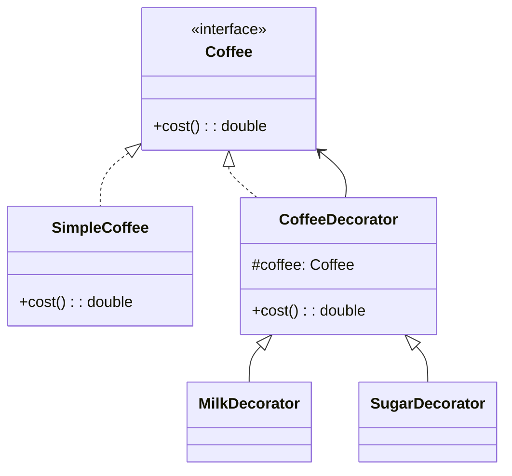

```java
interface Coffee { double cost(); }
class SimpleCoffee implements Coffee {
    public double cost() { return 10; }
}
abstract class CoffeeDecorator implements Coffee {
    protected Coffee coffee;
    CoffeeDecorator(Coffee c) { this.coffee = c; }
}
class MilkDecorator extends CoffeeDecorator {
    MilkDecorator(Coffee c) { super(c); }
    public double cost() { return coffee.cost() + 2; }
}
class SugarDecorator extends CoffeeDecorator {
    SugarDecorator(Coffee c) { super(c); }
    public double cost() { return coffee.cost() + 1; }
}
// 使用：可任意组合
Coffee c = new SugarDecorator(new MilkDecorator(new SimpleCoffee()));
System.out.println(c.cost());  // 13
```

### 代理（Proxy）

> [!definition] 代理
> 为其他对象提供一种代理以控制对这个对象的访问。常见有远程代理、虚拟代理（延迟加载）、保护代理（权限控制）。

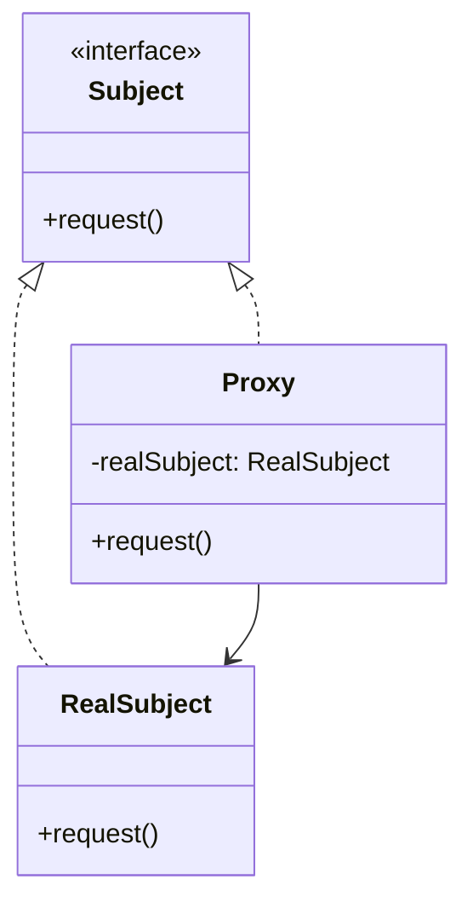

```java
interface Subject { void request(); }
class RealSubject implements Subject {
    public void request() { System.out.println("真实请求"); }
}
class Proxy implements Subject {
    private RealSubject real;
    public void request() {
        if (real == null) real = new RealSubject();  // 虚拟代理：延迟创建
        System.out.println("前置处理");
        real.request();
        System.out.println("后置处理");
    }
}
```

### 外观（Facade）

> [!definition] 外观
> 为子系统中的一组接口提供一个统一的入口，降低客户端与子系统的耦合。

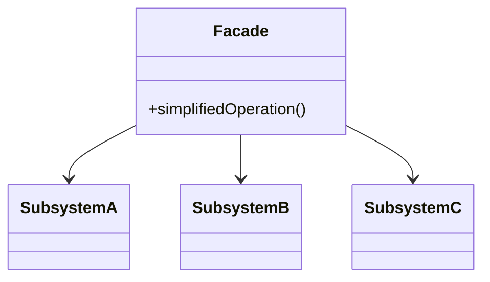

```java
class SubsystemA { void opA() {} }
class SubsystemB { void opB() {} }
class SubsystemC { void opC() {} }
class Facade {
    private SubsystemA a = new SubsystemA();
    private SubsystemB b = new SubsystemB();
    private SubsystemC c = new SubsystemC();
    void simplifiedOperation() {
        a.opA(); b.opB(); c.opC();  // 客户端只调一个方法
    }
}
```

## 行为型模式

### 策略（Strategy）

> [!definition] 策略
> 定义一系列算法，把它们封装起来，使它们可以互相替换。策略模式让算法的变化独立于使用算法的客户端。

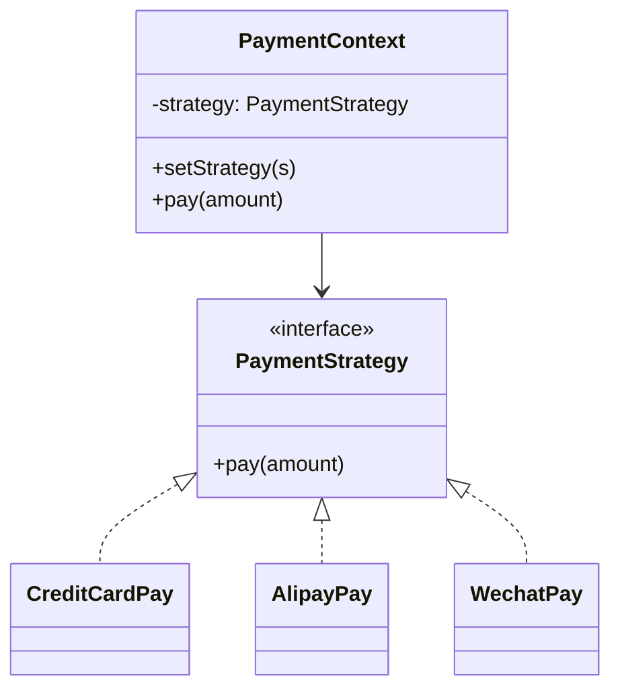

```java
interface PaymentStrategy { void pay(double amount); }
class CreditCardPay implements PaymentStrategy {
    public void pay(double amount) { System.out.println("信用卡支付 " + amount); }
}
class AlipayPay implements PaymentStrategy {
    public void pay(double amount) { System.out.println("支付宝支付 " + amount); }
}
class PaymentContext {
    private PaymentStrategy strategy;
    public void setStrategy(PaymentStrategy s) { this.strategy = s; }
    public void pay(double amount) { strategy.pay(amount); }
}
// 使用
PaymentContext ctx = new PaymentContext();
ctx.setStrategy(new AlipayPay());
ctx.pay(99.9);
```

### 观察者（Observer）

> [!definition] 观察者
> 定义对象间一对多的依赖关系，当一个对象状态变化时，所有依赖它的对象都会得到通知并自动更新。

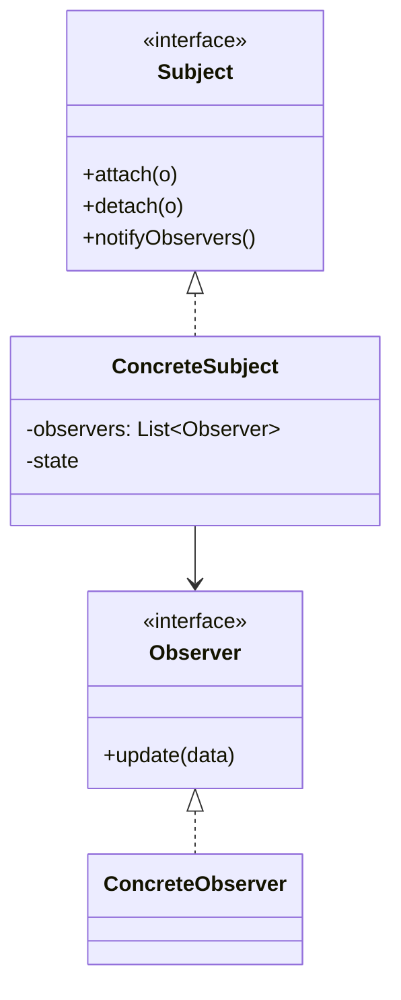

```java
interface Observer { void update(String data); }
interface Subject {
    void attach(Observer o);
    void detach(Observer o);
    void notifyObservers();
}
class NewsPublisher implements Subject {
    private List<Observer> observers = new ArrayList<>();
    private String news;
    public void attach(Observer o) { observers.add(o); }
    public void detach(Observer o) { observers.remove(o); }
    public void notifyObservers() {
        for (Observer o : observers) o.update(news);
    }
    public void publish(String news) {
        this.news = news;
        notifyObservers();
    }
}
class Reader implements Observer {
    private String name;
    Reader(String n) { name = n; }
    public void update(String data) { System.out.println(name + " 收到: " + data); }
}
// 使用
NewsPublisher publisher = new NewsPublisher();
publisher.attach(new Reader("Alice"));
publisher.attach(new Reader("Bob"));
publisher.publish("新版本发布");
```

### 命令（Command）

> [!definition] 命令
> 将一个请求封装为一个对象，从而可以用不同的请求对客户进行参数化、排队请求、记录日志、支持撤销。

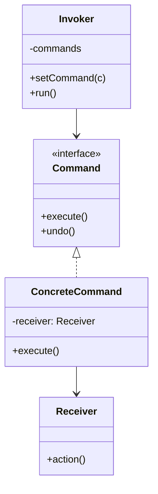

```java
interface Command { void execute(); void undo(); }
class Light {  // Receiver
    void on() { System.out.println("灯亮"); }
    void off() { System.out.println("灯灭"); }
}
class LightOnCommand implements Command {
    private Light light;
    LightOnCommand(Light l) { light = l; }
    public void execute() { light.on(); }
    public void undo() { light.off(); }
}
class RemoteControl {  // Invoker
    private Command command;
    public void setCommand(Command c) { command = c; }
    public void press() { command.execute(); }
}
```

### 状态（State）

> [!definition] 状态
> 允许一个对象在其内部状态改变时改变它的行为，对象看起来似乎修改了它的类。详见 [[5.3 状态模式与代码实现]]。

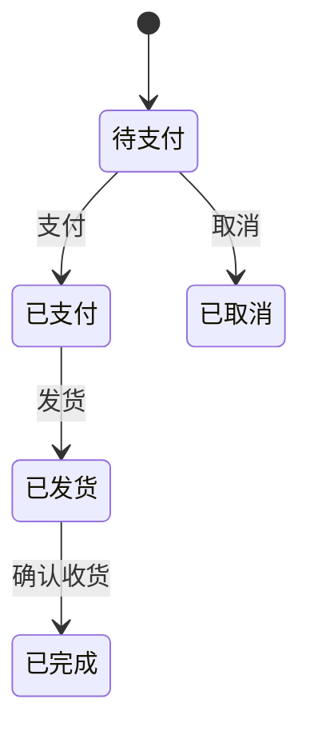

```java
interface OrderState {
    void next(OrderContext ctx);
}
class PendingPayState implements OrderState {
    public void next(OrderContext ctx) {
        System.out.println("支付成功，进入已发货状态");
        ctx.setState(new PaidState());
    }
}
class PaidState implements OrderState {
    public void next(OrderContext ctx) {
        System.out.println("发货成功，进入已完成状态");
        ctx.setState(new ShippedState());
    }
}
class ShippedState implements OrderState {
    public void next(OrderContext ctx) {
        System.out.println("已完成");
        ctx.setState(new CompletedState());
    }
}
class CompletedState implements OrderState {
    public void next(OrderContext ctx) { System.out.println("已是终态"); }
}
class OrderContext {
    private OrderState state = new PendingPayState();
    public void setState(OrderState s) { state = s; }
    public void proceed() { state.next(this); }
}
```

## 模式选择策略

> [!warning] 模式不是越多越好
> 过度使用模式会带来类爆炸、增加理解成本。选择模式应“针对变化点”：先识别系统中哪里会变化，再选合适模式隔离变化。

| 变化点 | 推荐模式 | 解决问题 |
| --- | --- | --- |
| 对象创建方式多变 | 工厂方法 / 抽象工厂 | 隔离创建逻辑 |
| 复杂对象分步构造 | 建造者 | 简化构造过程 |
| 算法可互换 | 策略 | 算法独立变化 |
| 状态驱动行为 | 状态 | 状态切换封装 |
| 接口不兼容 | 适配器 | 桥接旧接口 |
| 动态加职责 | 装饰器 | 灵活组合 |
| 访问控制 / 延迟加载 | 代理 | 控制访问 |
| 一对多通知 | 观察者 | 解耦发布者与订阅者 |
| 请求排队 / 撤销 | 命令 | 请求对象化 |
| 子系统入口统一 | 外观 | 简化调用 |

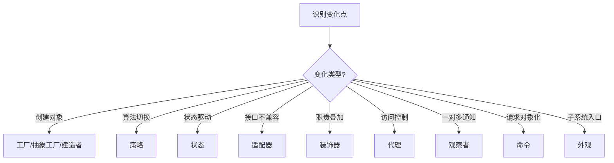

## 小结

GoF 23 种模式分为创建型（5）、结构型（7）、行为型（11）。本节重点掌握：工厂方法与抽象工厂的“产品 vs 产品族”区别、单例的双重检查锁、建造者的分步构造、装饰器与代理的组合差异、策略与状态的“意图”区分、观察者的一对多通知。模式选择应“针对变化点”，避免为模式而模式。设计模式是 SOLID 原则在具体场景的落地，理解模式背后的设计原则比记忆结构更重要。

## 关联

- 上一级：[[MOC - 第9章]]
- 上一节：[[9.1 面向对象设计原则SOLID]]
- 下一节：[[9.3 架构设计与系统映射]]
- 状态模式详解：[[5.3 状态模式与代码实现]]
- 设计原则基础：[[9.1 面向对象设计原则SOLID]]
