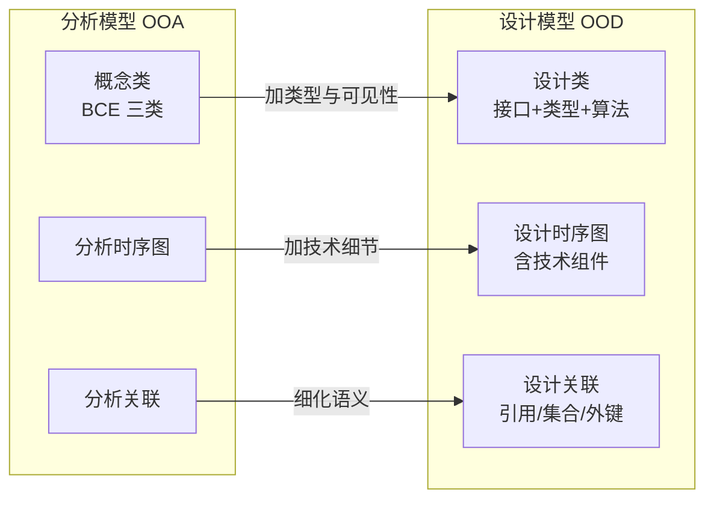
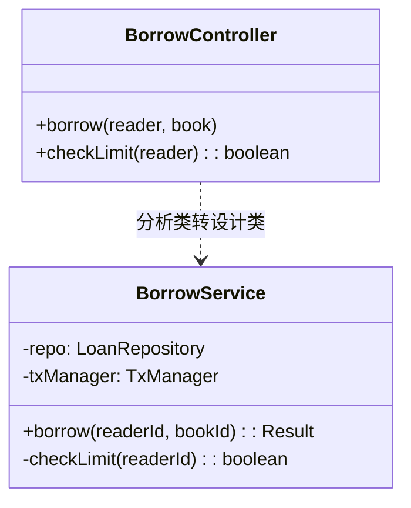
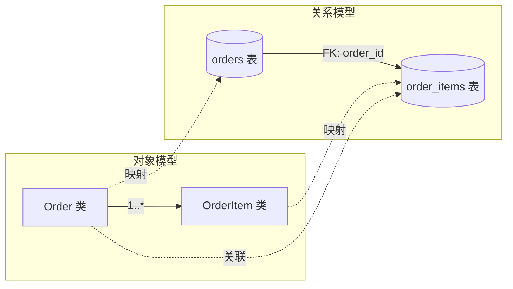
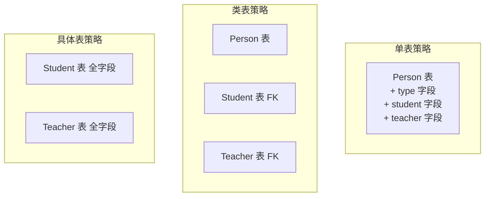
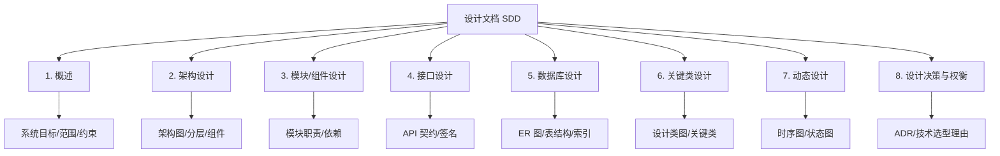
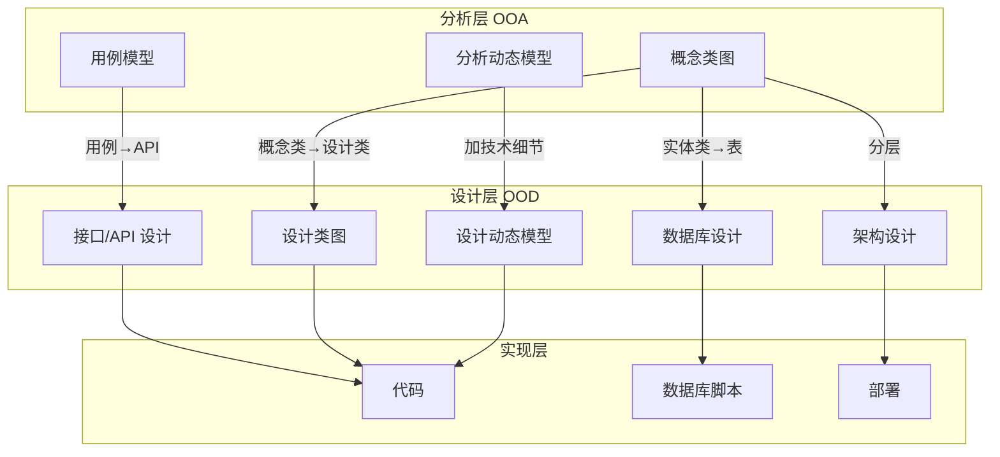

# 9.3 架构设计与系统映射

OOD 不仅要设计单个类，还要把分析模型映射到系统架构、接口契约与数据存储。本节回答：从分析模型如何转为设计模型、接口与 API 契约如何定义、面向对象类如何映射到关系数据库（ORM）、设计文档应包含哪些内容。这是 OOD 通向工程实现的最后一公里。

## 从分析模型到设计模型的转换

OOA 产出的是问题域的概念模型，OOD 在其基础上加入技术决策，形成可编码的设计模型。转换的核心是“抽象级别下降”。



| 转换项 | 分析模型 | 设计模型 |
| --- | --- | --- |
| 类 | 概念类，属性无类型 | 设计类，属性有类型、可见性 |
| 操作 | 仅描述职责 | 完整签名（参数、返回值、异常） |
| 关联 | 业务关系 | 引用、集合、外键、关联表 |
| 边界类 | 抽象界面 | UI 组件 / REST API 接口 |
| 控制类 | 流程协调 | Service / Controller，含事务 |
| 实体类 | 业务对象 | 持久化对象 + ORM 映射 |
| 动态 | 分析时序图 | 设计时序图（含框架/中间件） |

### 转换示例：借书控制器



```java
// 分析类（OOA）：仅描述职责
class BorrowController {
    // borrow(reader, book)
    // checkLimit(reader): boolean
}

// 设计类（OOD）：完整签名 + 依赖 + 事务
class BorrowService {
    private final LoanRepository repo;        // 依赖抽象（DIP）
    private final TxManager txManager;
    public BorrowService(LoanRepository r, TxManager t) {  // 构造注入
        this.repo = r; this.txManager = t;
    }
    @Transactional
    public Result borrow(Long readerId, Long bookId) {
        if (!checkLimit(readerId)) return Result.fail("超出借阅上限");
        Loan loan = new Loan(readerId, bookId, LocalDate.now().plusDays(30));
        repo.save(loan);
        return Result.ok(loan.getId());
    }
    private boolean checkLimit(Long readerId) {
        return repo.countByReader(readerId) < 5;
    }
}
```

## 接口设计：API 定义与契约

> [!definition] 接口契约
> 接口契约是组件之间约定的“做什么、需要什么输入、保证什么输出”的规范，包括操作签名、前置条件、后置条件、异常与不变式。契约明确了调用方与被调用方的责任边界。

### 接口设计的要素

| 要素 | 说明 | 示例 |
| --- | --- | --- |
| 操作名 | 动宾命名，语义清晰 | `createOrder` |
| 参数 | 类型、含义、约束 | `userId: Long, items: List<Item>` |
| 返回值 | 类型与含义 | `Result<Order>` |
| 前置条件 | 调用前必须满足 | 用户存在且未封禁 |
| 后置条件 | 调用后保证 | 创建订单并返回 ID |
| 异常 | 可能抛出的异常及含义 | `UserNotFoundException` |
| 不变式 | 始终成立的约束 | 订单金额 ≥ 0 |

### REST API 契约示例

```mermaid
flowchart LR
    C[客户端] -->|POST /orders| R[Resource: 订单]
    C -->|GET /orders/{id}| R
    C -->|PUT /orders/{id}/pay| R
    R -->|201 Created + Location| C
    R -->|200 OK + JSON| C
```

```java
// REST 接口契约（Spring 风格）
@RestController
@RequestMapping("/orders")
class OrderResource {
    private final OrderService service;
    OrderResource(OrderService s) { service = s; }

    @PostMapping
    public ResponseEntity<Order> create(@RequestBody CreateOrderReq req) {
        // 前置：req.items 非空，userId 有效
        Order o = service.create(req.getUserId(), req.getItems());
        // 后置：返回 201 + Location
        return ResponseEntity.created(URI.create("/orders/" + o.getId())).body(o);
    }

    @GetMapping("/{id}")
    public Order get(@PathVariable Long id) {
        return service.findById(id);  // 不存在抛 NotFoundException → 404
    }
}
```

> [!tip] 接口设计原则
> - **单一职责**：每个接口只做一件事；
> - **契约清晰**：前置/后置/异常显式声明；
> - **稳定优先**：接口变更代价高，应先抽象再细化；
> - **版本管理**：API 变更用版本号隔离（`/v1/orders`）；
> - **幂等性**：幂等接口便于重试与容错（GET、PUT 幂等，POST 不幂等）。

## 数据库映射：ORM 与类到表

关系数据库与面向对象模型存在“阻抗失配”：对象有继承、多态、关联，而表只有行与外键。ORM（Object-Relational Mapping）负责在两者间转换。



### 类到表的映射规则

| 对象模型 | 关系模型 | 说明 |
| --- | --- | --- |
| 类 | 表 | 一个类对应一张表 |
| 属性 | 列 | 属性对应字段，类型需映射 |
| 对象 | 行 | 一个实例对应一行 |
| 关联（多对一） | 外键 | 多端持有外键 |
| 关联（多对多） | 关联表 | 引入中间表 + 双外键 |
| 继承 | 三种策略 | 见下表 |

### 继承的三种映射策略



| 策略 | 做法 | 优势 | 劣势 |
| --- | --- | --- | --- |
| 单表（Single Table） | 所有子类字段放一张表，加类型列 | 查询简单、无 JOIN | 大量 NULL、约束难加 |
| 类表（Joined Table） | 父类一张表，子类各一张表，外键关联 | 规范、无冗余 | 查询需 JOIN |
| 具体表（Table per Class） | 每个具体类一张表，含父类全部字段 | 无 JOIN、无 NULL | 多态查询需 UNION |

### ORM 映射示例（JPA 风格）

```java
@Entity
@Table(name = "orders")
class Order {
    @Id @GeneratedValue
    private Long id;
    private Long userId;
    private BigDecimal amount;
    private OrderStatus status;  // 枚举映射

    @OneToMany(mappedBy = "order", cascade = CascadeType.ALL)
    private List<OrderItem> items = new ArrayList<>();
    // getter/setter 省略
}

@Entity
@Table(name = "order_items")
class OrderItem {
    @Id @GeneratedValue
    private Long id;

    @ManyToOne(fetch = FetchType.LAZY)
    @JoinColumn(name = "order_id")
    private Order order;

    private Long productId;
    private Integer quantity;
    private BigDecimal price;
}
```

> [!note] ORM 的权衡
> ORM 提升开发效率、屏蔽 SQL 细节，但复杂查询性能难优化、N+1 查询问题常见。关键路径（如报表、批量）仍建议用原生 SQL 或查询构造器，ORM 用于 CRUD 与简单关联。

## 设计文档编写

设计文档（SDD, Software Design Description）是 OOD 的最终产出，记录设计决策供开发与维护参考。

### 设计文档结构



| 章节 | 内容 | 配图 |
| --- | --- | --- |
| 概述 | 系统目标、范围、约束 | — |
| 架构设计 | 分层、组件、部署 | 组件图、部署图 |
| 模块设计 | 模块职责与依赖 | 包图 |
| 接口设计 | API 契约、签名 | — |
| 数据库设计 | ER 图、表结构、索引 | ER 图 |
| 关键类设计 | 设计类图 | 类图 |
| 动态设计 | 核心流程 | 时序图、状态图 |
| 设计决策 | ADR、技术选型 | — |

## 设计映射总览



## 小结

从分析模型到设计模型是抽象级别下降的过程：概念类细化为带类型与签名的设计类，边界类转为 UI 或 API，控制类转为 Service/Controller，实体类转为持久化对象。接口设计需明确契约（前置/后置/异常），遵循单一职责与版本管理。ORM 把类映射到表，需处理关联与继承三种策略。设计文档整合架构、接口、数据库、类与动态设计，配合 ADR 记录决策理由，是 OOD 的最终交付物。

## 关联

- 上一级：[[MOC - 第9章]]
- 上一节：[[9.2 设计模式与重用]]
- 架构基础：[[7.1 组件图与部署图]]、[[7.2 包图与系统架构]]
- OOA 衔接：[[8.3 OOA文档与建模规范]]
- 综合案例：[[10.1 综合案例：在线书店系统建模]]
