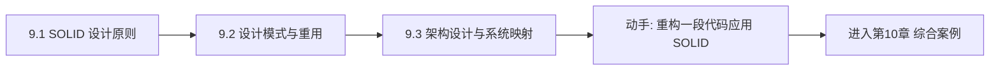

# MOC - 第9章 面向对象设计（OOD）原则

> [!info] 本章定位
> 第8章 OOA 解决“系统是什么”，第9章 OOD 解决“系统怎么设计与实现”。OOD 把分析模型细化为可编码的设计模型，核心是**设计原则**与**设计模式**。本章回答三个问题：SOLID 五大原则如何指导类设计、经典设计模式如何复用成熟方案、分析模型如何映射到架构与数据库。掌握 OOD 是写出可维护、可扩展、低耦合代码的前提。

## 学习路线图

## 知识点导航

| 节 | 主题 | 核心要点 | 入口 |
| --- | --- | --- | --- |
| 9.1 | SOLID 设计原则 | SRP/OCP/LSP/ISP/DIP，类图对比与 Java 代码 | [[9.1 面向对象设计原则SOLID]] |
| 9.2 | 设计模式与重用 | 创建型/结构型/行为型模式，选择策略 | [[9.2 设计模式与重用]] |
| 9.3 | 架构设计与系统映射 | 分析到设计转换、接口设计、ORM 映射 | [[9.3 架构设计与系统映射]] |

## 核心考点

> [!warning] 重点掌握
> 1. SOLID 五原则的名称、定义与目标：SRP（单一职责）、OCP（开闭）、LSP（里氏替换）、ISP（接口隔离）、DIP（依赖倒置）。
> 2. 每个原则的违反症状与重构方向（如 SRP 违反→上帝类；OCP 违反→每次加类型都改 if-else）。
> 3. 设计模式三大分类：创建型（5）、结构型（7）、行为型（11），共 23 种 GoF 模式。
> 4. 重点模式的意图与结构：工厂方法、抽象工厂、单例、建造者、适配器、装饰器、代理、外观、策略、观察者、命令、状态。
> 5. 模式选择策略：针对变化点选模式，避免为模式而模式。
> 6. 分析模型到设计模型的映射：概念类→设计类、关联→引用/集合/外键、操作→签名。
> 7. ORM 映射基本规则：类→表、属性→列、关联→外键、继承→三种映射策略。

## 自测题

> [!question] 题1
> 什么是开闭原则（OCP）？请举例说明如何通过抽象实现开闭。
> > [!check]- 参考答案
> > 开闭原则（Open-Closed Principle, OCP）要求软件实体**对扩展开放、对修改关闭**：增加新功能时通过新增代码（如新类、新实现）实现，而不修改已有代码。实现手段是**抽象**：把变化点抽象为接口或抽象类，新功能通过实现/继承这些抽象加入，调用方依赖抽象而非具体类。例如支付系统把“支付方式”抽象为 `PaymentStrategy` 接口，新增“微信支付”只需新建 `WechatPay implements PaymentStrategy`，无需修改 `PaymentContext`，满足 OCP。

> [!question] 题2
> 里氏替换原则（LSP）要求子类能够替换父类，违反 LSP 的典型表现是什么？
> > [!check]- 参考答案
> > 里氏替换原则（Liskov Substitution Principle, LSP）要求所有引用父类的地方必须能透明地使用子类对象，且程序行为不变。违反 LSP 的典型表现：子类**削弱父类后置条件**（如父类返回非 null，子类返回 null）、**加强前置条件**（子类要求传入参数必须满足额外约束）、**抛出父类不抛的异常**、**不实现父类承诺的行为**（如经典反例“正方形继承长方形”导致 `setWidth` 行为异常）。违反 LSP 会让多态失效，调用方需做类型判断，破坏开闭原则。

> [!question] 题3
> 工厂方法与抽象工厂的区别是什么？
> > [!check]- 参考答案
> > - **工厂方法（Factory Method）**：定义一个创建对象的接口，由子类决定实例化哪个类；针对“单一产品”的创建，每个具体工厂只产一种产品。
> > - **抽象工厂（Abstract Factory）**：提供一个接口创建**一系列相关或相互依赖的产品**（产品族），每个具体工厂产出一整套产品；强调“产品族”的一致性。
> > 区别：工厂方法是“一工厂一产品”，抽象工厂是“一工厂一族产品”。如数据库层 `DbFactory` 创建 `Connection`+`Command`+`Reader` 一族对象，不同工厂对应 MySQL/Oracle 整套，用抽象工厂；若只创建 `Connection` 一种对象，用工厂方法即可。

> [!question] 题4
> 策略模式与状态模式结构相似，如何区分？
> > [!check]- 参考答案
> > 二者结构都是“上下文持有策略/状态接口，运行时切换实现”，但**意图不同**：**策略模式**用于把一组可互换的算法封装起来，由客户端主动选择（“怎么做”的封装）；**状态模式**用于对象状态变化时自动改变行为，状态切换由对象内部驱动（“何时做什么”的封装）。策略的切换通常由外部客户端决定且可任意组合，状态的切换遵循状态机规则且受当前状态约束。如支付方式选择是策略，订单从“待支付→已支付→已发货”的行为变化是状态。

## 章节导航

- 上一级：[[MOC - 面向对象系统分析与建模]]
- 上一章：[[MOC - 第8章]]
- 下一章：[[MOC - 第10章]]
